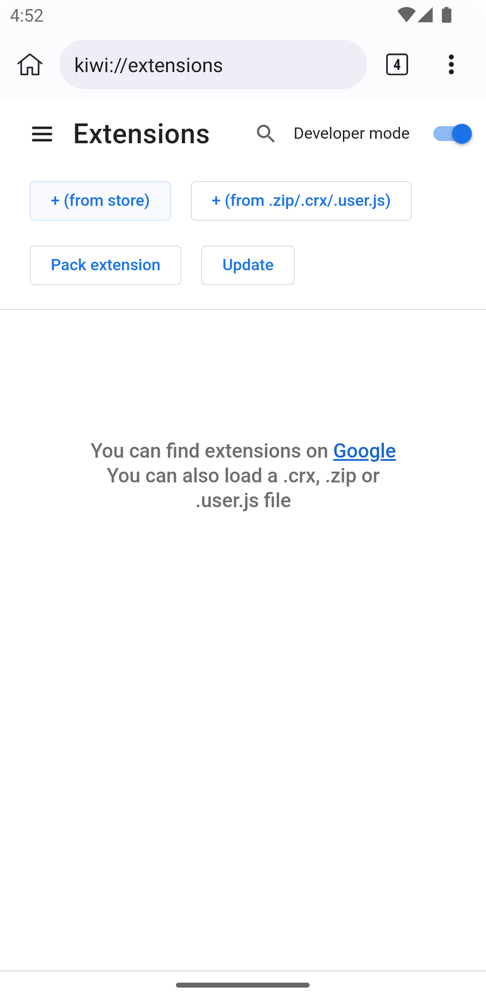
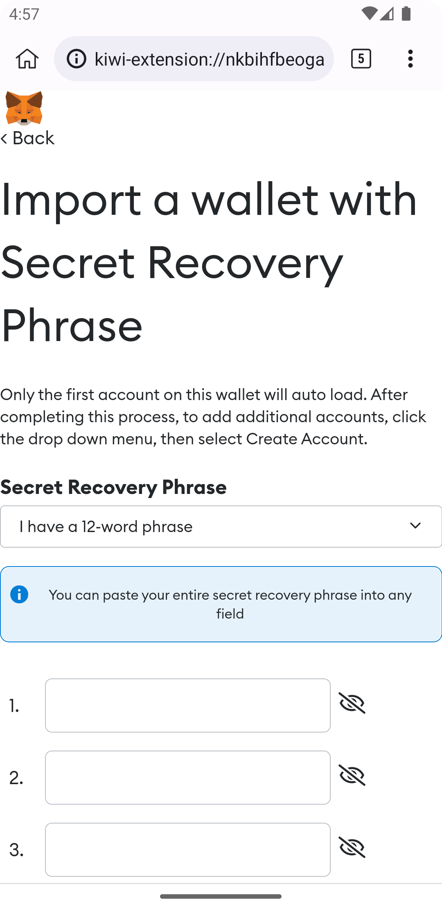

## Overview

Kiwi Browser is a [open-source](https://github.com/kiwibrowser/src) web browser for Android, based on "desktop" Chromium.

Kiwi Browser supports:
 - Night Mode
 - Support for all [Chrome Extensions](https://chrome.google.com/webstore/category/extensions)      
 - Bottom address bar
 - Performance improvements like partial rasterization of tiles

You can __get desktop-like experience using web3__ wallet extensions, which is the focus [here](https://github.com/Huge/DesktopBrowserWithWeb3wallets).
We shall port/mirror to Gitea and Radicle sooner than later.


The browser is licensed under the same, very [permissive, license](https://github.com/kiwibrowser/src.next/blob/kiwi/LICENSE) as Chromium, you are free to fork and [hack](#contributing).

## Table of contents

- [Timeline](#timeline)
- [Contributing](#contributing)
- [Modifying](#modifying)
- [Building](#building)
  - [Getting the source-code and environment](#getting-the-source-code-and-environment)
  - [Setting-up dependencies](#setting-up-dependencies)
  - [Preparing a signing key](#preparing-a-signing-key)
  - [Configuring the build type and platform](#configuring-the-build-type-and-platform)
  - [Preparing the first build](#preparing-the-first-build)
  - [Compiling Kiwi Browser](#compiling-kiwi-browser)
  - [Investigating crashes](#investigating-crashes)
  - [Remote debugging](#remote-debugging)
  - [Optimizing binary size](#optimizing-binary-size)
- [Roadmap](#roadmap)

## Timeline

- 15 April 2018 - First Kiwi Browser release.

- 15 April 2019 - Kiwi Browser gets support for Chrome Extensions.

- 17 April 2020 - Kiwi Browser goes fully open-source.

- 12 Nov 2022 - [EthBrno<sup>2</sup> hackaton](https://ethbrno.cz/) brings new wind for web3 and crypto-systems usage on mobile!
  - some mid-work presentation: https://docs.google.com/presentation/d/1dZCYoC79BqI28kqIbswjVsQ-bRV0swFfF4hVLoAFfJY/edit#slide=id.g18bb67c870f_0_12 

New builds are done from the [original source](https://github.com/kiwibrowser/src) to the [Play Store](https://play.google.com/store/apps/details?id=com.kiwibrowser.browser). 

There are thousands of hours of work in this repository and thousands of files changed.

## Contributing

Contributions are welcome and _encouraged_. For discussion, join https://matrix.to/#/#kiwibrowser-fans-building-it:matrix.org or post a new issue.

For your code to be integrated into KiwiBrowser open a PR and we either merge it or give feedback.

## Modifying

If you create your own browser or a mod, make sure to _change the browser name and icon_ in `chrome/android/java/res_chromium/values/channel_constants.xml` and translation strings (search and replace Kiwi in all `*.xtb`, all `*.grd` and all `*.grdp` files).
When replacing the app icon, make sure to add the new icon files in their respective `chrome/android/java/res/mipmap` folders(mdpi, hdpi etc) and also update the AndroidManifest.xml.

## Building

The reference build machine is using Ubuntu 19.04 (also tested using Ubuntu 18.04 and Ubuntu 19.10).

The minimum system requirements are 2 vCPUs, 7.5 GB Memory.

You can use a virtual machine, an AWS VM, or a Google Cloud VM.

### Getting the source-code and environment

To put tools in your path run:

```
git clone https://chromium.googlesource.com/chromium/tools/depot_tools.git
```

then( assuming you have cloned that to your `~`) add following to the end of your `~/.bashrc` file

```bash
export PATH=$HOME/depot_tools:$PATH
```

Apply the change:

```bash
source ~/.bashrc
```

This will give you access to one utility called gclient (as in "Google client")

Create a directory called `chromium`, then:

```bash
cd chromium
git clone https://github.com/kiwibrowser/dependencies.git .cipd
cd .cipd
cp .gclient ..
cp .gclient_entries ..
git clone https://github.com/Huge/DesktopBrowserWithWeb3wallets.git src
```

At this stage, in `chromium` you will have the .cipd folder, and a folder with the Kiwi Browser source code `./src`.

### Setting up dependencies

To be able to build Kiwi Browser, you need python and OpenJDK (OpenJDK to create Java bindings for Android):

On MacOS:
```bash
brew install ncurses python
brew install --cask temurin ## on M1 you can skip this and look at the next step.
```

Debian-based Linux( like Ubuntu):
```bash
sudo apt-get update
sudo apt-get install python openjdk-8-jdk-headless libncurses5
```

We want to be sure to __use Java 1.8__ in to avoid compilation errors (lint and errorprone):

[On M1(+) Mac](https://www.yippeecode.com/topics/upgrade-to-openjdk-temurin-using-homebrew/)Books:
```bash
brew tap homebrew/cask-versions
brew install --cask temurin8
```
( See https://stackoverflow.com/questions/74008762/homebrew-error-openjdk8-no-bottle-available and https://www.yippeecode.com/topics/upgrade-to-openjdk-temurin-using-homebrew/ for more info. )

On Linux-like OSs:
```bash
sudo update-java-alternatives --set java-1.8.0-openjdk-amd64
```

then run the following commands in `chromium/src`:

```bash
bash install-build-deps.sh --no-chromeos-fonts # Here you get forced to the Ubuntu eco real hard-(
build/linux/sysroot_scripts/install-sysroot.py --arch=i386
build/linux/sysroot_scripts/install-sysroot.py --arch=amd64
```

These commands will install all necessary system packages using apt-get and gather a minimal build filesystem.

### Preparing a signing key

APKs (application packages) on Android need to be signed by developers in order to be distributed.

To generate a key:

```bash
keytool -genkey -v -keystore ~/chromium/keystore.jks -alias production -keyalg RSA -keysize 2048 -validity 10000 -storepass HERE_YOUR_ANDROID_KEYSTORE_PASSWORD -keypass HERE_YOUR_ANDROID_KEYSTORE_PASSWORD
```

### Configuring the build type and platform

Run:

```bash
mkdir -p ~/chromium/src/out/android_arm
```

Create a file called args.gn in ~/chromium/src/out/android_arm/ with this content:

```bash
target_os = "android"
target_cpu = "arm" # <---- can be arm, arm64, x86 or x64
is_debug = false
is_java_debug = false

android_channel = "stable"
is_official_build = true
is_component_build = false
is_chrome_branded = false
is_clang = true
symbol_level = 1
use_unofficial_version_number = false
android_default_version_code = "158"
android_keystore_name = "production"
android_keystore_password = "HERE_YOUR_ANDROID_KEYSTORE_PASSWORD"
android_keystore_path = "../../../keystore.jks"
android_default_version_name = "Quadea"
fieldtrial_testing_like_official_build = true
icu_use_data_file = false
enable_iterator_debugging = false

google_api_key = "KIWIBROWSER"
google_default_client_id = "42.apps.kiwibrowser.com"
google_default_client_secret = "KIWIBROWSER_NOT_SO_SECRET"
use_official_google_api_keys = true

ffmpeg_branding = "Chrome"
proprietary_codecs = true
enable_hevc_demuxing = true
enable_nacl = false
enable_wifi_display = false
enable_widevine = false
enable_google_now = true
enable_ac3_eac3_audio_demuxing = true
enable_iterator_debugging = false
enable_mse_mpeg2ts_stream_parser = true
enable_remoting = false
rtc_use_h264 = false
rtc_use_lto = false
use_openh264 = false

v8_use_external_startup_data = true
update_android_aar_prebuilts = true

use_thin_lto = true

enable_extensions = true
enable_plugins = true
```

You can replace Android keystore password and Android keystore keypath with the data for your Android keystore (or you can generate a new key).

### Preparing the first build

To prepare initial setup run from ~/chromium/src:

```
gclient runhooks
```

then generate the build files in ~/chromium/src:

```
gn gen out/android_arm
```

Alternatively you can use: gn args out/android_arm

### Compiling Kiwi Browser

To compile, use the command:

```
ninja -C out/android_arm chrome_public_apk
```

you'll have the output APK in ~/chromium/src/out/android_arm/apks/ChromePublic.apk

then you can run the APK on your phone.

### Investigating crashes

You need to have the symbols for the version that crashed, the symbols can be generated using:
```
components/crash/content/tools/generate_breakpad_symbols.py --build-dir=out/lnx64 --symbols-dir=/tmp/my_symbols/ --binary=out/android_arm/lib.unstripped/libchrome.so --clear --verbose
```

If you have the crash information from logcat:
```
out/lnx64/microdump_stackwalk -s /tmp/dump.dmp /tmp/my_symbols/
```

If you have the crash information in a tombstone:
```
./third_party/android_ndk/ndk-stack -sym out/android_x86/lib.unstripped -dump tombstone
```

### Remote debugging

You can use Google Chrome to debug using the devtools console.

In case the devtools console doesn't work (error 404),  the solution is to use chrome://inspect (Inspect fallback)
or change SHA1 in build/util/LASTCHANGE

```
LASTCHANGE=8920e690dd011895672947112477d10d5c8afb09-refs/branch-heads/3497@{#948}
```

and confirm the change using:

```
rm out/android_arm/gen/components/version_info/version_info_values.h out/android_x86/gen/components/version_info/version_info_values.h out/android_arm/gen/build/util/webkit_version.h out/android_x86/gen/build/util/webkit_version.h out/android_arm/gen/chrome/common/chrome_version.h out/android_x86/gen/chrome/common/chrome_version.h
```

### Optimizing binary size

If you want to optimize of the final APK, you can look at the size of each individual component using command:

```
./tools/binary_size/supersize archive chrome.size --apk-file out/android_arm/apks/ChromePublic.apk -v
./tools/binary_size/supersize html_report chrome.size --report-dir size-report -v
```

## Precompiled binaries

<a href="https://play.google.com/store/apps/details?id=com.kiwibrowser.browser"> 

## Business model

The browser is getting paid by search engines for every search done using Kiwi Browser.

Depending on the search engine choice, requests may go via Kiwibrowser / Kiwisearchservices servers.
This is for invoicing our search partners and provide alternative search results (e.g. bangs aka "shortcuts").

In some countries, the browser displays sponsored tiles or news on the homepage.

User data (browsing, navigation, passwords, accounts) is not collected because we have no interest to know what you do in the browser. Our main goal is to convince you to use a search engine partner, and this search engine makes money / new partnerships and shares revenue with us.

## Roadmap

TBD, see the "focus" above for broad idea. 
 - Perhaps would be good to have tests to run in parallel comparing desktop Chromium behaviour with our mobile app's.
 - Make/build a Docker image for building the `.apk`, add instruction for using it here
 
