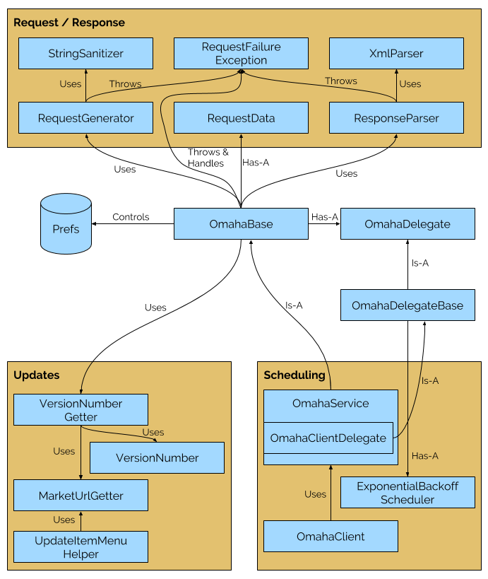

# Omaha Architecture Overview

## Overview

This document aims to explain how the Omaha client implementation in Chrome for
Android currently works at the point of handing the code base ownership over to
the Omaha team.

For finding / solving issues that may arise, it might be a good idea to look at
the class structure, the class diagram and the tables which describe which
classes do what.

## Core Flow

### Concepts

There are a few concepts used in this document, described below.

#### Install Event Request

Sent once the first time the user opens Chrome. This is a specially formed HTTP
POST request.

If a user clears data for the Chrome application, this will be re-sent the next
time the user opens Chrome.

#### Active Ping Request

Sent every 5 hours while Chrome is open.

#### Main Run Method

The main run method is what’s invoked every time the Omaha code is executed. It
contains all the business logic for what to do at various stages. Each run is a
one-off that is unable to store state in-memory (implementation detail), so it
needs to read from disk before each run, and then store the updated state to
disk when it’s done. Only one run is active at any one time.

Each invocation of the run method is either through a direct method call from
the Chrome code base, or through a scheduled event.

This method runs on a background thread, so long running operations such as HTTP
requests are synchronous.

#### Timestamps

There are two main timestamps we track during the main run method: When we
should generate a request, and when we should POST a request we have previously
generated.

Requests are generated at 5 hour intervals.

POSTs timestamps are calculated based on an exponential backoff.

### Flow

The main run method `OmahaBase#run`, contains the core flow for what happens for
interaction with Omaha, and the following provides an overview of the flow:

1.  Check if Omaha is enabled. If not, bail out.
1.  Restore previously stored state.
1.  Check if Chrome is currently being used. If so, create a new Active Ping
    Request if required.
    1.  This is not required if there recently has been a request sent to the
        server.
    1.  If the generated request is too old, a new request is generated.
    1.  Creating a new requests resets the exponential backoff, and sets when to
        post to right now.
    1.  If there is an available request, maybe execute it.
1.  If it is time to do the request, do the HTTP POST now, else schedule a
    request for when it’s supposed to be posted.
    1.  If the request succeeded, and it was the Install Event Request, we
        generate another request, which is just the normal Active Ping Request,
        and then immediately try to post it. The Install Event Request is only
        ever sent once.
    1.  Whenever we successfully finish an HTTP POST, we clear the current
        request.
1.  If necessary, schedule a run of itself again in the future.
    1.  There are two things that requires rescheduling: Generating a new Active
        Ping Request, or retrying sending a request.
    1.  If Chrome is constantly running and in the foreground, we send generate
        requests every `OmahaBase#MS_BETWEEN_REQUESTS` hours = `5 hours`.
    1.  The shortest delay of either retrying a request or generating a new
        request is the new timestamp we use to schedule another run of the main
        flow.
1.  Save current state to disk.

## Triggering

Omaha is initiated through the `PowerBroadcastReceiver` which is invoked when
the screen is on and Chrome is in the foreground. Android might bring the
`Activity` to the foreground when it wakes it up to do tasks, but the screen
would then typically be off, so that provides an extra guard against that.

The `PowerBroadcastReceiver` then tells `OmahaBase` that a foreground session
has started, which immediately triggers the `OmahaService`. The `OmahaService`
then depending on the OS version either starts an `IntentService` called
`OmahaClient`, or schedules a `BackgroundTask` with the Chrome
`BackgroundTaskScheduler` for immediate scheduling (0ms delay).

## Requests and Responses

The HTTP POST requests follow the Omaha Server Protocol V3, as outlined here:
https://github.com/google/omaha/blob/master/doc/ServerProtocolV3.md

### Request Generation

The `RequestGenerator` generates the XML data for the HTTP POST request.

The code uses a separate `appid` for handsets and tablets, defined in an
internal class.

The `requestid` is different for each request, but repeated attempts to POST a
particular request does keep the `requestid`. The `sessionid` is kept around for
the course of one run of the Omaha core flow. In practice this means that the
initial install event request and the immediately following active ping request
will have the same `sessionid`. Other requests will not share a session ID
though, even though Chrome might have been alive between the requests.

Both the `requestid` and `sessionid` are randomly generated UUIDs, while the
user-id is an MD5 hash of the device’s Android ID
(`Settings.Secure.ANDROID_ID`), with an added salt. The Android ID is
re-generated a device is factory reset, but kept around even if a user clears
data for the Chrome application.

The `<ping>` tag will always have an `active=”1”` attribute because we fire
pings only when Chrome has been started. Note that the `<ping>`’s a and r
attributes are used only to differentiate between different users; since we are
sending a unique ID per user, they are unnecessary.

### Sending the request

The requests are sent using `HttpURLConnection`, which also receives the
server’s XML response. The connection is created using the at the time of
writing suggested way of creating it:

```java
URL url = new URL(...);
HttpURLConnection connection = (HttpURLConnection) url.openConnection();
```

The connection and read timeout is 1 minute:

```java
connection.setConnectTimeout(MS_CONNECTION_TIMEOUT);
connection.setReadTimeout(MS_CONNECTION_TIMEOUT);
```

After checking that the server sent a `200 OK` error code we pass it along to
the parser.

### Parsing the response

The `ResponseParser` parses the server’s XML for a `<ping status=”ok” />`
message and verifies other part of the declared protocol. If the process fails
at any point, it is recorded and an attempt to resend it is scheduled.

### Exponential Backoff

The delay between two post requests is calculated using the
`ExponentialBackoffScheduler`. Except in the initial sending of both an install
event request and active ping request, there is always a minimum delay between
requests.

*   Delay between after a successful attempt: `1 hour`
*   Delay after the kth cumulative failed attempt: `1 hour * randomInt(1, 2^k)`
    *   Minimum delay = `1 hour`
    *   Maximum delay after kth = `2^k * 1 hour`
    *   Absolute maximum delay = `6 hours`

## Scheduling

How the next event is scheduled depends on the version of the operating system.
Android O added new constraints for what was allowed to run in the background,
which lead to changing how we scheduled events on Android M+. Before Android M,
an `IntentService` and `AlarmManager` is used, but on Android M+ we use
`BackgroundTaskScheduler` which is a wrapper around `JobScheduler` for Android
M+. We could have used `BackgroundTaskScheduler` for all operating systems, but
that would unnecessarily add a dependency on Google Play services
`GcmNetworkManager` for versions of the OS before Android M.

## Class Structure

### Class Diagram



### Core

**File** | **Description**
--- | ---
OmahaBase.java | Core class for all business logic. Requires a `OmahaDelegate` to interact with the system.<br><br>- Posts requests.<br>- Schedules new jobs.<br>- Stores and restores state.
OmahaDelegate.java | Top-level delegate. This is split out to simplify testing.
OmahaDelegateBase.java | Base implementation of delegate. Only ever extended by `OmahaService$OmahaClientDelegate`.

### Request / Response

**File** | **Description**
--- | ---
RequestData.java | Represents parameters for a single XML request to send to the server.
RequestFailureException.java | Describes error scenarios for connections to the Omaha update server.
RequestGenerator.java | Base class that generates XML requests to send to the Omaha server.<br><br>Note: This has an internal subclass which provides the data for the fields: `brand`, `client`, `appid`. The appid is different for tablet and handset only for historical reasons. Other fields describing the type of devices could have been used instead.
ResponseParser.java | Parses XML responses from the Omaha Update Server.
StringSanitizer.java | Sanitizes Strings sent to the Omaha server.
XMLParser.java | Breaks XML down into its constituent elements and attributes using a SAXParser.

### Scheduling

**File** | **Description**
--- | ---
ExponentialBackoffScheduler.java | Manages a timer that implements exponential backoff for failed attempts.
OmahaClient.java | The `IntentService` based implementation of the Omaha client.<br><br>Note: This class can not be renamed because it has is referred to by the system, and therefore possibly old intents, etc.
OmahaService.java | Uses either `AlarmManager` or `BackgroundTaskScheduler` to schedule jobs.<br><br>Also contains `OmahaClientDelegate`. The delegate contains logic for scheduling using the `AlarmManager` or a `BackgroundTask`.

### Updates

**File** | **Description**
--- | ---
MarketURLGetter.java | Grabs the URL that points to the Google Play Store page for Chrome. Retrieved from the Omaha server.
UpdateMenuItemHelper.java | Contains logic for whether the update menu item should be shown, whether the update toolbar badge should be shown, and UMA logging for the update menu item.
VersionNumber.java | Utility for dealing with Chrome version numbers (parsing, comparing, etc.).
VersionNumberGetter.java | Stubbed class for getting version numbers from the rest of Chrome. Separated out to simplify unit testing.

## Testing

The Omaha code is basically fully white-box tested, and the tests are typically
on the form of change-detector tests, since this is a protocol that has existed
for a long time, and should not change unless it is intentional.
