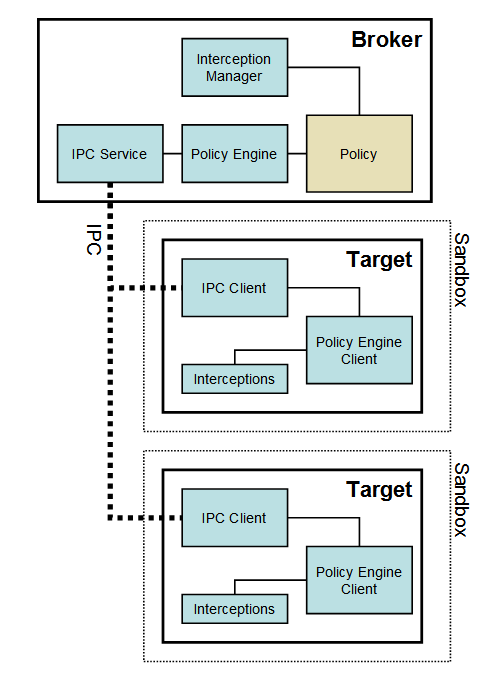

# Sandbox

[TOC]

## Overview

Security is one of the most important goals for Chromium. The key to security is
understanding: we can only truly secure a system if we fully understand its
behaviors with respect to the combination of all possible inputs in all possible
states. For a codebase as large and diverse as Chromium, reasoning about the
combined behavior of all its parts is nearly impossible. The sandbox objective
is to provide hard guarantees about what ultimately a piece of code can or
cannot do no matter what its inputs are.

Sandbox leverages the OS-provided security to allow code execution that cannot
make persistent changes to the computer or access information that is
confidential. The architecture and exact assurances that the sandbox provides
are dependent on the operating system. This document covers the Windows
implementation as well as the general design. The Linux implementation is
described [here](../linux_sandboxing.md), the OSX implementation
[here](http://dev.chromium.org/developers/design-documents/sandbox/osx-sandboxing-design).

If you don't feel like reading this whole document you can read the
[Sandbox FAQ](sandbox_faq.md) instead. A
description of what the sandbox does and doesn't protect against may also be
found in the FAQ.

## Design principles

* **Do not re-invent the wheel:** It is tempting to extend the OS kernel with a
  better security model. Don't. Let the operating system apply its security to
  the objects it controls. On the other hand, it is OK to create
  application-level objects (abstractions) that have a custom security model.
* **Principle of least privilege:** This should be applied both to the sandboxed
  code and to the code that controls the sandbox. In other words, the sandbox
  should work even if the user cannot elevate to super-user.
* **Assume sandboxed code is malicious code:** For threat-modeling purposes, we
  consider the sandbox compromised (that is, running malicious code) once the
  execution path reaches past a few early calls in the `main()` function. In
  practice, it could happen as soon as the first external input is accepted, or
  right before the main loop is entered.
* **Be nimble:** Non-malicious code does not try to access resources it cannot
  obtain. In this case the sandbox should impose near-zero performance
  impact. It's ok to have performance penalties for exceptional cases when a
  sensitive resource needs to be touched once in a controlled manner. This is
  usually the case if the OS security is used properly.
* **Emulation is not security:** Emulation and virtual machine solutions do not
  by themselves provide security. The sandbox should not rely on code emulation,
  code translation, or patching to provide security.  
  
## Sandbox windows architecture

The Windows sandbox is a user-mode only sandbox. There are no special kernel
mode drivers, and the user does not need to be an administrator in order for the
sandbox to operate correctly. The sandbox is designed for both 32-bit and 64-bit
processes and has been tested on all Windows OS flavors between Windows 7 and
Windows 10, both 32-bit and 64-bit.

Sandbox operates at process-level granularity. Anything that needs to be
sandboxed needs to live on a separate process. The minimal sandbox configuration
has two processes: one that is a privileged controller known as the _broker_,
and one or more sandboxed processes known as the _target_. Throughout the
documentation and the code these two terms are used with that precise
connotation. The sandbox is provided as a static library that must be linked to
both the broker and the target executables.

### The broker process

In Chromium, the broker is always the browser process. The broker, is in broad
terms, a privileged controller/supervisor of the activities of the sandboxed
processes. The responsibilities of the broker process are:

1. Specify the policy for each target process
1. Spawn the target processes
1. Host the sandbox policy engine service
1. Host the sandbox interception manager
1. Host the sandbox IPC service (to the target processes)
1. Perform the policy-allowed actions on behalf of the target process

The broker should always outlive all the target processes that it spawned. The
sandbox IPC is a low-level mechanism (different from Chromium's IPC) that is
used to transparently forward certain windows API calls from the target to the
broker: these calls are evaluated against the policy. The policy-allowed calls
are then executed by the broker and the results returned to the target process
via the same IPC. The job of the interceptions manager is to patch the windows
API calls that should be forwarded via IPC to the broker.

### The target process

In Chromium, the renderers are always target processes, unless the
`--no-sandbox` command line has been specified for the browser process. The
target process hosts all the code that is going to run inside the sandbox, plus
the sandbox infrastructure client side:

1. All code to be sandboxed
1. The sandbox IPC client
1. The sandbox policy engine client
1. The sandbox interceptions

Items 2,3 and 4 are part of the sandbox library that is linked with the code to
be sandboxed.

The interceptions (also known as hooks) are how Windows API calls are forwarded
via the sandbox IPC to the broker. It is up to the broker to re-issue the API
calls and return the results or simply fail the calls. The interception + IPC
mechanism does not provide security; it is designed to provide compatibility
when code inside the sandbox cannot be modified to cope with sandbox
restrictions.  To save unnecessary IPCs, policy is also evaluated in the target
process before making an IPC call, although this is not used as a security
guarantee but merely a speed optimization.

It is the expectation that in the future most plugins will run inside a target
process.

## Sandbox restrictions

At its core, the sandbox relies on the protection provided by four Windows
mechanisms:

* A restricted token
* The Windows _job_ object
* The Windows _desktop_ object
* Windows Vista and above: The integrity levels

These mechanisms are highly effective at protecting the OS, its configuration,
and the user's data provided that:

* All the securable resources have a better than null security descriptor. In
  other words, there are no critical resources with misconfigured security.
* The computer is not already compromised by malware.
* Third party software does not weaken the security of the system.

** Note that extra mitigations above and beyond this base/core will be described
in the "Process Mitigations" section below.

### The token

One issue that other similar sandbox projects face is how restricted can the
token and job be while still having a properly functioning process. For the
Chromium sandbox, the most restrictive token for Windows XP takes the following
form:

#### Regular Groups
* Logon SID : mandatory
* All other SIDs : deny only, mandatory
#### Restricted Groups
* S-1-0-0 : mandatory
#### Privileges
* None

With the caveats described above, it is near impossible to find an existing
resource that the OS will grant access with such a token. As long as the disk
root directories have non-null security, even files with null security cannot be
accessed. In Vista, the most restrictive token is the same but it also includes
the low integrity level label. The Chromium renderer normally runs with this
token, which means that almost all resources that the renderer process uses have
been acquired by the Browser and their handles duplicated into the renderer
process.

Note that the token is not derived from anonymous or from the guest token; it is
derived from the user's token and thus associated to the user logon. As a
result, any auditing that the system or the domain has in place can still be
used.

By design, the sandbox token cannot protect the following non-securable
resources:

* Mounted FAT or FAT32 volumes: The security descriptor on them is effectively
  null. Malware running in the target can read and write to these volumes as
  long it can guess or deduce their paths.
* TCP/IP: The security of TCP/IP sockets in Windows 2000 and Windows XP (but not
  in Vista) is effectively null. It might be possible for malicious code in the
  target to send and receive network packets to any host.

More information about the Windows token object can be
found
[here](http://alt.pluralsight.com/wiki/default.aspx/Keith.GuideBook/WhatIsAToken.htm)

### The Job object

The target process also runs under a Job object. Using this Windows mechanism,
some interesting global restrictions that do not have a traditional object or
security descriptor associated with them are enforced:

* Forbid per-use system-wide changes using `SystemParametersInfo()`, which can
  be used to swap the mouse buttons or set the screen saver timeout
* Forbid the creation or switch of Desktops
* Forbid changes to the per-user display configuration such as resolution and
  primary display
* No read or write to the clipboard
* Forbid Windows message broadcasts
* Forbid setting global Windows hooks (using `SetWindowsHookEx()`)
* Forbid access to the global atoms table
* Forbid access to USER handles created outside the Job object
* One active process limit (disallows creating child processes)

Chromium renderers normally run with all these restrictions active. Each
renderers run in its own Job object. Using the Job object, the sandbox can (but
currently does not) prevent:

* Excessive use of CPU cycles
* Excessive use of memory
* Excessive use of IO

More information about Windows Job Objects can be
found [here](http://www.microsoft.com/msj/0399/jobkernelobj/jobkernelobj.aspx)

### The alternate desktop

The token and the job object define a security boundary: that is, all processes
with the same token and in the same job object are effectively in the same
security context. However, one not-well-understood fact is that applications
that have windows on the same desktop are also effectively in the same security
context because the sending and receiving of window messages is not subject to
any security checks. Sending messages across desktops is not allowed. This is
the source of the infamous "shatter" attacks, which is why services should not
host windows on the interactive desktop. A Windows desktop is a regular kernel
object that can be created and assigned a security descriptor.

In a standard Windows installation, at least two desktops are attached to the
interactive window station; the regular (default) desktop, and the logon
desktop. The sandbox creates a third desktop that is associated to all target
processes. This desktop is never visible or interactive and effectively isolates
the sandboxed processes from snooping the user's interaction and from sending
messages to windows operating at more privileged contexts.

The only disadvantage of an alternate desktop is that it uses approximately 4MB
of RAM from a separate pool, possibly more on Vista.

More information about Window Stations

### The integrity levels

Integrity levels are available on Windows Vista and later versions. They don't
define a security boundary in the strict sense, but they do provide a form of
mandatory access control (MAC) and act as the basis of Microsoft's Internet
Explorer sandbox.

Integrity levels are implemented as a special set of SID and ACL entries
representing five levels of increasing privilege: untrusted, low, medium, high,
system. Access to an object may be restricted if the object is at a higher
integrity level than the requesting token. Integrity levels also implement User
Interface Privilege Isolation, which applies the rules of integrity levels to
window messages exchanged between different processes on the same desktop.

By default, a token can read an object of a higher integrity level, but not
write to it. Most desktop applications run at medium integrity (MI), while less
trusted processes like Internet Explorer's protected mode and our own sandbox
run at low integrity (LI). A low integrity mode token can access only the
following shared resources:

* Read access to most files
* Write access to `%USER PROFILE%\AppData\LocalLow`
* Read access to most of the registry
* Write access to `HKEY_CURRENT_USER\Software\AppDataLow`
* Clipboard (copy and paste for certain formats)
* Remote procedure call (RPC)
* TCP/IP Sockets
* Window messages exposed via `ChangeWindowMessageFilter`
* Shared memory exposed via LI (low integrity) labels
* COM interfaces with LI (low integrity) launch activation rights
* Named pipes exposed via LI (low integrity) labels

You'll notice that the previously described attributes of the token, job object,
and alternate desktop are more restrictive, and would in fact block access to
everything allowed in the above list. So, the integrity level is a bit redundant
with the other measures, but it can be seen as an additional degree of
defense-in-depth, and its use has no visible impact on performance or resource
usage.

More information on integrity levels can be
found [here](http://msdn.microsoft.com/en-us/library/bb625963.aspx).

### Process mitigation policies

Most process mitigation policies can be applied to the target process by means
of SetProcessMitigationPolicy.  The sandbox uses this API to set various
policies on the target process for enforcing security characteristics.

#### Relocate Images:

* &gt;= Win8
* Address-load randomization (ASLR) on all images in process (and must be
  supported by all images).

#### Heap Terminate:

* &gt;= Win8
* Terminates the process on Windows heap corruption.

#### Bottom-up ASLR:

* &gt;= Win8
* Sets random lower bound as minimum user address for the process.

#### High-entropy ASLR:

* &gt;= Win8
* Increases randomness range for bottom-up ASLR to 1TB.

#### Strict Handle Checks:

* &gt;= Win8
* Immediately raises an exception on a bad handle reference.

#### Win32k.sys lockdown:

* &gt;= Win8
* `ProcessSystemCallDisablePolicy`, which allows selective disabling of system
  calls available from the target process.
* Renderer processes now have this set to `DisallowWin32kSystemCalls` which
  means that calls from user mode that are serviced by `win32k.sys` are no
  longer permitted. This significantly reduces the kernel attack surface
  available from a renderer.  See
  [here](https://docs.google.com/document/d/1gJDlk-9xkh6_8M_awrczWCaUuyr0Zd2TKjNBCiPO_G4)
  for more details.

#### App Container (low box token):

* &gt;= Win8
* In Windows this is implemented at the kernel level by a Low Box token which is
  a stripped version of a normal token with limited privilege (normally just
  `SeChangeNotifyPrivilege` and `SeIncreaseWorkingSetPrivilege`), running at Low
  integrity level and an array of "Capabilities" which can be mapped to
  allow/deny what the process is allowed to do (see
  [MSDN](https://msdn.microsoft.com/en-us/library/windows/apps/hh464936.aspx)
  for a high level description). The capability most interesting from a sandbox
  perspective is denying is access to the network, as it turns out network
  checks are enforced if the token is a Low Box token and the `INTERNET_CLIENT`
  Capability is not present.
* The sandbox therefore takes the existing restricted token and adds the Low Box
  attributes, without granting any Capabilities, so as to gain the additional
  protection of no network access from the sandboxed process.

#### Disable Extension Points (legacy hooking):

* &gt;= Win8
* `ProcessExtensionPointDisablePolicy`
* The following injection vectors are blocked: 
  * AppInit DLLs Winsock Layered Service Providers (LSPs)
  * Global Window Hooks (not thread-targeted hooks)
  * Legacy Input Method Editors (IMEs) 
  
#### Control Flow Guard (CFG):

* &gt;= Win8.1 Update 3 (KB3000850)
* Enabled in all chrome.exe processes.  Not compiled into all chrome binaries.
* Takes advantage of CFG security in Microsoft system DLLs in our processes.
* Compiler/Linker opt-in, not a run-time policy opt-in.  See
[MSDN](https://msdn.microsoft.com/en-us/library/windows/desktop/mt637065(v=vs.85).aspx).

#### Disable Font Loading:

* &gt;= Win10
* `ProcessFontDisablePolicy`

#### Disable Image Load from Remote Devices:

* &gt;= Win10 TH2
* `ProcessImageLoadPolicy`
* E.g. UNC path to network resource.

#### Disable Image Load of "mandatory low" (low integrity level):

* &gt;= Win10 TH2
* `ProcessImageLoadPolicy`
* E.g. temporary internet files.

#### Extra Disable Child Process Creation:

* &gt;= Win10 TH2
* If the Job level <= `JOB_LIMITED_USER`, set
  `PROC_THREAD_ATTRIBUTE_CHILD_PROCESS_POLICY` to
  `PROCESS_CREATION_CHILD_PROCESS_RESTRICTED` via `UpdateProcThreadAttribute()`.
* This is an extra layer of defense, given that Job levels can be broken out of.
  See also:
[ticket](https://bugs.chromium.org/p/project-zero/issues/detail?id=213&redir=1),
[Project Zero blog](http://googleprojectzero.blogspot.co.uk/2015/05/in-console-able.html).

### Other caveats

The operating system might have bugs. Of interest are bugs in the Windows API
that allow the bypass of the regular security checks. If such a bug exists,
malware will be able to bypass the sandbox restrictions and broker policy and
possibly compromise the computer. Under Windows, there is no practical way to
prevent code in the sandbox from calling a system service.

In addition, third party software, particularly anti-malware solutions, can
create new attack vectors. The most troublesome are applications that inject
dlls in order to enable some (usually unwanted) capability. These dlls will also
get injected in the sandbox process. In the best case they will malfunction, and
in the worst case can create backdoors to other processes or to the file system
itself, enabling specially crafted malware to escape the sandbox.

## Sandbox policy

The actual restrictions applied to a target process are configured by a
policy. The policy is just a programmatic interface that the broker calls to
define the restrictions and allowances. Four functions control the restrictions,
roughly corresponding to the four Windows mechanisms:

* `TargetPolicy::SetTokenLevel()`
* `TargetPolicy::SetJobLevel()`
* `TargetPolicy::SetIntegrityLevel()`
* `TargetPolicy::SetDesktop()`

The first three calls take an integer level parameter that goes from very strict
to very loose; for example, the token level has 7 levels and the job level has 5
levels. Chromium renderers are typically run with the most strict level in all
four mechanisms. Finally, the last (desktop) policy is binary and can only be
used to indicate if a target is run on an alternate desktop or not.

The restrictions are by design coarse in that they affect all securable
resources that the target can touch, but sometimes a more finely-grained
resolution is needed. The policy interface allows the broker to specify
exceptions. An exception is a way to take a specific Windows API call issued in
the target and proxy it over to the broker. The broker can inspect the
parameters and re-issue the call as is, re-issue the call with different
parameters, or simply deny the call. To specify exceptions there is a single
call: `AddRule`. The following kinds of rules for different Windows subsystems
are supported at this time:

* Files
* Named pipes
* Process creation
* Registry
* Synchronization objects

The exact form of the rules for each subsystem varies, but in general rules are
triggered based on a string pattern. For example, a possible file rule is:

    AddRule(SUBSYS_FILES, FILES_ALLOW_READONLY, L"c:\\temp\\app_log\\d*.dmp")

This rule specifies that access will be granted if a target wants to open a
file, for read-only access as long as the file matches the pattern expression;
for example `c:\temp\app_log\domino.dmp` is a file that satisfies the
pattern. Consult the header files for an up-to-date list of supported objects
and supported actions.

Rules can only be added before each target process is spawned, and cannot be
modified while a target is running, but different targets can have different
rules.

## Target bootstrapping

Targets do not start executing with the restrictions specified by policy. They
start executing with a token that is very close to the token the regular user
processes have. The reason is that during process bootstrapping the OS loader
accesses a lot of resources, most of them are actually undocumented and can
change at any time. Also, most applications use the standard CRT provided with
the standard development tools; after the process is bootstrapped the CRT needs
to initialize as well and there again the internals of the CRT initialization
are undocumented.

Therefore, during the bootstrapping phase the process actually uses two tokens:
the lockdown token which is the process token as is and the initial token which
is set as the impersonation token of the initial thread. In fact the actual
`SetTokenLevel` definition is:

    SetTokenLevel(TokenLevel initial, TokenLevel lockdown)

After all the critical initialization is done, execution continues at `main()`
or `WinMain()`, here the two tokens are still active, but only the initial
thread can use the more powerful initial token. It is the target's
responsibility to discard the initial token when ready. This is done with a
single call:

    LowerToken()

After this call is issued by the target the only token available is the lockdown
token and the full sandbox restrictions go into effect. The effects of this call
cannot be undone. Note that the initial token is a impersonation token only
valid for the main thread, other threads created in the target process use only
the lockdown token and therefore should not attempt to obtain any system
resources subject to a security check.

The fact that the target starts with a privileged token simplifies the explicit
policy since anything privileged that needs to be done once, at process startup
can be done before the `LowerToken()` call and does not require to have rules in
the policy.

**Important**

Make sure any sensitive OS handles obtained with the initial token are closed
before calling LowerToken(). Any leaked handle can be abused by malware to
escape the sandbox.

