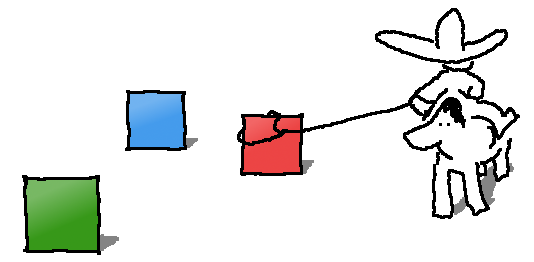

# GPU Bots & Pixel Wrangling

(December 2017: presentation on GPU bots and pixel wrangling: see [slides].)

GPU Pixel Wrangling is the process of keeping various GPU bots green. On the
GPU bots, tests run on physical hardware with real GPUs, not in VMs like the
majority of the bots on the Chromium waterfall.

[slides]: https://docs.google.com/presentation/d/1sZjyNe2apUhwr5sinRfPs7eTzH-3zO0VQ-Cj-8DlEDQ/edit?usp=sharing

[TOC]

## Fleet Status

The following links (sorry, Google employees only) show the status of various
GPU bots in the fleet.

Primary configurations:

*   [Windows 10 Quadro P400 Pool](http://shortn/_dmtaFfY2Jq)
*   [Windows 10 Intel HD 630 Pool](http://shortn/_QsoGIGIFYd)
*   [Linux Quadro P400 Pool](http://shortn/_fNgNs1uROQ)
*   [Linux Intel HD 630 Pool](http://shortn/_dqEGjCGMHT)
*   [Mac AMD Retina 10.12.6 GPU Pool](http://shortn/_BcrVmfRoSo)
*   [Mac Mini Chrome Pool](http://shortn/_Ru8NESapPM)
*   [Android Nexus 5X Chrome Pool](http://shortn/_G3j7AVmuNR)

Secondary configurations:

*   [Windows 7 Quadro P400 Pool](http://shortn/_cuxSKC15UX)
*   [Windows AMD R7 240 GPU Pool](http://shortn/_XET7RTMHQm)
*   [Mac NVIDIA Retina 10.12.6 GPU Pool](http://shortn/_jQWG7W71Ek)

## GPU Bots' Waterfalls

The waterfalls work much like any other; see the [Tour of the Chromium Buildbot
Waterfall] for a more detailed explanation of how this is laid out. We have
more subtle configurations because the GPU matters, not just the OS and release
v. debug. Hence we have Windows Nvidia Release bots, Mac Intel Debug bots, and
so on. The waterfalls we’re interested in are:

*   [Chromium GPU]
    *   Various operating systems, configurations, GPUs, etc.
*   [Chromium GPU FYI]
    *   These bots run less-standard configurations like Windows with AMD GPUs,
        Linux with Intel GPUs, etc.
    *   These bots build with top of tree ANGLE rather than the `DEPS` version.
    *   The [ANGLE tryservers] help ensure that these bots stay green. However,
        it is possible that due to ANGLE changes these bots may be red while
        the chromium.gpu bots are green.
    *   The [ANGLE Wrangler] is on-call to help resolve ANGLE-related breakage
        on this watefall.
    *   To determine if a different ANGLE revision was used between two builds,
        compare the `got_angle_revision` buildbot property on the GPU builders
        or `parent_got_angle_revision` on the testers. This revision can be
        used to do a `git log` in the `third_party/angle` repository.

<!-- TODO(kainino): update link when the page is migrated -->
[Tour of the Chromium Buildbot Waterfall]: http://www.chromium.org/developers/testing/chromium-build-infrastructure/tour-of-the-chromium-buildbot
[Chromium GPU]: https://ci.chromium.org/p/chromium/g/chromium.gpu/console?reload=120
[Chromium GPU FYI]: https://ci.chromium.org/p/chromium/g/chromium.gpu.fyi/console?reload=120
[ANGLE tryservers]: https://build.chromium.org/p/tryserver.chromium.angle/waterfall
<!-- TODO(kainino): update link when the page is migrated -->
[ANGLE Wrangler]: https://sites.google.com/a/chromium.org/dev/developers/how-tos/angle-wrangling

## Test Suites

The bots run several test suites. The majority of them have been migrated to
the Telemetry harness, and are run within the full browser, in order to better
test the code that is actually shipped. As of this writing, the tests included:

*   Tests using the Telemetry harness:
    *   The WebGL conformance tests: `webgl_conformance_integration_test.py`
    *   A Google Maps test: `maps_integration_test.py`
    *   Context loss tests: `context_lost_integration_test.py`
    *   Depth capture tests: `depth_capture_integration_test.py`
    *   GPU process launch tests: `gpu_process_integration_test.py`
    *   Hardware acceleration validation tests:
        `hardware_accelerated_feature_integration_test.py`
    *   Pixel tests validating the end-to-end rendering pipeline:
        `pixel_integration_test.py`
    *   Stress tests of the screenshot functionality other tests use:
        `screenshot_sync_integration_test.py`
*   `angle_unittests`: see `src/gpu/gpu.gyp`
*   drawElements tests (on the chromium.gpu.fyi waterfall): see
    `src/third_party/angle/src/tests/BUILD.gn`
*   `gles2_conform_test` (requires internal sources): see
    `src/gpu/gles2_conform_support/gles2_conform_test.gyp`
*   `gl_tests`: see `src/gpu/BUILD.gn`
*   `gl_unittests`: see `src/ui/gl/BUILD.gn`

And more. See `src/content/test/gpu/generate_buildbot_json.py` for the
complete description of bots and tests.

Additionally, the Release bots run:

*   `tab_capture_end2end_tests:` see
    `src/chrome/browser/extensions/api/tab_capture/tab_capture_apitest.cc` and
    `src/chrome/browser/extensions/api/cast_streaming/cast_streaming_apitest.cc`

### More Details

More details about the bots' setup can be found on the [GPU Testing] page.

[GPU Testing]: https://sites.google.com/a/chromium.org/dev/developers/testing/gpu-testing

## Wrangling

### Prerequisites

1.  Ideally a wrangler should be a Chromium committer. If you're on the GPU
pixel wrangling rotation, there will be an email notifying you of the upcoming
shift, and a calendar appointment.
    *   If you aren't a committer, don't panic. It's still best for everyone on
        the team to become acquainted with the procedures of maintaining the
        GPU bots.
    *   In this case you'll upload CLs to Gerrit to perform reverts (optionally
        using the new "Revert" button in the UI), and might consider using
        `TBR=` to speed through trivial and urgent CLs. In general, try to send
        all CLs through the commit queue.
    *   Contact bajones, kainino, kbr, vmiura, zmo, or another member of the
        Chrome GPU team who's already a committer for help landing patches or
        reverts during your shift.
1.  Apply for [access to the bots].
1.  You may want to install the [Flake linker] extension, which adds several useful features to the bot build log pages.
    *   Links to Chromium flakiness dashboard from build result pages, so you can see all failures for a single test across the fleet.
    *   Automatically hides green build steps so you can see the failure immediately.
    *   Turns build log links into deep links directly to the failure line in the log.

[access to the bots]: https://sites.google.com/a/google.com/chrome-infrastructure/golo/remote-access?pli=1
[Flake linker]: https://chrome.google.com/webstore/detail/flake-linker/boamnmbgmfnobomddmenbaicodgglkhc

### How to Keep the Bots Green

1.  Watch for redness on the tree.
    1.  [Sheriff-O-Matic now has support for the chromium.gpu.fyi waterfall]!
    1.  The chromium.gpu bots are covered under Sheriff-O-Matic's [Chromium
        tab]. As pixel wrangler, ignore any non-GPU test failures in this tab.
    1.  The bots are expected to be green all the time. Flakiness on these bots
        is neither expected nor acceptable.
    1.  If a bot goes consistently red, it's necessary to figure out whether a
        recent CL caused it, or whether it's a problem with the bot or
        infrastructure.
    1.  If it looks like a problem with the bot (deep problems like failing to
        check out the sources, the isolate server failing, etc.) notify the
        Chromium troopers and file a P1 bug with labels: Infra\>Labs,
        Infra\>Troopers and Internals\>GPU\>Testing. See the general [tree
        sheriffing page] for more details.
    1.  Otherwise, examine the builds just before and after the redness was
        introduced. Look at the revisions in the builds before and after the
        failure was introduced.
    1.  **File a bug** capturing the regression range and excerpts of any
        associated logs. Regressions should be marked P1. CC engineers who you
        think may be able to help triage the issue. Keep in mind that the logs
        on the bots expire after a few days, so make sure to add copies of
        relevant logs to the bug report.
    1.  Use the `Hotlist=PixelWrangler` label to mark bugs that require the
        pixel wrangler's attention, so it's easy to find relevant bugs when
        handing off shifts.
    1.  Study the regression range carefully. Use drover to revert any CLs
        which break the chromium.gpu bots. Use your judgment about
        chromium.gpu.fyi, since not all bots are covered by trybots. In the
        revert message, provide a clear description of what broke, links to
        failing builds, and excerpts of the failure logs, because the build
        logs expire after a few days.
1.  Make sure the bots are running jobs.
    1.  Keep an eye on the console views of the various bots.
    1.  Make sure the bots are all actively processing jobs. If they go offline
        for a long period of time, the "summary bubble" at the top may still be
        green, but the column in the console view will be gray.
    1.  Email the Chromium troopers if you find a bot that's not processing
        jobs.
1.  Make sure the GPU try servers are in good health.
    1.  The GPU try servers are no longer distinct bots on a separate
        waterfall, but instead run as part of the regular tryjobs on the
        Chromium waterfalls. The GPU tests run as part of the following
        tryservers' jobs:
        1.  <code>[linux_chromium_rel_ng]</code> on the [luci.chromium.try]
            waterfall
        1.  <code>[mac_chromium_rel_ng]</code> on the [luci.chromium.try]
            waterfall
            <!-- TODO(kainino): update link to luci.chromium.try -->
        1.  <code>[win7_chromium_rel_ng]</code> on the [tryserver.chromium.win]
            waterfall
    1.  The best tool to use to quickly find flakiness on the tryservers is the
        new [Chromium Try Flakes] tool. Look for the names of GPU tests (like
        maps_pixel_test) as well as the test machines (e.g.
        mac_chromium_rel_ng). If you see a flaky test, file a bug like [this
        one](http://crbug.com/444430). Also look for compile flakes that may
        indicate that a bot needs to be clobbered. Contact the Chromium
        sheriffs or troopers if so.
    1.  Glance at these trybots from time to time and see if any GPU tests are
        failing frequently. **Note** that test failures are **expected** on
        these bots: individuals' patches may fail to apply, fail to compile, or
        break various tests. Look specifically for patterns in the failures. It
        isn't necessary to spend a lot of time investigating each individual
        failure. (Use the "Show: 200" link at the bottom of the page to see
        more history.)
    1.  If the same set of tests are failing repeatedly, look at the individual
        runs. Examine the swarming results and see whether they're all running
        on the same machine. (This is the "Bot assigned to task" when clicking
        any of the test's shards in the build logs.) If they are, something
        might be wrong with the hardware. Use the [Swarming Server Stats] tool
        to drill down into the specific builder.
    1.  If you see the same test failing in a flaky manner across multiple
        machines and multiple CLs, it's crucial to investigate why it's
        happening. [crbug.com/395914](http://crbug.com/395914) was one example
        of an innocent-looking Blink change which made it through the commit
        queue and introduced widespread flakiness in a range of GPU tests. The
        failures were also most visible on the try servers as opposed to the
        main waterfalls.
1.  Check if any pixel test failures are actual failures or need to be
    rebaselined.
    1.  For a given build failing the pixel tests, click the "stdio" link of
        the "pixel" step.
    1.  The output will contain a link of the form
        <http://chromium-browser-gpu-tests.commondatastorage.googleapis.com/view_test_results.html?242523_Linux_Release_Intel__telemetry>
    1.  Visit the link to see whether the generated or reference images look
        incorrect.
    1.  All of the reference images for all of the bots are stored in cloud
        storage under [chromium-gpu-archive/reference-images]. They are indexed
        by version number, OS, GPU vendor, GPU device, and whether or not
        antialiasing is enabled in that configuration. You can download the
        reference images individually to examine them in detail.
1.  Rebaseline pixel test reference images if necessary.
    1.  Follow the [instructions on the GPU testing page].
    1.  Alternatively, if absolutely necessary, you can use the [Chrome
        Internal GPU Pixel Wrangling Instructions] to delete just the broken
        reference images for a particular configuration.
1.  Update Telemetry-based test expectations if necessary.
    1.  Most of the GPU tests are run inside a full Chromium browser, launched
        by Telemetry, rather than a Gtest harness. The tests and their
        expectations are contained in [src/content/test/gpu/gpu_tests/] . See
        for example <code>[webgl_conformance_expectations.py]</code>,
        <code>[gpu_process_expectations.py]</code> and
        <code>[pixel_expectations.py]</code>.
    1.  See the header of the file a list of modifiers to specify a bot
        configuration. It is possible to specify OS (down to a specific
        version, say, Windows 7 or Mountain Lion), GPU vendor
        (NVIDIA/AMD/Intel), and a specific GPU device.
    1.  The key is to maintain the highest coverage: if you have to disable a
        test, disable it only on the specific configurations it's failing. Note
        that it is not possible to discern between Debug and Release
        configurations.
    1.  Mark tests failing or skipped, which will suppress flaky failures, only
        as a last resort. It is only really necessary to suppress failures that
        are showing up on the GPU tryservers, since failing tests no longer
        close the Chromium tree.
    1.  Please read the section on [stamping out flakiness] for motivation on
        how important it is to eliminate flakiness rather than hiding it.
1.  For the remaining Gtest-style tests, use the [`DISABLED_`
    modifier][gtest-DISABLED] to suppress any failures if necessary.

[Sheriff-O-Matic now has support for the chromium.gpu.fyi waterfall]: https://sheriff-o-matic.appspot.com/chromium.gpu.fyi
[Chromium tab]: https://sheriff-o-matic.appspot.com/chromium
[tree sheriffing page]: https://sites.google.com/a/chromium.org/dev/developers/tree-sheriffs
[linux_chromium_rel_ng]: https://ci.chromium.org/p/chromium/builders/luci.chromium.try/linux_chromium_rel_ng
[luci.chromium.try]: https://ci.chromium.org/p/chromium/g/luci.chromium.try/builders
[mac_chromium_rel_ng]: https://ci.chromium.org/p/chromium/builders/luci.chromium.try/mac_chromium_rel_ng
[tryserver.chromium.mac]: https://ci.chromium.org/p/chromium/g/tryserver.chromium.mac/builders
[win7_chromium_rel_ng]: https://ci.chromium.org/buildbot/tryserver.chromium.win/win7_chromium_rel_ng/
[tryserver.chromium.win]: https://ci.chromium.org/p/chromium/g/tryserver.chromium.win/builders
[Chromium Try Flakes]: http://chromium-try-flakes.appspot.com/
<!-- TODO(kainino): link doesn't work, but is still included from chromium-swarm homepage so not removing it now -->
[Swarming Server Stats]: https://chromium-swarm.appspot.com/stats
[chromium-gpu-archive/reference-images]: https://console.developers.google.com/storage/chromium-gpu-archive/reference-images
[instructions on the GPU testing page]: https://sites.google.com/a/chromium.org/dev/developers/testing/gpu-testing#TOC-Updating-and-Adding-New-Pixel-Tests-to-the-GPU-Bots
[Chrome Internal GPU Pixel Wrangling Instructions]: https://sites.google.com/a/google.com/client3d/documents/chrome-internal-gpu-pixel-wrangling-instructions
[src/content/test/gpu/gpu_tests/]: https://chromium.googlesource.com/chromium/src/+/master/content/test/gpu/gpu_tests/
[webgl_conformance_expectations.py]: https://chromium.googlesource.com/chromium/src/+/master/content/test/gpu/gpu_tests/webgl_conformance_expectations.py
[gpu_process_expectations.py]: https://chromium.googlesource.com/chromium/src/+/master/content/test/gpu/gpu_tests/gpu_process_expectations.py
[pixel_expectations.py]: https://chromium.googlesource.com/chromium/src/+/master/content/test/gpu/gpu_tests/pixel_expectations.py
[stamping out flakiness]: gpu_testing.md#Stamping-out-Flakiness
[gtest-DISABLED]: https://github.com/google/googletest/blob/master/googletest/docs/AdvancedGuide.md#temporarily-disabling-tests

### When Bots Misbehave (SSHing into a bot)

1.  See the [Chrome Internal GPU Pixel Wrangling Instructions] for information
    on ssh'ing in to the GPU bots.

[Chrome Internal GPU Pixel Wrangling Instructions]: https://sites.google.com/a/google.com/client3d/documents/chrome-internal-gpu-pixel-wrangling-instructions

### Reproducing WebGL conformance test failures locally

1.  From the buildbot build output page, click on the failed shard to get to
    the swarming task page. Scroll to the bottom of the left panel for a
    command to run the task locally. This will automatically download the build
    and any other inputs needed.
2.  Alternatively, to run the test on a local build, pass the arguments
    `--browser=exact --browser-executable=/path/to/binary` to
    `content/test/gpu/run_gpu_integration_test.py`.
    Also see the [telemetry documentation].

[telemetry documentation]: https://cs.chromium.org/chromium/src/third_party/catapult/telemetry/docs/run_benchmarks_locally.md

## Extending the GPU Pixel Wrangling Rotation

See the [Chrome Internal GPU Pixel Wrangling Instructions] for information on extending the rotation.

[Chrome Internal GPU Pixel Wrangling Instructions]: https://sites.google.com/a/google.com/client3d/documents/chrome-internal-gpu-pixel-wrangling-instructions
