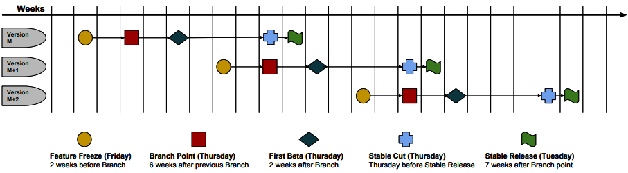

# Chrome Release Cycle

[TOC]

## Overview

Chrome pushes a new stable version to the public every 6 weeks while
taking 7 weeks to stabilize the beta branch.

## Schedule

* Feature freeze and branch point dates are fixed, but release dates may change
depending on the build quality.
* There would be some adjustment in the release schedule due to Chrome no
meeting weeks or holidays.

## Key Dates

### Feature Freeze

**2 weeks** before the branch point, the feature freeze is declared! Any feature
planned to launch with this milestone should be code-complete (its
implementation should be done) and enabled on Trunk/Canary so that the test team
can give initial feedback. By the feature freeze, all strings must be landed!

### Branch Point

**Every 6 weeks**, the latest canary is declared as the new milestone
stabilization branch with a number (used as the branch name) associated with it.
The feature enhancement should be completed by the branch point and all
ReleaseBlock-Beta bugs should be fixed. Avoid committing big and risky changes
close to the branch point!

### First Beta

**2 weeks** after the branch point, the first beta release is pushed. All
disabled tests associated with the release milestone should be completely
addressed. New beta builds are pushed weekly until the stable release.

### Stable Cut

The Thursday before the stable release date, the last build from the beta branch
is cut as the release build. All ReleaseBlock-Stable bugs should be fixed by the
stable cut, which consequently corresponds to the absolute last date a merge to
the release branch should be taken for inclusion in the initial stable release.
The stable cut will, unless there are exceptions, use the final beta as its
basis. For Chrome OS, the stable cut date may be different than the rest of
Chrome.

### Stable Release

**7 weeks** after the branch point a new major version is released. The
stable rollout is staged over time so that any issues can be detected early and
addressed before they reach all users. Each Chrome platform has a different
stable rollout plan and the schedule below can vary based on circumstances:

*  **Desktop**: Desktop consists of three main platforms, Windows, Mac, and
Linux. Linux is ramped up to 100% immediately. Mac and Windows follow a
staged rollout as follows:
    * 5% deployment ->15% deployment ->50% deployment ->100% deployment.
*  **Android**: Android releases both Chrome and WebView with each release, and
follows a pattern similar to:
    * 1% deployment -> 5% deployment -> 10% deployment -> 50% deployment
    -> 100% deployment.
*  **iOS**: iOS follows a phased release with no control over the following
rollout percentage schedule:
    * Day 1: 1% -> Day 2: 2% -> Day 3: 5% -> Day 4: 10% -> Day 5: 20%
    -> Day 6: 50% -> Day 7: 100%.

### Stable Refresh

A stable refresh is defined as a release of a new Chrome build outside of the
normal release schedule to fix critical bugs detected during the stable rollout.
Except for extremely critical issues (e.g. security or privacy escalations),
a Chrome stable refresh should not be pushed more than **2 weeks** after the
initial build has been released to the public. In this case, we should consider
punting any detected production issues to the next release.

## More Info

For more information, see these [guidelines for considering branch dates in project planning](../release_branch_guidance.md).
