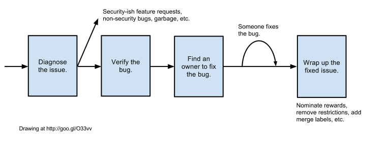

# Security Sheriff

[TOC]

## Important Links

[Chrome Open Security Bugs dashboard,
go/chrome-security-bugs](http://go/chrome-security-bugs).

[Vulnerability Severity Guidelines](severity-guidelines.md).

[Security Labels](security-labels.md).

[Sheriff Handoff Log](http://go/chrome-security-sheriff-handoff) (Googlers
only).

You might also like the [HOWTO: Be A Security Sheriff
deck](https://docs.google.com/presentation/d/1eISJXxyv7dUCGUKk_rvUI9t9s2xb98QY4d_-dZSa7Wg/edit#slide=id.p).

## What Is A Security Sheriff?

A security sheriff is a member of a rotation that occurs in 1-week time slots,
starting on Tuesdays and ending the following Monday. [Here is the rotation
schedule](https://docs.google.com/spreadsheets/d/10sLYZbi6QfLcXrhO-j5eSc82uc7NKnBz_o1pR9y8h7U/edit#gid=0).

Sheriffs ensure that all incoming security issues are triaged quickly and
correctly. We aim to have get every bug triaged and assigned within 48 hours
(preferably 24). This includes weekends, so it's good for sheriffs to check in
once on a weekend and see if there are any emergencies.

Sheriffing is not an on-call rotation, however. Sheriffs don't have to work
nights or to do more than a few minutes' work on weekends.

## I'm The Security Sheriff. What Do I Do?

Each week has a primary and secondary sheriff, and during their rotation both
have various important and overlapping responsibilities:

### Primary Sheriff

* Look at every incoming security bug report on the
[dashboard](http://go/chrome-security-bugs). Ensure each is accurately triaged,
and actively progressing towards getting fixed.
* Keep the [Sheriff Handoff Log](http://go/chrome-security-sheriff-handoff) up
to date.
* Shout for help if the incoming bug rate is too high ([suggested vocal
exercises](https://youtu.be/5y_SbnPx_cE?t=37s)). The first person to ask is
the secondary sheriff.
* Stay sharp, keep in shape ([hand-stand
pushups](https://www.youtube.com/watch?v=jZ1ZDlLImF8#t=50) are standard for the
primary sheriff), and remember you may be [called upon during
emergencies](https://www.youtube.com/watch?v=buHaKYL9Jhg).

### Secondary Sheriff

* Ensure that all incoming queries to the
[security@chromium.org](https://groups.google.com/a/chromium.org/forum/#!forum/security)
and
[chrome-security@google.com](https://groups.google.com/a/google.com/forum/#!forum/chrome-security)
lists get a reply (by someone; not necessarily the sheriffs themselves).
  * Note: external emails will always come in on security@chromium.org as
chrome-security@google.com is a google-only list, but both need to be triaged.
* Ensure [accurate label management](security-labels.md) on bugs, for example
applying the correct **Merge-?** and **Restrict-View-?** labels when a bug
transitions to **Fixed**.
* Change bugs status to **Fixed** for those that the developer forgets to
close. Make sure to read bug comments where developer might point out that it
needs more CLs, et c. Wait 24 hours before closing ClusterFuzz bugs, to give
ClusterFuzz a chance to close it automatically.
* Look at open security bug reports and check that progress is occurring.
* Generally keep an eye on all bug traffic in case anything needs action or
replying to.
* Stay sharp, keep in shape ([finger
exercises](https://youtu.be/20elMaVZ9lg?t=47s) are standard for the secondary
sheriff), and remember you may be called upon during emergencies.

## Life Of A Security Bug

Do as much as you can for the week to triage, shepherd, and wrap up open
security bugs. What follows are the details of what that entails, but it
practically means turning all the red cells in the dashboard to green. **If
you're ever stuck or in doubt, ask for help on #chrome-security!**

[link](https://twitter.com/__apf__/status/728776130564526080)

### Diagnose The Issue

* **If the report is invalid**, remove the **Restrict-View-SecurityTeam** label
and mark it **WontFix**.
* **If the report is a duplicate**, mark it **Duplicate**. If the issue this is
a duplicate of is public, remove the **Restrict-View-SecurityTeam** label.
* **If the report is primarily a privacy issue**, send it to the privacy team:
  * Add the **Privacy** component so that it enters their triage queue
  * CC any security team members, including yourself, who may be interested in
  the privacy issue
	* Change the **Restrict-View-SecurityTeam** label to
  **Restrict-View-ChromePrivacy**
    * Note that security team members don't automatically have privacy bug
    access, so this will probably make the issue inaccessible to you.
* **If the report is asking about why something is or is not on the Safe
Browsing list:**
  * Assign it to zbutler@, who will triage it for the Safe Browsing team
	* Remove the **Restrict-View-SecurityTeam** label and add the
  **Restrict-View-Google** label
  * Change **Type-Bug-Security** label to **Type-Bug**
  * Add the **Security** component
  * See below for reporting URLs to SafeBrowsing
* **If the report is a potentially valid bug but is not a security vulnerability:**
  * remove the **Restrict-View-SecurityTeam** label. If necessary, add one of the
  other **Restrict-View-?** labels:
    * **Restrict-View-Google** if this is a crash report
    * **Restrict-View-EditIssue** if the bug can be abused (e.g. denial of service)
	* Change **Type-Bug-Security** label to **Type-Bug** (or whatever **Type-?**
  is appropriate)
  * Add appropriate component or CCs to ensure it does get triaged
  * Add the **Security** component or the **Team-Security-UX** label if the security
team should still track the issue (e.g. security features).
* **If the report doesn't have enough information**, ask the reporter for more
information, add the **Needs-Feedback** label and wait for 24 hours for a response.
* **If the report smells like a vulnerability, keep going.**

### Verify And Label The Bug

#### Step 1. Reproduce legitimate-sounding issues.

If you can't reproduce the issue, ask for help on IRC (#chrome-security) or the
Chrome Security chat, or find an area owner to help.

Tips for reproducing bugs:

* [https://clusterfuzz.com/v2/upload-testcase](https://clusterfuzz.com/v2/upload-testcase)
allows you to upload files to reproduce crashes on various platforms and will
identify revision ranges when the regression was introduced. If a test case
requires multiple files, they can be uploaded together in a zip or tar archive.
* When you can't just build from a specific branch locally, check out
[https://dev.chromium.org/getting-involved/dev-channel](https://dev.chromium.org/getting-involved/dev-channel)
or
[https://commondatastorage.googleapis.com/chromium-browser-asan/index.html](https://commondatastorage.googleapis.com/chromium-browser-asan/index.html)
for latest release of a specific version.
* There are many tools available to help you reproduce various memory issues
reliably. If you aren't already familiar with them, check out
[AddressSanitizer](https://www.chromium.org/developers/testing/addresssanitizer),
[MemorySanitizer](https://www.chromium.org/developers/testing/memorysanitizer),
[ThreadSanitizer](https://www.chromium.org/developers/testing/threadsanitizer-tsan-v2),
and
[UndefinedBehaviorSanitizer](https://www.chromium.org/developers/testing/undefinedbehaviorsanitizer).
* If you run into issues with a reproducible ClusterFuzz test case (like
missing symbols, or if anything else seems off), try uploading the test case
again using a different job type with a more mature tool (e.g. ASan on Linux).
It may give more complete information.

#### Step 2. Assess the severity.

[See the severity guidelines](severity-guidelines.md). If it's a critical
vulnerability, act quick! We aim to get users patched in < 30 days. Remember
that if something requires an unusual configuration or complicated user
interaction, the severity rating should be lowered.

Bug chains are typically composed of several individual security bugs and
should be split into a new bug for each potential fix required, so this allows
each team to work on fixing their part of the chain. In cases like this, leave
the main bug as the severity/priority of the full chain, and mark child bugs as
being blockers of the parent bug each with their own separate severity. Each
child bug can have its own priority. Examples of this in action are [issue
352369](https://crbug.com/352369) and [issue 453937](https://crbug.com/453937).

#### Step 3. [Label, label, label](security-labels.md).

Much of Chrome's development and release process depends on bugs having the
right labels and components. Labels and components are vitally important for
our metrics, the visiblity of bugs, and tracking our progress over time.

Labels to **double-check** (that should already be there if the bug was filed
using the Security template):

* **Restrict-View-SecurityTeam**
* **Type-Bug-Security**
* **If the reporter wants to remain anonymous or if the bug description or
comments contain PII**, add **Restrict-View-SecurityEmbargo**.

Generally, see [the Security Labels document](security-labels.md).

**Ensure the comment adequately explains any status changes.** Severity,
milestone, and priority assignment generally require explanatory text.

* Report suspected malicious URLs to SafeBrowsing:
  * Public URL:
  [https://support.google.com/websearch/contact/safe_browsing](https://support.google.com/websearch/contact/safe_browsing)
  * Googlers: see instructions at [go/safebrowsing-escalation](https://goto.google.com/safebrowsing-escalation)
  * Report suspected malicious file attachments to SafeBrowsing and VirusTotal.
* Make sure the report is properly forwarded when the vulnerability is in an
upstream project, the OS, or some other dependency.
* For vulnerabilities in services Chrome uses (e.g. Omaha, Chrome Web Store,
SafeBrowsing), make sure the affected team is informed and has access to the
necessary bugs.

##### Labeling For Chrome On iOS

* Reproduce using iOS device, desktop Safari, or [Browserstack](http://browserstack.com/)
* Assign severity, impact, milestone, and component labels
* CC Apple friends (if you don't know who they are, ping awhalley@)
* Label **ExternalDependency**
* File the bug at [bugs.webkit.org](https://bugs.webkit.org) or with
  product-security@apple.com.

### Find An Owner To Fix The Bug

That owner can be you! Otherwise, this is one of the more grey areas of
sheriffing. With experience, you'll figure out good goto people for certain
areas. Until then, here are some tips.

**Determine the correct component before continuing.** It's not enough on its
own, but it's a good starting point. Many components will automatically apply
some CCs who may be able to help you out. If it's a crash bug, see if
ClusterFuzz is able to provide one (will appear in the same card as the culprit
CL). You can also use `git hyper-blame` and check OWNERS files to see who might
own the relevant code.

**For crashes, check to see if ClusterFuzz provides a culprit CL.** Before you
assign a bug based on this, do a quick sanity check to ensure the CL could have
caused the bug. If the result seems wrong, apply the Test-Predator-Wrong label
to the bug and keep going.

If you're able to narrow this to a specific regression range, usually from
ClusterFuzz for crash bugs, do a quick pass over the git log to see if any CLs
stand out. If you aren't sure, don't be afraid to add CCs to the bug and ask!

At this point, you'll probably need to dive in and attempt to root cause the
bug, which is another complicated grey area that you'll figure out with
experience. Try not to spend too much time for this on any given bug, as some
cases will simply be too difficult without a deep understanding of certain
portions of the codebase.

* If you can narrow the bug to a specific file or block of code, or if
something stands out as suspicious, try to assign an owner based on `git
hyper-blame` or add some CCs based on OWNERS files
* If not, consider searching in the issue tracker for people that fixed
similar bugs or bugs in similar areas of the code base, such as issues with the
same components, recently. For example, let's say you were trying to figure out
a good person to assign a Content>Fonts issue. Look for "status=fixed,
verified" and query by when the issues were closed after (i.e. w/ in the last
30 days == closed>today-30).

A few components have their own triage processes or points of contact who can
help.

* V8 bugs? Look for V8 rolls within the regression range, then look within the
CLs of those rolls to find possible culprits. If you are unable to find the
culprit CL, assign to the [V8 ClusterFuzz
Sheriff](https://rotation.googleplex.com/status?id=5714662985302016) for
triage. Note that V8 CHECK failure crashes can have security implications, so
don't triage it yourself and instead assign it to V8 ClusterFuzz Sheriff. He or
she can make an informed decision on whether it is a security vulnerability or
not and whether it is safe to strip the security tags (**Type=Bug-Security**,
**Restrict-View-SecurityTeam**).
* Skia bugs? If you made it this far and still aren't sure, assign them to
hcm@chromium.org. Be careful while triaging these! The place where we're
crashing isn't necessarily the place where the bug was introduced, so blame may
be misleading.
* URL spoofing issues, especially related to RTL or IDNs? See
[go/url-spoofs](go/url-spoofs) for a guide to triaging these.

Still stuck? Ask #chrome-security or someone from
[go/chrome-security-secondary-sheriffs](https://goto.google.com/chrome-security-secondary-sheriffs)
for help! That's why we're here. Don't be afraid to do this!

Make sure that the person you assign to handle a bug is not OOO. And,
generally, explicitly CC more than 1 person on the bug, if possible, and
preferably people from more than 1 geographic region. (See the OWNERS file(s)
that affect(s) the relevant area of code.)

**Sometimes, finding an owner isn't enough to ensure that a bug will get
fixed.** Check the stale bug list on the security dashboard and try resolve
some of the problems that might be blocking these issues. If you get in touch
with a bug owner off of the issue tracker, be sure to have them update the bug
so that future sheriffs are aware of the status.

> Q: Why isn’t setting the component alone good enough?
>
> A: CCs are critical because just assigning to a component is ineffective
> because the component’s team cannot see the issues unless they have the
> Security View permissions.

### Using The Permission API Kill Switch

If you find a vulnerability in a Permission API and need to use the Global
Permissions Kill Switch, then follow [the
instructions](https://docs.google.com/document/d/17JeYt3c1GgghYoxy4NKJnlxrteAX8F4x-MAzTeXqP4U)

### Wrap Up The Fixed Issue

1. For any **Security_Severity-**{**Critical**, **High**, **Medium**} bugs that
**Security_Impact-**{**Beta**, **Stable**}, add **Merge-Requested** so that the
fix gets merged into the next release. Exercise discretion according to
security severity and risk associated with the bug fix; you can ask the patch
author whether any risky code paths are affected. The actual merging and
drafting of release notes is taken care of by the [security release management
role](https://www.chromium.org/Home/chromium-security/security-release-management).
1. Chrome's [Vulnerability Rewards
Program](https://www.google.com/about/appsecurity/chrome-rewards/index.html)
TPM adds the **reward-topanel** label by mass modification, but **do** label any
bugs reported by a @chromium.org email that should be rewarded (e.g. "I'm
filing this on behalf of" or the like).

## End Of Rotation

Update the [Sheriff Handoff Log](http://go/chrome-security-sheriff-handoff).
