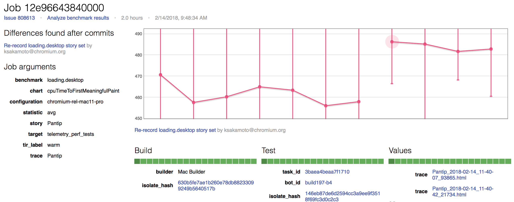
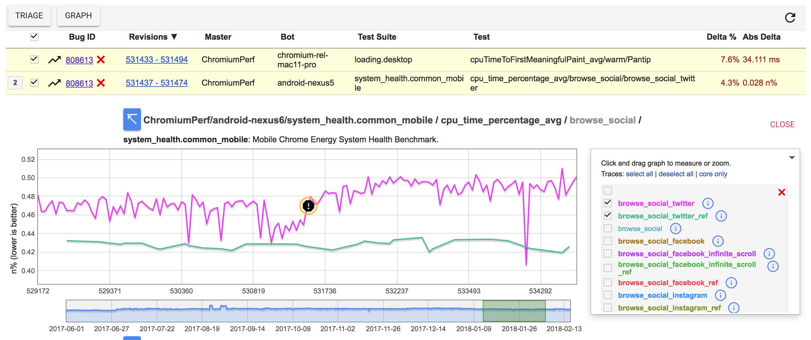

# Addressing Performance Regressions

The bisect bot just picked your CL as the culprit in a performance regression
and assigned a bug to you! What should you do? Read on...

[TOC]

## About our performance tests

The [chromium.perf waterfall](perf_waterfall.md) is a continuous build which
runs performance tests on dozens of devices across Windows, Mac, Linux, and
Android Chrome and WebView. Often, a performance regression only affects a
certain type of hardware or a certain operating system, which may be different
than what you tested locally before landing your CL.

Each test has an owner, named in
[this spreadsheet](https://docs.google.com/spreadsheets/d/1xaAo0_SU3iDfGdqDJZX_jRV0QtkufwHUKH3kQKF3YQs/edit#gid=0),
who you can cc on a performance bug if you have questions.

## Understanding the bisect results

### The bug comment

The bisect service spits out a comment on the bug that looks like this:

> **📍 Found significant differences after each of 2 commits.**<br>
> https://pinpoint-dot-chromeperf.appspot.com/job/148a8d4e840000
>
> **Add smcgruer as an animations OWNER** by flackr@chromium.org<br>
> https://chromium.googlesource.com/chromium/src/+/b091c264862d26ac12d932e84eef7bd5f674e62b
>
> **Roll src/third_party/depot_tools/ 0f7b2007a..fd4ad2416 (1 commit)**
> by depot-tools-roller@chromium.org<br>
> https://chromium.googlesource.com/chromium/src/+/14fc99e3fd3614096caab7c7a8362edde8327a5d
> 
> Understanding performance regressions:<br>
> &nbsp;&nbsp;http://g.co/ChromePerformanceRegressions

The bug comment gives a summary of that commits that caused improvements or
regressions. For more details, click the link at the beginning of the comment
to go to the Pinpoint Job details page.

### The Job details page

Clicking the Pinpoint link in the bug comment brings you to the Job details
page.



Down the left you can see some details about the bisect configuration, including
the benchmark (`loading.desktop`) and story (`Pantip`) that ran, the bot it ran
on (`chromium-rel-mac11-pro`), and the metric that was measured
(`cpuTimeToFirstMeaningfulPaint`). If you're not familiar with the benchmark or
metric, you can cc the
[benchmark owner](https://docs.google.com/spreadsheets/d/1xaAo0_SU3iDfGdqDJZX_jRV0QtkufwHUKH3kQKF3YQs/edit#gid=0)
to ask for help.

The graph in the middle of the page shows a summary of the commits that were
tested across the x-axis and their results on the y-axis. The dots show the
medians, and the bars show the min and max. These can be used to estimate the
size of the regression. The units are not available on this page, but are on the
performance graphs linked on the bug in comment #1.

Click the `+` button in the bottom-right corner of the page to test a patch with
the current configuration.

### The alerts page

Comment 1 on the bug will have a link to the perf dashboard graphs for the
regression. (`https://chromeperf.appspot.com/group_report?bug_id=XXX`)



The graphs will give you an idea how widespread the regression is. The `Bot`
column shows all the different bots the regression occurred on, and the
`Test` column shows the metrics it regressed on. Often, the same metric
is gathered on many different web pages. If you see a long list of
pages, it's likely that the regression affects most pages; if it's
short, maybe your regression is an edge case. The size of the regressions on
each bot are also in the table in both relative and absolute terms.

## Debugging regressions

### How do I run the test?

It's best to [run a perf tryjob](perf_trybots.md), since the machines in the lab
are set up to match the device and software configs as the perf waterfall,
making the regression more likely to reproduce. From the Pinpoint Job page,
clicking the `+` button in the bottom-right corner to test a patch with the
current configuration.

You can also run locally:
```
src$ tools/perf/run_benchmark benchmark_name --story-filter story_name
```

### Can I get a trace?

For most metrics, yes. Here are the steps:

1. Click on the `All graphs for this bug` link in comment #1. It should
   look like this:
   `https://chromeperf.appspot.com/group_report?bug_id=XXXX`

2. Select a bot/test combo that looks like what the bisect bot originally
   caught. You might want to look through various regressions for a really
   large increase.

3. On the graph, click on the exclamation point icon at the regression, and
   a tooltip comes up. There is a "trace" link in the tooltip, click it to
   open a the trace that was recorded during the performance test.

4. There is also a "Request Debug Trace" button, which kicks off a tryjob with
   all of the debug trace categories enabled.

### Wait, what's a trace?

See the
[documentation on tracing](https://www.chromium.org/developers/how-tos/trace-event-profiling-tool)
to learn how to use traces to debug performance issues.

### Are there debugging tips specific to certain benchmarks?

* [Memory](https://chromium.googlesource.com/chromium/src/+/master/docs/memory-infra/memory_benchmarks.md)
* [Android binary size](apk_size_regressions.md)

## If you don't believe your CL could be the cause

> Please remember that our performance tests exist to catch unexpected
regressions. Often, the tests catch performance problems the CL author was
not aware of. Please look at the data carefully and understand what the test
is measuring before concluding that your CL is not related.

There are some clear reasons to believe the bisect bot made a mistake:

  * Your CL changes a test or some code that isn't compiled on the platform
    that regressed.
  * Your CL is completely unrelated to the metric that regressed.
  * You looked at the numbers the bisect spit out (see example above; the first
    column is the revision, the second column is the value at that revision,
    and the third column is the standard deviation), and:
    * The change attributed to your CL seems well within the noise, or
    * The change at your CL is an improvement (for example, the metric is bytes
      of memory used, and the value goes **down** at your CL) or
    * The change is far smaller that what's reported in the bug summary (for
      example, the bug says there is a 15% memory regression but the bisect
      found that your CL increases memory by 0.77%)

Do the following:

  * Add a comment to the bug explaining why you believe your CL is not the
    cause of the regression.
  * **Unassign yourself from the bug**. This lets our triage process know that
    you are not actively working on the bug.
  * Kick off another bisect. You can do this by:
    1. Click on the `All graphs for this bug` link in comment #1. It should
       look like this:
       `https://chromeperf.appspot.com/group_report?bug_id=XXXX`
    2. Sign in to the dashboard with your chromium.org account in the upper
       right corner.
    3. Select a bot/test combo that looks like what the bisect bot originally
       caught. You might want to look through various regressions for a really
       clear increase.
    4. On the graph, click on the exclamation point icon at the regression, and
       a tooltip comes up. Click the `Bisect` button on the tooltip.


## If you believe the regression is justified

Sometimes you are aware that your CL caused a performance regression, but you
believe the CL should be landed as-is anyway. Chrome's
[core principles](https://www.chromium.org/developers/core-principles) state:

> If you make a change that regresses measured performance, you will be required to fix it or revert.

**It is your responsibility to justify the regression.** You must add a comment
on the bug explaining your justification clearly before WontFix-ing.

Here are some common justification scenarios:

  * **Your change regresses this metric, but is a net positive for performance.**
    There are a few ways to demonstrate that this is true:
    * **Use benchmark results.** If your change has a positive impact, there
      should be clear improvements detected in benchmarks. You can look at all
      the changes (positive and negative) the perf dashboard detected by
      entering the commit position of a change into this url:
      `https://chromeperf.appspot.com/group_report?rev=YOUR_COMMIT_POS_HERE`
      All of these changes are generally changes found on a CL range, and may
      not be attributable to your CL. You can bisect any of these to find if
      your CL caused the improvement, just like you can bisect to find if it
      caused the regression.
    * **Use finch trial results.** There are some types of changes that cannot
      be measured well in benchmarks. If you believe your case falls into this
      category, you can show that end users are not affected via a finch trial.
      See the "End-user metrics" section of
      [How Chrome measures performance](how_does_chrome_measure_performance.md#End_user-metrics)
  * **Your change is a critical correctness or security fix.**
    It's true that sometimes something was "fast" because it was implemented
    incorrectly. In this case, a justification should clarify the performance
    cost we are paying for the fix and why it is worth it. Some things to
    include:
    * **What did the benchmark regression cost?** Look at the
      list of regressions in bug comment 1:
      `https://chromeperf.appspot.com/group_report?bug_id=XXXX`
      What is the absolute cost (5MiB RAM? 200ms on page load?)
      How many pages regressed? How many platforms?
    * **What do we gain?** It could be something like:
      * Reduced code complexity
      * Optimal code or UI correctness
      * Additional security
      * Knowledge via an experiment
      * Marketing - something good for users
    * **Is there a more performant way to solve the problem?**
      The [benchmark owner](https://docs.google.com/spreadsheets/d/1xaAo0_SU3iDfGdqDJZX_jRV0QtkufwHUKH3kQKF3YQs/edit#gid=0)
      can generally give you an idea how much work it would take to make a
      similarly-sized performance gain. For example, it might take 1.5
      engineering years to save 3MiB of RAM on Android; could you solve the
      problem in a way that takes less memory than that in less than 1.5 years?
  * **This performance metric is incorrect.** Not all tests are perfect. It's
    possible that your change did not regress performance, and only appears to
    be a problem because the test is measuring incorrectly. If this is the
    case, you must explain clearly what the issue with the test is, and why you
    believe your change is performance neutral. Please include data from traces
    or other performance tools to clarify your claim.

**In all cases,** make sure to cc the [benchmark owner](https://docs.google.com/spreadsheets/d/1xaAo0_SU3iDfGdqDJZX_jRV0QtkufwHUKH3kQKF3YQs/edit#gid=0)
when writing a justification and WontFix-ing a bug. If you cannot come to an
agreement with the benchmark owner, you can escalate to benhenry@chromium.org,
the owner of speed releasing.
