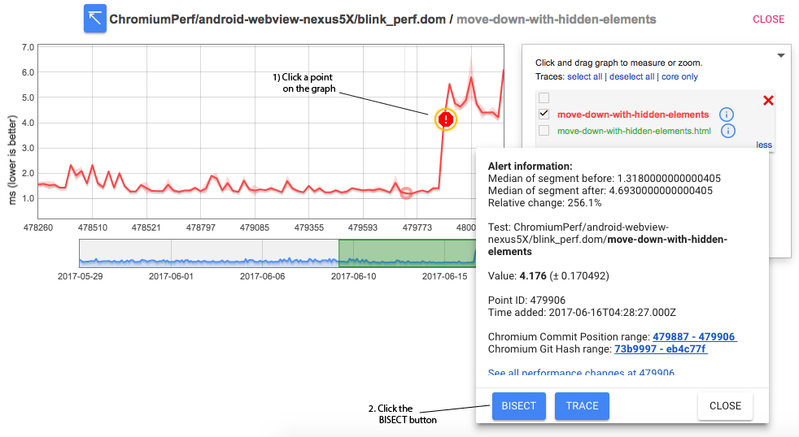
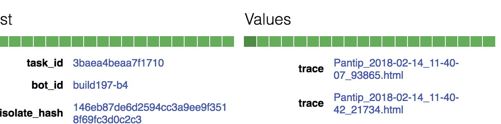

# Bisecting Performance Regressions

The perf tests on chromium's continuous build are very long-running, so we
cannot run them on every revision. Further, separate repositories like v8
and skia sometimes roll multiple performance-sensitive changes into chromium
at once. For these reasons, we need a tool that can bisect the root cause of
performance regressions over a CL range, descending into third_party
repositories as necessary. The name of the service that does this is called
[Pinpoint](https://pinpoint-dot-chromeperf.appspot.com/).

[TOC]

## Starting a perf bisect

Performance bisects are integrated with the
[Chrome Performance Dashboard](https://chromeperf.appspot.com/alerts) and
[monorail](https://bugs.chromium.org/p/chromium/issues/list). Users kick off
perf bisects on the perf dashboard and view results in monorail.

You can kick off perf bisect from performance graphs on the perf dashboard for
any test that runs on the
[chromium.perf waterfall](https://ci.chromium.org/p/chromium/g/chromium.perf/builders).

### To get to a graph, use one of the following methods:

  * From a perf sheriff-filed bug, follow the link in #1 that looks like
    `https://chromeperf.appspot.com/group_report?bug_id=XXXXXX`. Check the
    boxes next to alerts in the table to display graphs.
  * From the [alerts page](https://chromeperf.appspot.com/alerts), check the
    box next to an alert and click the `Graph` button.
  * From the [report page](https://chromeperf.appspot.com/report), use the menu
    to navigate to the graph you want.

### To kick off a bisect from the graph:

  1. Click on a data point in the graph.
  2. In the tooltip that shows up, click the `BISECT` button.
  3. Make sure to enter a Bug ID in the dialog that comes up.
  4. Click the `CREATE` button.

### What are all the boxes in the form?

  * **Bug ID**: The bug number in monorail. It's very important to fill in
    this field, as this is where bisect results will be posted.
  * **Start commit**: The chromium commit pos to start bisecting from. This
    is prefilled by the dashboard to the start of the revision range for the
    point you clicked on. You can set it to an earlier commit position to
    bisect a larger range.
  * **End commit**: The chromium commit pos to bisect to. This is prefilled
    by the dashboard to the end of the revision range for the point you clicked
    on. You can set it to a later commit pos to bisect a larger range.
  * **Story Filter**: This is a flag specific to
    [telemetry](https://github.com/catapult-project/catapult/blob/master/telemetry/README.md).
    It tells telemetry to only run a specific test case, instead of running all
    the test cases in the suite. This dramatically reduces bisect time for
    large test suites. The dashboard will prefill this box based on the graph
    you clicked on. If you suspect that test cases in the benchmark are not
    independent, you can try bisecting with this box cleared.
  * **Performance or functional**: use "performance" to bisect on a performance
    metric, or "functional" to bisect on a test failure or flake.

## Interpreting the results

The bisect bot will output a comment on the bug when the bisection is complete. See
[Understanding the Bisect Results](addressing_performance_regressions.md#Understanding-the-bisect-results)
for details on how to interpret the results.

### Traces and stdout

On the Job result page, there is a line chart. Each dot represents a commit. The bisect culprits are represented by flashing dots. Clicking on a dot reveals some colored bars; each box represents one benchmark run. Click on one of the runs to see trace links. Click on the `task_id` link to see the stdout.

