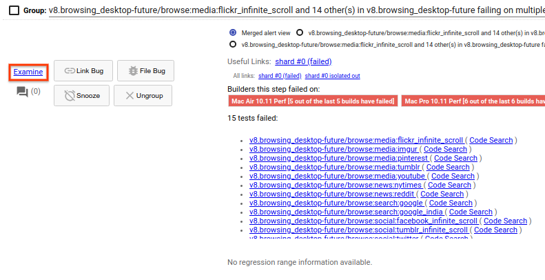
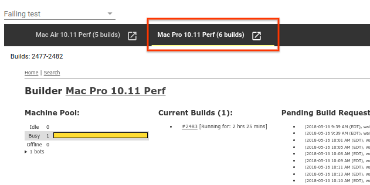
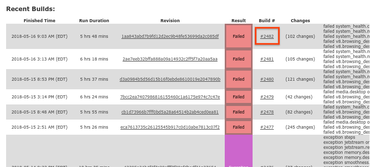
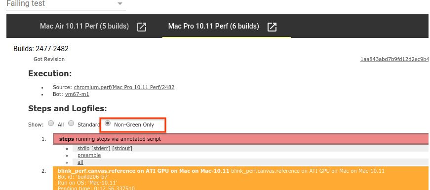
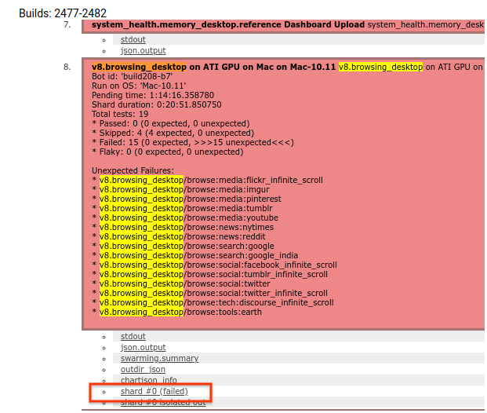

# How to access and navigate test logs

When trying to understand a failure, it can be useful to inspect the test logs where the failure occurred.

[TOC]

## Accessing test logs

### Accessing the log for the most recent failure

Usually, Sheriff-o-matic will include a link directly in the alert to the most recent instance of the test failure. Just click on "shard #0 (failed)".

### Accessing the logs for older failures

From the Sheriff-o-matic alert, click the "Examine" link to access a list of recent runs on the given bot.

If the failure spans multiple platforms, you can select which platform you care about from the top of the new pane.

This new pane shows all recent runs, not just runs where this benchmark failed, so it's often useful to use Ctrl+F and search for the failing benchmark name to highlight these runs.Next, click the build number for the run for which you want to access the logs. Once you've found the run you want the logs for, click the build number for the run for which you want to access the logs.

Once at the build page listing all steps, we need to find the test step that failed. Start by selecting to show "Non-Green Only" steps at the top of the page.

After doing this, search for your benchmark's name (in this case, "v8.browsing_desktop") until you find a step with a name like "<benchmark_name> on <platform>". Click the "shard #0 (failed)" link below that step to open the logs.

## Navigating log files

### Identifying why a story failed

The most common goal in opening a log file is to identify why a story failed.

To do this, search the logs for "`FAILED  ]`" (failed, space, space, right bracket) until you find the section in the middle of the logs in where your particular story ran. (Note that all failing story names will also be listed at the end of the logs, but this isn't what we want right now.)

Once at this location, scroll up until you find a call stack describing the failure that occurred.

### Identifying why a benchmark failed

Occasionally, a benchmark will fail in a way that prevents any stories from being run.

Generally, this means that the test log is very short. In order to find the call stack describing the failure, go to the bottom of the logs and scroll up until you find the failure.

### Getting a list of stories that failed

At the conclusion of the run, Telemetry lists all stories that failed. To find this list, search for "` FAILED TEST`" (space, failed, space, test). This should take you to a section that looks like this:

    [  PASSED  ] 58 tests.
    [  FAILED  ] 1 test, listed below:
    [  FAILED  ]  blink_perf.layout/subtree-detaching.html
    FAILED TEST

This section lists all failed stories.

