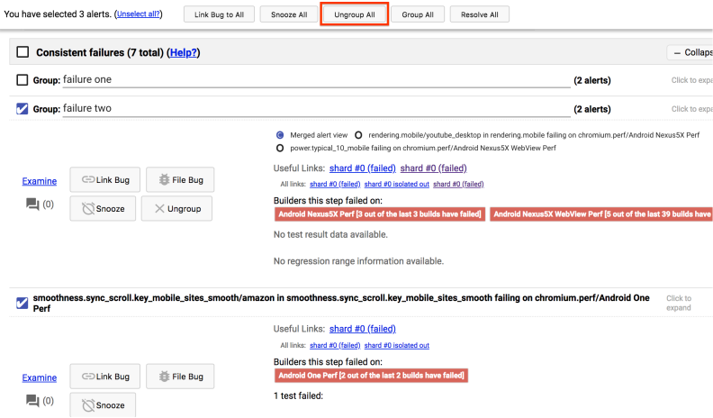
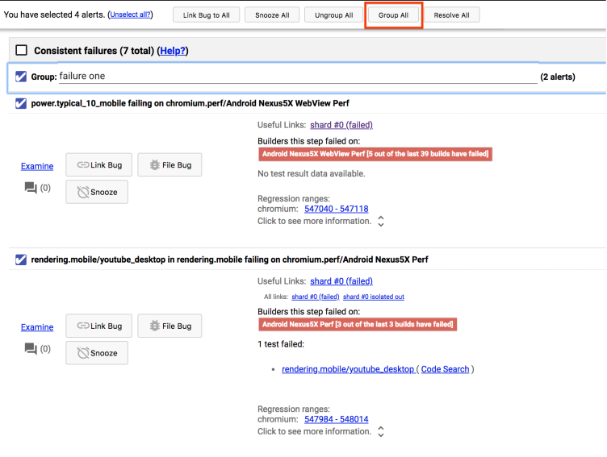

# How to address a new alert with the same root cause as an existing alert

It's common when large problems arise for multiple alerts to fire due to the same underlying problem. Sheriff-o-matic does its best to automatically group these problems into a single alert, but sometimes it's unable to and we have to group the alerts together manually. This is important because it helps future sheriffs see at a glance the number of distinct problems.

Unfortunately, there's no way to distinguish these duplicate alerts from new alerts without knowing the contents of those other alerts. If you're unsure about two particular alerts, don't hesitate to ask for help [on chat](https://hangouts.google.com/group/2GmiXjz55R2ixTXi1).

## How to group duplicate alerts

First, decide which of your duplicate alerts is going to be your "main" alert. If one of the alerts is already an alert group, use that alert. Otherwise, it doesn't matter which alert is picked.

Next, select all of the other alerts that you want to merge into this main alert. If there are any existing alert groups among these other alerts, you need to click "Ungroup all" and check all of the boxes in the dialog to ensure that the alerts are out of their existing groups.

Once you've ungrouped all the alerts being merged into the main alert and selected all alerts being merged, including your primary alert, click the "Group all" button at the top of the screen.

If the alert group still has an auto-generated name, it's a good idea to give it a name that clarifies the problem.

Lastly, it may be necessary to broaden the scope of the existing bug. If, for example, the previous alert had the name "system_health.common_desktop failing on Mac Retina Perf" and you merged in a duplicate alert on Mac Air Perf, you should change the bug and alert names to "system_health.common_desktop failing on multiple Mac builders" and simultaneously add a comment to the bug to the effect of "I'm broadening this bug because the issue is also causing failures on Mac Air Perf".

