# How to launch a functional bisect and interpret its results

A functional bisect determines the revision at which a particular benchmark or story started failing more often. It does this by doing a binary search between a known good and known bad revision, running the test multiple times at each potential revision until it narrows down the culprit to a single revision.

[TOC]

## Identifying a good and bad revision

The first step is to launching a bisect is to identify a revision at which you're confident the test was passing more often (the good revision) and a revision at which you're confident the test was failing more often (the bad revision).

The easiest way to do this is to use the [flakiness dashboard](https://test-results.appspot.com/dashboards/flakiness_dashboard.html#testType=blink_perf.canvas) (basic instructions [here](https://docs.google.com/document/d/1YJ7TCXz8Oh0ai3fG9pkxmdoYkLOt0cuoRswuEzpovJ4/edit)). 

The below screenshot shows the easiest possible case: it's clear when the test went from passing to failing. (Remember, runs are listed from most recent on the left to oldest on the right.)

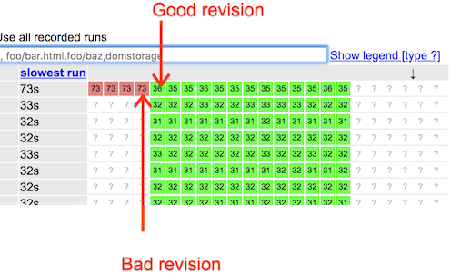

To get the good revision, just click on the good revision box and note the end of its revision range.

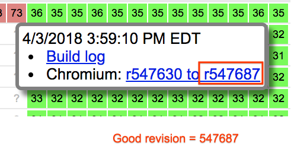

To get the bad revision, do the same for the bad revision box.

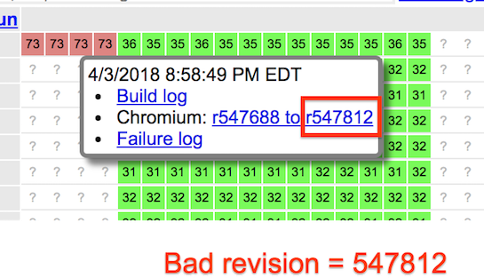

The flakier the test, the further you generally need to venture into the past "green zone" for your good revision or further into the newer "red zone" for your bad revision. Remember that it's better to pick a slightly wider, safer bisect range and have the bisect take slightly longer than to pick a too-narrow bisect range and have to rerun the entire bisect.

For example, let's look at a little flakier failure:

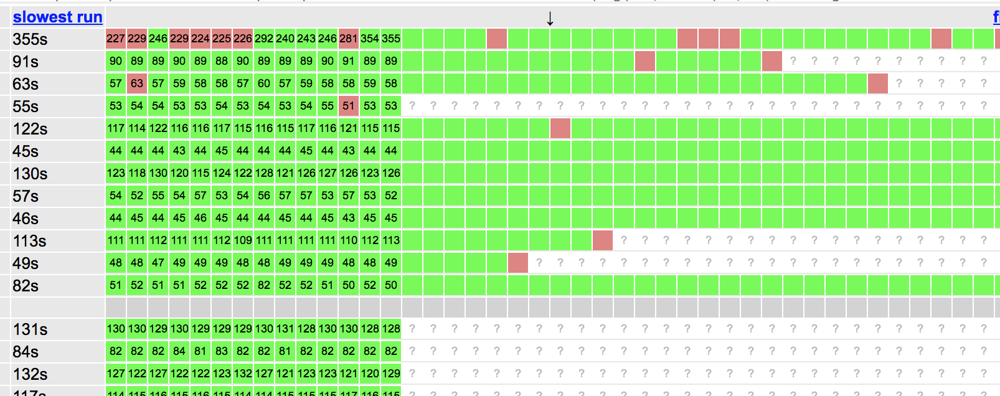

The first row here shows a story that went from being a little flaky to very flaky. To choose the "good" revision, we should go a little further back than the last one in the streak of good runs (in this case, labeled 292) because it's possible that that particular run was a lucky pass and the already-failing code had already been submitted, like the run labeled 246 a few runs later. Similarly, when choosing a "bad" revision, we should pick one a little more recent than the first in the streak of failures (in this case, labeled 226) because it's possible that the first failure was one of the rare flakes that were already happening.

In this case, I might choose the following as safe good and bad revisions:

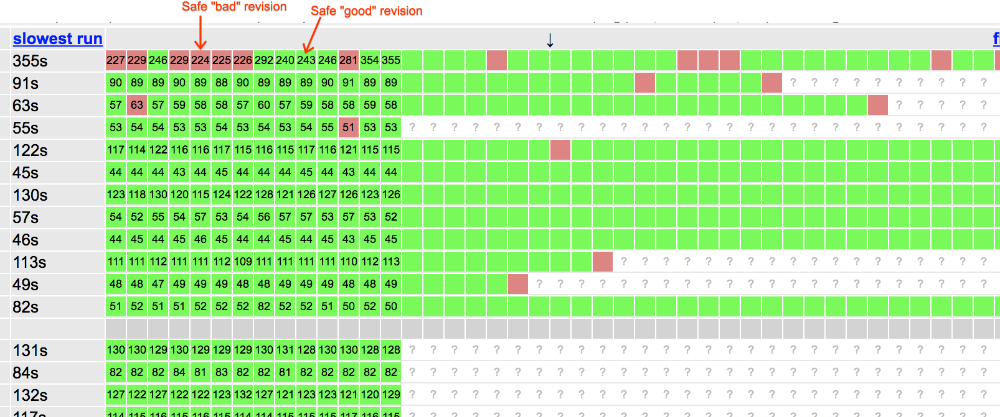

Now you can start the bisect.

## Launching the bisect through the perf dashboard

To launch a function bisect, open up the ["Browse Graphs" page on the Chrome Performance Dashboard](https://chromeperf.appspot.com/report).

For "Test Suite", select the name of your benchmark.

For "Bot", choose the platform on which the benchmark or story is failing. If it's failing on multiple platforms, you can choose any of them.

For the first "Subtest" entry, choose any metric that would have been collected in the particular story that's failing. Do not choose benchmark_duration, which is unsuitable for bisects. You'll know that you picked a suitable metric when, at the end of this series of steps, you're shown a graph with recent data points for your story.

For the next "Subtest" entry, pick the story that's failing. If all stories are failing, you can choose any story. Make sure to select the story name without the "_ref" suffix on it.

Once you've done this, click "Add" to add a graph of this metric to the page. It should look like this.

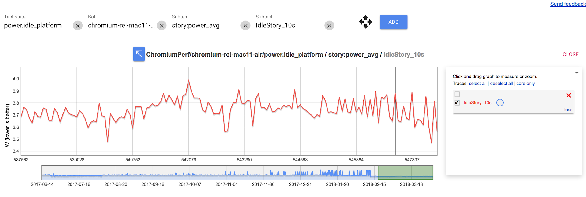

Click on any data point in that graph to bring up a dialog the click "Bisect" in that dialog.

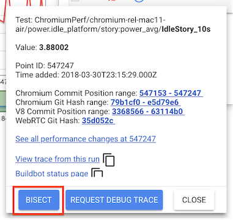

You'll be shown a dialog box requesting

- A tracking bug ID to which the bisect results will be posted (if you haven't created one yet, do so)
- A start commit (your "good" revision from above)
- An end commit (your "bad" revision from above)
- A story filter (should be prepopulated)
- A patch to apply to the entire job (can be left blank)
- The bisect type (choose "Functional")

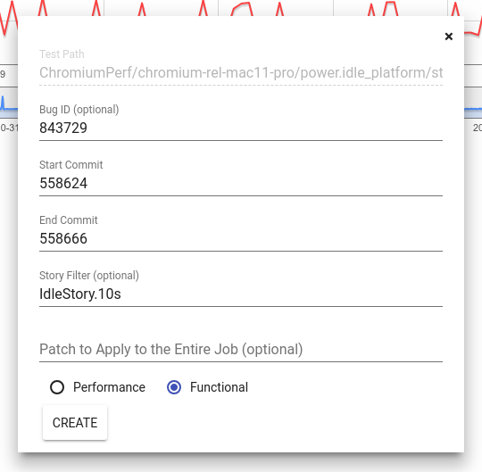

Finally, click "Create" and your functional bisect should start. Pinpoint, the bisection service, will add a new comment on your bug with a link to track the bisect.

When the bisect finishes, it will post a comment on your tracking bug.

## Interpreting functional bisect results

(Note that bot health sheriffs usually don't need to interpret bisect results and can therefore safely skip this section.)

A Pinpoint result comment on a bug looks like this:

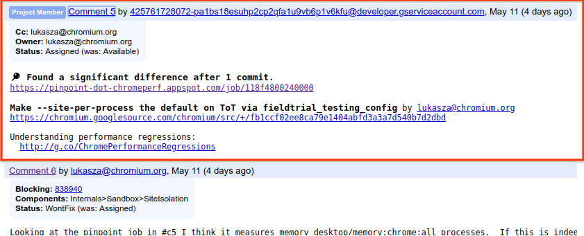

The bisect can have one of several results:

* **Found a significant difference** indicates that the bisect successfully identified the CL causing the change in the failure rate. In this situation, it also assigns the bug associated with the bisect to the author of the culprit CL, making them responsible for reverting the CL.

* **Could not reproduce** indicates that the test could not reproduce the problem that you were trying to find the culprit for.

* **Failure** indicates that there was a bisect infrastructure failure. CC dtu@chromium.org on your bug to take a further look.

To get more details click on the Pinpoint job link in the comment. You'll be taken to a page showing the results of the functional bisect.

This page has several useful panels.

The largest shows the failure rate of the story at various revisions:

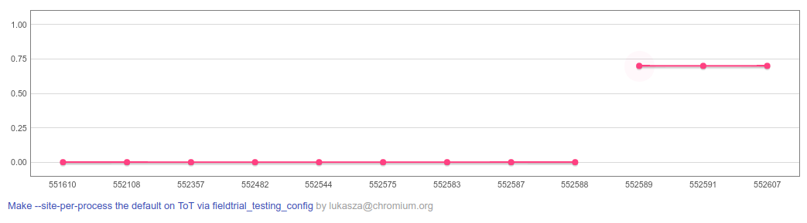

In the example above, the story went from failing 0% of the time to failing about 70% of the time. Below this graph, the culprit CL identified by the bisect is listed if the bisect was successful.

Clicking on a particular data point in this graph will change the three panels below it to show more information about the runs used to measure the failure rate at that revision.

The most useful panel among these three for functional bisects is the "Test" panel. In this panel, green boxes indicate a successful run at the revision and red boxes indicate a failed run.

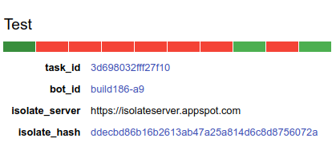

In the above example, 7/10 of the runs at the revision selected failed. Clicking on a particular run's box will provide a link to the logs for that run, which can be useful in understanding why a particular run failed.

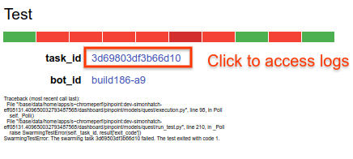
