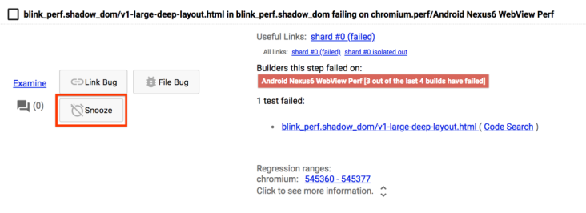
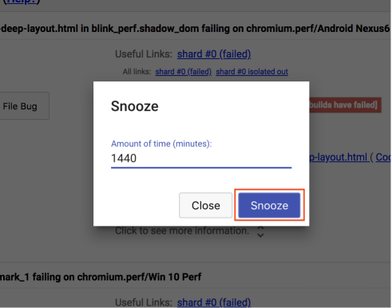

# How to snooze an alert

After addressing an alert, the next step is to snooze it. 

Snoozing an alert hides the alert, moving it to a collapsed section at the bottom of the "Consistent alerts" section until the specified time has expired. This acts as a signal to yourself and other sheriffs that no further action is necessarily until the alert becomes unsnoozed.

To snooze an alert, click the "Snooze" button for the specified alert and then enter the number of minutes you'd like to snooze the alert for.

Generally, you should snooze an alert for however long you think it will take for your fix to take effect and a successful run to complete, removing the alert from Sheriff-o-matic. If you're unsure of how long this should be, 24 hours (1440 minutes) is usually a safe default.
