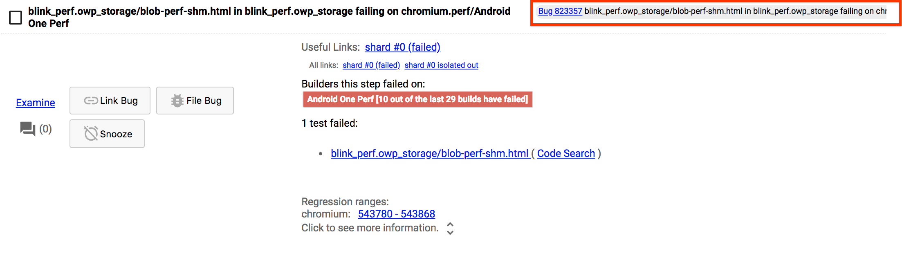
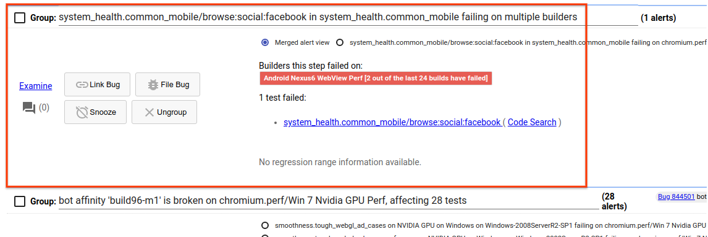
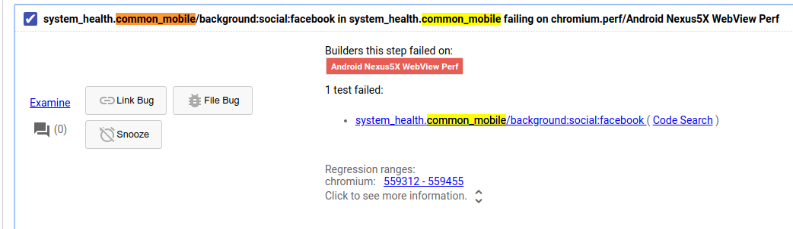

# Perf bot health sheriff rotation

## Goal

The goal of the perf bot health sheriff rotation is to ensure that the benchmarks running on our perf waterfall continue to produce data and catch regressions quickly. This is also known as "keeping the bots green" and is primarily achieved by triaging incoming alerts.

## Quick links

* [How to determine what story is failing](https://chromium.googlesource.com/chromium/src/+/master/docs/speed/bot_health_sheriffing/what_test_is_failing.md)
* [How to disable a story](https://chromium.googlesource.com/chromium/src/+/master/docs/speed/bot_health_sheriffing/how_to_disable_a_story.md)
* [How to launch a functional bisect](https://chromium.googlesource.com/chromium/src/+/master/docs/speed/bot_health_sheriffing/how_to_launch_a_functional_bisect.md)
* [How to snooze an alert](https://chromium.googlesource.com/chromium/src/+/master/docs/speed/bot_health_sheriffing/how_to_snooze_an_alert.md)
* [How to access test logs](https://chromium.googlesource.com/chromium/src/+/master/docs/speed/bot_health_sheriffing/how_to_access_test_logs.md)
* [How to handle a new problem](https://chromium.googlesource.com/chromium/src/+/master/docs/speed/bot_health_sheriffing/how_to_handle_a_new_problem.md)
* [How to follow up on an alert](https://chromium.googlesource.com/chromium/src/+/master/docs/speed/bot_health_sheriffing/how_to_follow_up_on_an_alert.md)
* [How to address duplicate alerts](https://chromium.googlesource.com/chromium/src/+/master/docs/speed/bot_health_sheriffing/how_to_address_duplicate_alerts.md)
* [Glossary](https://chromium.googlesource.com/chromium/src/+/master/docs/speed/bot_health_sheriffing/glossary.md)

[TOC]

## Vocabulary

Definitions of various bot health related vocabulary can be found in our [glossary](https://chromium.googlesource.com/chromium/src/+/master/docs/speed/bot_health_sheriffing/glossary.md).

## High-level responsibilities

The sheriff's role is to work through the list of failures, fixing the easiest ones and routing the  rest to the correct owners. This mostly requires filing bugs, disabling benchmarks and stories, launching bisects, and reverting any CLs that are obviously responsible for breakages.

The sheriff should *not* feel like responsible for investigating hard problems. The volume of incoming alerts makes this infeasible. Instead, they should delegate deep investigations to the right owners. As a rule of thumb, a trained sheriff should expect to spend 10-20 minutes per alert and should never be spending more than an hour per alert.

## Workflow

Incoming failures are shown in [Sheriff-o-matic](https://sheriff-o-matic.appspot.com/chromium.perf), which acts as a task management system for bot health sheriffs. Failures are divided into three groups on the dashboard:

* **Infra failures** show general infrastructure problems that are affecting benchmarks.

* **Consistent failures** show benchmarks that have been failing for a while.

* **New failures** show benchmarks that benchmarks that have recently started failing.

Of these three groups, the sheriff should only be concerned with **infra failures** and **consistent failures.** New failures are too likely to be one-off flakes to warrant investigation.

The high-level workflow is to start at the top of the list of the list of failures and address one alert at a time. The alerts are ordered roughly in order of their impact.

As the sheriff addresses alerts, the number of alerts will generally decrease as problems with the same cause get grouped together and failures get fixed. Addressed alerts will also move to the bottom of the list. Ideally, Sheriff-o-matic should reflect the work you've done so that a new sheriff could potentially take over at any time and pick up at the top of the list.

## How to address each alert

Alerts can be addressed by answering the following questions:

### Has a previous sheriff already addressed this alert?

This category of alert should have a bug already linked with it. This link can be found next to the alert.

Instructions can be found [here](https://chromium.googlesource.com/chromium/src/+/master/docs/speed/bot_health_sheriffing/how_to_follow_up_on_an_alert.md) on how to follow up with an existing alert.

### Is this a new alert caused by the same root cause as an already-triaged alert?

This category of alert won't have a bug linked with it yet. However, a bug *does* exist for the issue: it may be linked to another alert, but can otherwise be found [here](https://bugs.chromium.org/p/chromium/issues/list?can=2&q=label:Performance-Sheriff-BotHealth&sort=pri&colspec=ID%20Pri%20M%20Stars%20ReleaseBlock%20Component%20Status%20Owner%20Summary%20OS%20Modified) under the Performance-Sheriff-BotHealth label in monorail. For example:

and

are both in the list of current of alerts but represent the same failure.

It can sometimes be tricky to differentiate between these alerts and ones caused by completely new problems, but sheriffs can always treat an alert as new and merge it with another later.

Instructions can be found [here](https://chromium.googlesource.com/chromium/src/+/master/docs/speed/bot_health_sheriffing/how_to_address_duplicate_alerts.md) on how to handle a duplicate alert.

### Is this a new alert caused by a new problem?

This category of alert doesn't yet have a bug associated with it. It's the most common category and requires the most expertise to handle.

Instructions can be found [here](https://chromium.googlesource.com/chromium/src/+/master/docs/speed/bot_health_sheriffing/how_to_handle_a_new_problem.md) on how to handle an alert for a new problem.

## After your shift is over

Your only responsibility after your shift concludes is to follow up with any bugs that would no longer appear on the dashboard (i.e. the failure has stopped) but still need correct routing.

For example, if you disabled a story and snoozed an alert during your shift, you should ensure that the bug is assigned to the benchmark's owner before relinquishing responsibility for the bug.

## Frequently asked questions

### Why do the benchmarks break so often?

The bots runs Chrome benchmarks that are complicated integration tests of Chrome. Developers frequently submit code that breaks some part of Chrome and one of our integration tests (hopefully) tests that bit of code, resulting in a broken benchmark. In some sense, frequent breakages indicate that the benchmarks are working.

Many breakages probably *aren't* good signs, though. If you have ideas on how to reduce the number of breakages or the work required to handle a breakage, submit your idea to the Chrome benchmarking group!

### Do I have to use Sheriff-o-matic?

Yes! Sheriff-o-matic allows us to smoothly hand off responsibility between sheriffs and allows us to standardize sheriffing.

If you find a problem with Sheriff-o-matic or have a feature request, file a bug [here](https://bugs.chromium.org/p/chromium/issues/entry?template=Build%20Infrastructure&components=Infra%3ESheriffing%3ESheriffOMatic&labels=Pri-2,Infra-DX&cc=seanmccullough@chromium.org,martiniss@chromium.org,zhangtiff@chromium.org&comment=Problem+with+Sheriff-o-Matic). The team is usually very responsive and, because of their work, the tool is getting better every day.

### How can I tell if I've done a good job?

It can be hard to tell. Generally, a good goal is to try and have fewer alerts when your shift ends than when it began. Sometimes that isn't possible, though.
