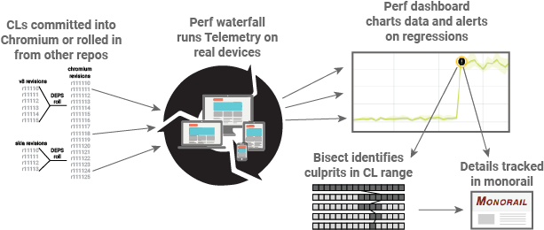

# Speed Operations: Services

TL: simonhatch@ 
Team: simonhatch@ benjhayden@, dtu@, eakuefner@ 
TPM: benhenry@ 
Mailing List: speed-services-dev@chromium.org 
**[go/chrome-speed-services](https://goto.google.com/chrome-speed-services)**

## Mission
The mission of the Chrome Speed Services team is to develop the tools and
infrastructure necessary for teams to detect, help diagnose, and follow through
on performance regressions in Chrome. We accomplish this through a set of
interconnected tools, which process data from the Chrome Benchmarking Team and
automate the Chrome Speed Releasing workflow:
 
  * The [Chrome Performance Dashboard](https://chromeperf.appspot.com) stores
    over 4 million performance timeseries, and monitors hundreds of thousands
    of them for performance regressions. It integrates with Chrome's bug
    tracker for follow-through.
  * Most of our automated builds take too long to get performance data on every
    revision, so we have [bisect bots](bisects.md) to narrow down regressions.
    These bots also support running performance try jobs on unsubmitted CLs.
  * Whether a performance test is run locally or in the lab, right now or last
    year, we want to make it easy to understand and share the results. We
    develop [data formats](https://github.com/catapult-project/catapult/blob/master/docs/histogram-set-json-format.md)
    and user interfaces that make it easy to dig deeply into performance
    regressions.
 
Here is a diagram of how our tooling fits into the chromium performance
continuous build:

## 2017 Roadmap
  * **Improve our ability to bisect to root causes**.
    [Pinpoint](https://docs.google.com/document/d/1FKPRNU2kbPJ15p6XHO0itCjYtfvCpGt2IHblriTX1tg/edit)
    is a rewrite of the existing bisect system, design to address the
    shortcomings of a fully automated system running on buildbot. Tighter
    integration with the dashboard will allow better code sharing, more
    thorough test coverage, and a greatly improved and interactive user
    interface.
  * **Enable deep debugging and better numerics across our products.**
    We are working to make the dashboard, pinpoint, and telemetry all use our new
    [HistogramSet](https://github.com/catapult-project/catapult/blob/master/docs/histogram-set-json-format.md)
    data format, which stores full histograms and statistics about test
    results, as well as diagnostics with built-in UIs which help users dig in
    when something's wrong.
  * **Improve the sheriffing process.** We're working on burning down bugs in
    the sheriffing workflow, and also adding
    [milestone-level reports](https://docs.google.com/document/d/1MgTs2TBEHcKqgil_zqy72GlZr_74udyDKznTZixhrrI/edit)
    that give a high-level overview of how Chrome is performing from release to
    release, so that we can better focus our performance efforts.
