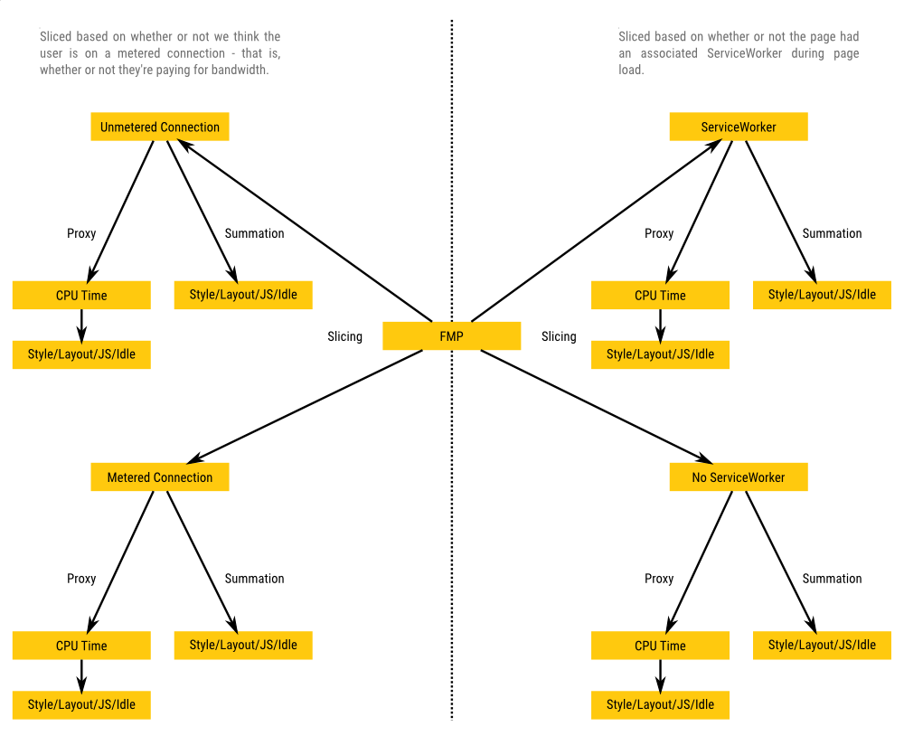

# Making Metrics Actionable with Diagnostic Metrics

[TOC]

We want our metrics to be reflective of user experience, so we know we’re optimizing for the right thing. However, metrics which accurately reflect user experience are often so high level that they aren’t very actionable. Diagnostic metrics are submetrics which enable us to act on our high level user experience metrics. Also see the document on constructing a [good toplevel metric](good_toplevel_metrics.md) for guidance on constructing high quality user experience metrics.

There are three types of diagnostic metrics:

* Summations
* Slices
* Proxies

## Summation Diagnostics

We often notice that a number is Too Big. Whether it’s the time it took to generate a frame, or the time until a page was visible, the first thing we want to know is what’s contributing to the number.

Summations enable us to answer these questions. In a Summation diagnostic, the diagnostic metrics sum up to the higher level metric. For example, a Summation diagnostic for First Meaningful Paint (FMP) might be the durations the main thread spent doing various tasks, such as Style, Layout, V8, Idle, etc before FMP fired. These diagnostics often lead to hierarchies, where the top level metric, such as FMP, has a diagnostic metric, such as time spent in V8 before FMP, which has further diagnostic metrics, such as the time spent parsing, compiling, or executing JS. Summation breakdowns are implemented in telemetry as [Related Histogram Breakdowns](https://cs.chromium.org/chromium/src/third_party/catapult/tracing/tracing/value/diagnostics/related_histogram_breakdown.html?q=RelatedHistogramBreakdown&sq=package:chromium&l=18).

With Summation diagnostics, the top level metric equals the sum of all diagnostics metrics. It’s **extremely important** that you don’t leave things out of a Summation diagnostic. This can seem a little daunting - how are you going to account for everything that contributes to the top level metric?

The best way to do this is to start with something you can easily measure, and also report the "unexplained time".

Suppose we're creating a Summation diagnostic for TimeFromNavStartToInteractive. And, suppose we can easily time Idle and Script. So, we report those two only (don’t do this!)

* TimeInScript: 800ms
* TimeInIdle: 300ms

You'd incorrectly conclude from this data that script is the problem, and focus on optimizing script. This would be a shame, because if you had reported unexplained time, the reality would become clearer:

* TimeInScript: 800ms
* TimeInIdle: 300ms
* Unexplained: 800ms

Here, it jumps out that you've got some data that you've not explained and you should, before you leap to conclusions.

So, start with a single pair of data:

1. a specific submetric that you're sure you can measure, and
2. a way to measure "the rest."

It might be that you start off just with:

1. Time in Script
2. Unexplained == TimeToInteractive - TimeInScript

But at least when you do this, your "unexplained time" is jumping out at you. From there, your goal is to drive that number downward to the 5%-ish range. Maybe on most pages, script is so huge that you get to 80% coverage. Great! Then, you study a few pages with high "unexplained" time and figure out, "aha, this has a lot of idle time." So you add idle to your diagnostics, and maybe that gets you to 90% coverage. Repeat until you're happy enough.

Diagnostics are imperfect. You'll always have some unexplained. And tracking your unexplained time will keep you honest and pointed in the right direction.

## Slicing Diagnostics

Slicing Diagnostics split up a metric based on its context. For example, we could split up Memory Use by whether a process has foreground tabs, or the number of tabs a user has open, or whether there’s a video playing. For each way we slice the metric, the higher level metric is a weighted average of the diagnostic metrics.

With Slicing diagnostics, the top level metric equals the weighted sum of all diagnostic metrics. In the examples above, the weight of each diagnostic is the fraction of the time spent in the given context. Slicing diagnostics are implemented in telemetry via [Related Histogram Maps](https://cs.chromium.org/chromium/src/third_party/catapult/tracing/tracing/value/diagnostics/related_histogram_map.html?q=RelatedHistogramMap&sq=package:chromium&l=16).

In the same way that when constructing a Summation Diagnostic we account for everything which contributes to the high level metric, when producing a Slicing Diagnostic, we ensure that we don’t leave out any contexts. If you want to Slice a metric by the number of tabs a user has open, you shouldn’t just use a set of reasonable tab numbers, from 1-8 for example. You should make sure to also have an overflow context (9+), so we get the full picture.

## Proxy Diagnostics

Some diagnostic metrics correlate with the higher level metric, but aren’t related in any precise way. For example, the top level FMP metric measures wall clock time. We could add a CPU time equivalent as a diagnostic metric, which is likely to have lower noise. In cases like this, we expect there to exist some monotonic function which approximately maps from the top level metric to the diagnostic metric, but this relationship could be quite rough.

Slicing diagnostics are implemented in telemetry via [Related Histogram Maps](https://cs.chromium.org/chromium/src/third_party/catapult/tracing/tracing/value/diagnostics/related_histogram_map.html?q=RelatedHistogramMap&sq=package:chromium&l=16).

## Composing Diagnostics

Many metrics will have multiple sets of diagnostics. For example, this set of FMP diagnostics involves Slicing, Summation, and Proxy Diagnostics.

With this diagnostic we can tell if there’s a regression in JS times that’s specific to when there’s a ServiceWorker on the page, or if there’s a reduction in idle time spent on pages when we’ve got metered connections.

