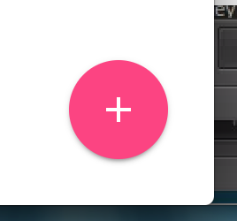
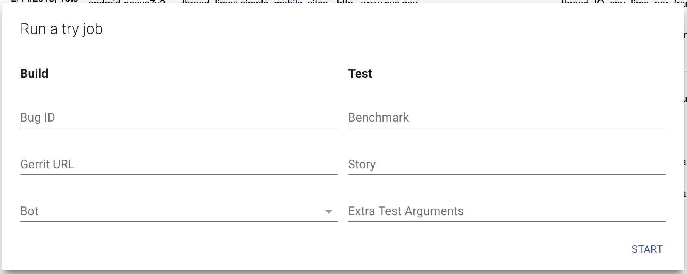

# Perf Try Bots

Chrome has a performance lab with dozens of device and OS configurations.
[Pinpoint](https://pinpoint-dot-chromeperf.appspot.com) is the service that lets
you run performance tests in the lab. With Pinpoint, you can run try jobs, which
let you put in a Gerrit patch, and it will run tip-of-tree with and without the
patch applied.

[TOC]

## Why perf try jobs?

* All of the devices exactly match the hardware and OS versions in the perf
  continuous integration suite.
* The devices have the "maintenance mutex" enabled, reducing noise from
  background processes.
* The devices are instrumented with BattOrs for power measurements.
* Some regressions take multiple repeats to reproduce, and Pinpoint
  automatically runs multiple times and aggregates the results.
* Some regressions reproduce on some devices but not others, and Pinpoint will
  run the job on multiple devices.

## Starting a perf try job

Visit [Pinpoint](https://pinpoint-dot-chromeperf.appspot.com) and click the perf try button in the bottom right corner of the screen.

You should see the following dialog popup:

**Build Arguments**| **Description**
--- | ---
Bug ID | (optional) A bug ID. Pinpoint will post updates on the bug.
Gerrit URL | The patch you want to run the benchmark on. Patches in dependent repos (e.g. v8, skia) are supported.
Bot | The device type to run the test on. All hardware configurations in our perf lab are supported.

 

**Test Arguments**| **Description**
--- | ---
Benchmark | A telemetry benchmark. E.g. `system_health.common_desktop`  All the telemetry benchmarks are supported by the perf trybots. To get a full list, run `tools/perf/run_benchmark list`  To learn more about the benchmarks, you can read about the [system health benchmarks](https://docs.google.com/document/d/1BM_6lBrPzpMNMtcyi2NFKGIzmzIQ1oH3OlNG27kDGNU/edit?ts=57e92782), which test Chrome's performance at a high level, and the [benchmark harnesses](https://docs.google.com/spreadsheets/d/1ZdQ9OHqEjF5v8dqNjd7lGUjJnK6sgi8MiqO7eZVMgD0/edit#gid=0), which cover more specific areas.
Story | (optional) A specific story from the benchmark to run.
Extra Test Arguments | (optional) Extra arguments for the test. E.g. `--extra-chrome-categories="foo,bar"`  To see all arguments, run `tools/perf/run_benchmark run --help`

## Interpreting the results

### Detailed results

On the Job result page, click the "Analyze benchmark results" link at the top. See the [metrics results UI documentation](https://github.com/catapult-project/catapult/blob/master/docs/metrics-results-ui.md) for more details on reading the results.

### Traces

On the Job result page, there is a chart containing two dots. The left dot represents HEAD and the right dot represents the patch. Clicking on the right dot reveals some colored bars; each box represents one benchmark run. Click on one of the runs to see trace links.

