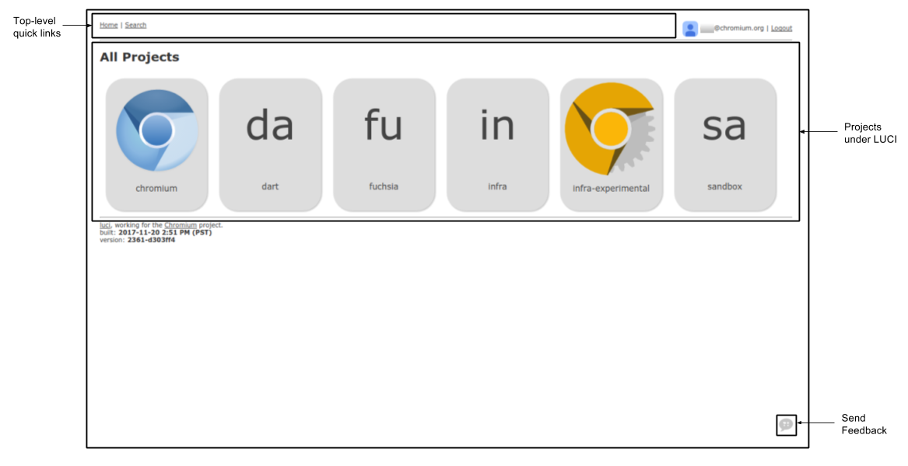
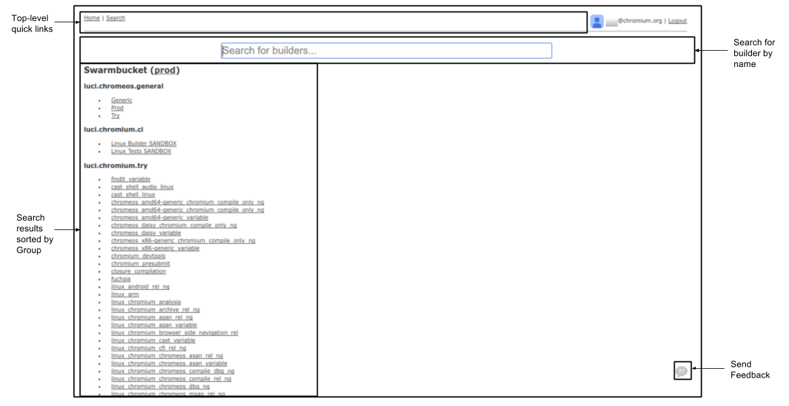
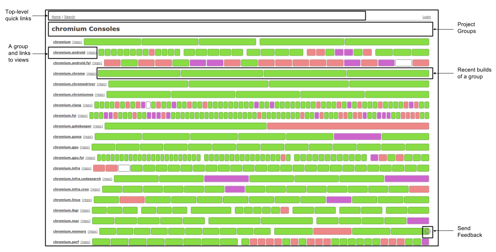
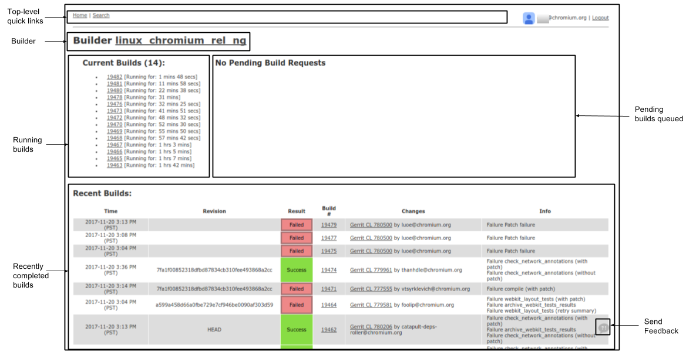
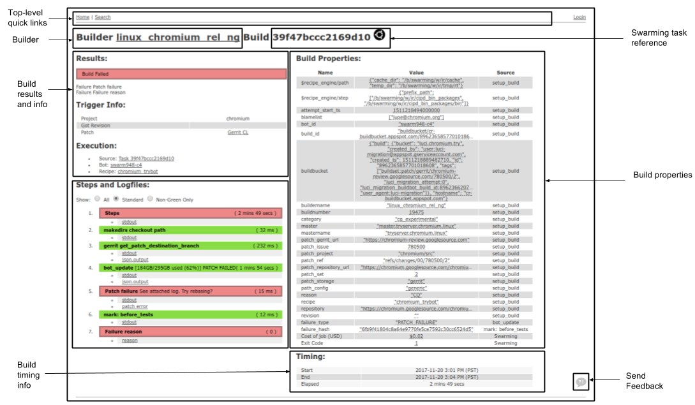
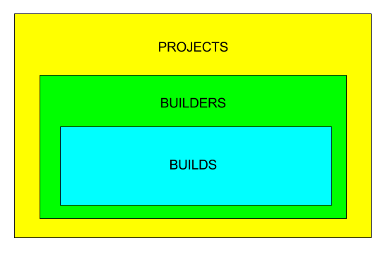
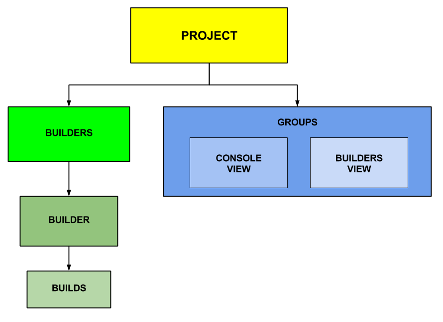
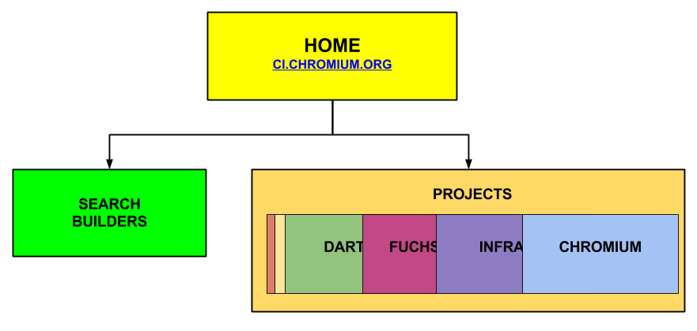

# A Tour of Continuous Integration UI

This document details a tour of page layouts and site hierarchy for [LUCI
UI](https://ci.chromium.org/p/chromium), Chromium's continuous integration user
interface. Currently, LUCI shows both Buildbot and LUCI builds. In the near
future, LUCI will replace Buildbot as the default continuous integration system.
Read this document to learn how to navigate LUCI and to better understand the
new UX concepts LUCI introduces. Refer to the [FAQ](#FAQ) to quickly jump to
sections.

[TOC]

## FAQ

**Where can I see the console view for my builders?**

*Using this URL schema, `ci.chromium.org/p/<project_id>/g/<group_id>/console`,
replace `<project_id>` with the project ID and `<group_id>` with the group ID.
For example, [Chromium Main](http://ci.chromium.org/p/chromium/g/main/console).
See [console view page](#Console-view-page) section below for details on the
page.*

**Why are we replacing Buildbot with LUCI?**

*Buildbot is slow and doesn't scale well. LUCI fixes this and over time, we have
already been swapping out Buildbot responsibilities with LUCI services.  See
[Background section](#Background) for more details.*

**What are the LUCI pages I should expect to see?**

*[Jump](#Tour-of-LUCI-Pages) to the Tour of LUCI Pages section to see details on
each page.*

**Is LUCI only for the Chromium project?**

_The overall goal is to have LUCI serve all projects (wherever possible) that
Buildbot currently serves. The 11/30 UI rollout is limited to chromium.* masters
and tryserver.chromium.* + tryserver.blink masters. Other projects/masters will
switch to LUCI UI at later notice._

**Is there a list of Known Issues?**

_A list of known user interface issues can be viewed in [Chromium
bugs](https://bugs.chromium.org/p/chromium/issues/list?q=label%3Aluci-knownissues-ui)._

**What happened to Masters?**

_LUCI no longer uses Masters and distributes the responsibility of scheduling,
distributing, collecting, archiving and logging builds into separate independent
services. As a UI concept, "masters" are replaced with "groups" and "views". See
[Background section](#Background) for more details._

**What is a Group?**

_Builders of each project are organized into groups of ordered builders (A
single builder can be referenced by multiple groups). See [Site Hierarchy
section](#Site-Hierarchy) for more details._

**What is a View?**

*A group of builders and their builds can be visualized in a couple ways; we
call these views. See [Site Hierarchy section](#Site-Hierarchy) for more
details.*

**Are URLs final?**

*No. URLs and pages are subject to change. Our initial goal is to provide
Buildbot functionality parity, but we are committed to building additional
enhanced user experiences on top of the new LUCI UI.*

**How do I provide feedback?**

*LUCI UI is still in development and we would love to get feedback, please see
[feedback section](#Feedback) for links.*

## Tour of LUCI Pages

**Please note** that URLs and pages are subject to change. Our initial goal is
to provide Buildbot functionality, but we are committed to building additional
enhanced user experiences on top of the new LUCI UI.

### High level pages

#### Home

**URL:** [ci.chromium.org](http://ci.chromium.org/)

This is the "Home" page for LUCI. It contains a listing of all of the projects
configured in LUCI.

#### Search

**URL:** [ci.chromium.org/search](http://ci.chromium.org/search)

This is the builder search page for LUCI. Find a specific builder serviced by
LUCI by name. Search results are sorted by bucket and groups. This can also be
accessed by typing "ci.<tab>" in the Chrome Omnibox.

#### Project page

**URL:** `ci.chromium.org/p/<project_id>`

Example: [ci.chromium.org/p/chromium](http://ci.chromium.org/p/chromium)

A list of the groups defined for the project. A group is an ordered list of
builders (Builders can be referenced by multiple groups). This page contains
links to the default view defined for each group and the
last-completed-build-status for each builder.

Refer to the build results [color key](#Color-Key) on how to interpret the build
status.

**Note:** Initially, we have defined "groups" of builders corresponding to a
Buildbot master and included builders that used to be attached to it. 

#### Builders list page per project

**URL:** `ci.chromium.org/p/<project_id>/builders`

Example:
[ci.chromium.org/p/chromium/builders](http://ci.chromium.org/p/chromium/builders)

Shows a listing of all builders belonging to the *`<project_id>`*. Each builder
shows number of builds pending, in-progress and the build statuses of the last
30 recently completed builds by default (option available to show more).

Refer to the build results [color key](#Color-Key) on how to interpret the build
status.

### Project Resource pages

These pages display a singular resource that *belongs to* the project
(currently, Builders and Build Results).

#### Builder page

**Buildbot Builder URL:** `ci.chromium.org/buildbot/<group_id>/<builder_name>`

**LUCI Builder URL:**
`ci.chromium.org/p/<project_id>/builders/<bucket>/<builder_name>`

This is the page describing the builder and lists machine pool, current builds,
pending builds and recent builds completed. The layout is equivalent to Buildbot
layout of builder pages.

#### Build Results page

**Buildbot Build URL:** `
ci.chromium.org/buildbot/<group_id>/<builder_name>/<build_#>`

**LUCI Build URL:**
`ci.chromium.org/p/<project_id>/builders/<bucket>/<builder_name>/<build_#>`

*Alternate LUCI Build URL: `ci.chromium.org/p/<project_id>/builds/b<buildbucket_build_id>`*

This is the page describing the build and results. Contains build info,
properties, result status, blame-list, steps and links to log files. The layout
is equivalent to Buildbot layout of build result pages.

Builds can also have an alternate LUCI build URL under
`ci.chromium.org/p/<project_id>/builds/b<buildbucket_build_id>` if the build does
not have a “buildnumber” property. This does not apply to Chromium builds since
all Chromium builds have a buildnumber property.

### View pages

Each group has multiple views (currently "console" and "builders" views).
Later, we may add additional views (e.g. "stats"). Views are the primary reason
to create a group; For example, you put builders into the "main" group so that
they show up on main/console.

#### Console view page

**URL:** `ci.chromium.org/p/<project_id>/g/<group_id>/console`

Example:
[ci.chromium.org/p/chromium/g/main/console](http://ci.chromium.org/p/chromium/g/main/console)

A high-level overview of the recently completed builds. Contains most relevant
information on the Group, including tree status, on-call information, important
links, sub groups, and builds ordered by latest commits by users over all
platform builders. Refer to the build results [color key](#Color-Key) on how to
interpret the build status.

**Tree Status**

The "tree" represents the various source repositories used to build the project,
e.g.  chromium/src.git plus its
[DEPS](http://src.chromium.org/viewvc/chrome/trunk/src/DEPS?view=markup) file.
**Tree status **displays the state of the tree corresponding to the project and
determines whether or not developers are allowed to commit to the repositories.
The tree can be "open", "closed" or "throttled". The normal state is open. When
vital builders fail or tests break, the tree is closed by putting the word
"closed" in the tree status;
[PRESUBMIT.py](http://src.chromium.org/viewvc/chrome/trunk/src/PRESUBMIT.py?view=markup)
checks the status and will block commits, and the build sheriff will act to fix
the tree. When the tree is throttled, commits are only allowed with specific
permission from the build sheriff, generally because the sheriff wants to make
sure the tree is stable before opening it up to unlimited commits. 

**On-call Info**

This is the list of list the current build sheriffs and troopers. The sheriffs
have overall responsibility in case someone else is away or not paying
attention.

**Commits/CLs**

Each time someone lands a change, the scheduler gathers changes and schedules
builds and tests on all relevant builders. Each row in the table represents a
commit and resulting builds across the various builders. The columns are sorted
by build configuration and platform. A build can span multiple commits, in the
event that commits land faster than the builder can cycle. At the start of each
build, a yellow box is displayed. Clicking on the box shows more information
about the build, including the "blamelist" of changes that went into it and
detailed step/log information for the build (See [build
results](#Build-Results-page) page for more details). The times shown in the
table are in U.S. Pacific time.

Refer to the build results [color key](#Color-Key) on how to interpret the build
status.

#### Builders view page

**URL:** `ci.chromium.org/p/<project_id>/g/<group_id>/builders`

Example:
[ci.chromium.org/p/chromium/g/main/builders](http://ci.chromium.org/p/chromium/g/main/builders)

Builders view page for the group_id under project_id. Shows all builders of this
group. Each builder shows number of builds pending, in-progress and the build
statuses of the last 30 recently completed builds by default (option available
to show more).

### Color Key 

Throughout LUCI, we visualize a build results using colored boxes, where the
color signifies the build result status. Below is the color key mapping.

*   Yellow = in progress
*   Green = finished successfully
*   Red = finished with errors
*   Purple = internal error.

## Background

LUCI which stands for Layered Universal Continuous Integration is a replacement
for Buildbot (our existing single-threaded monolithic continuous integration
system). LUCI is made up of a number of independent services that work together,
each service dealing with one part of the continuous integration stack. Over
time, we have been swapping out Buildbot responsibilities with LUCI services. As
such, most builds today on Buildbot are already running using LUCI services.

LUCI tries to separate each CI concern into a separate service. Swarming, for
example, is one such service in LUCI, and handles job distribution. One of the
technical limitations of Buildbot is that each set of builders needed to be
owned by a single "master" process. This master would be responsible for
scheduling, distributing, collecting, archiving and logging builds. LUCI
distributes the responsibility of this work into separate independent services,
negating the need for a master. For ease of migration from Buildbot masters to
LUCI builders, we have defined "groups" of builders that each correspond to a
single Buildbot master, and we have kept the LUCI Builder names the same as they
were in Buildbot.

For more an overview of the services that make up LUCI, take a look at the [LUCI
Overview
presentation](https://docs.google.com/presentation/d/1dhUecmBf7IZ3moy_SflNT7yBYeiJbvj7m9kAxqeN9-A/preview?slide=id.g6571e2aaf_0_95).

## Site Hierarchy

On the highest level, LUCI is organized by **projects**. A project contains all
the configuration necessary to do development on a given repo, for example,
Chromium is one of these projects (corresponding to chromium/src.git). Each
project contains **builders**, which describe how a given builder works (i.e.
recipe to run, gn args to use, etc.). Each **builder** has **builds**, which
contain build information, build properties details, success or failure status,
blamelists, steps and links to log files.

For the LUCI UI, to organize builders in each project, we introduce the idea of
**groups**. Builders of each project are organized into **groups **of ordered
builders (A single builder can be referenced by multiple groups). For example,
"main" might contain all of the main builders, and "gpu" might contain all of
the "gpu" builders but since groups can overlap, (so "main" can contain some
subset of the "gpu" builders). Notably, groups don't own any project resources,
they're simply a mechanism to group them for display purposes. Projects may have
as many groups as they like, for whatever purpose they need them.

A group of builders and their builds can be visualized in a couple ways; we call
these **views**. We have currently implemented 2 views; a **console view** and a
**builders view** for each group.

To get started with LUCI, go to [ci.chromium.org](http://ci.chromium.org). Drill
down to build results from the list of projects. The search page is available to
find a specific builder by name.

## Known Issues

A list of [known
issues](https://bugs.chromium.org/p/chromium/issues/list?q=label%3Aluci-knownissues-ui)
for the user interface of LUCI is available under Chromium bugs.

Note: URLs and pages are subject to change. Our initial goal is to provide
Buildbot user functionality parity, but we are committed to building additional
enhanced user experiences on top of the new LUCI UI.

## Help

The Chrome Operations Foundation team is responsible for the design and
development of LUCI. If you have any questions or need help on usage, feel free
to reach out to the Chrome Operations team by emailing us at
[infra-dev@chromium.org](mailto:infra-dev@chromium.org)

## Feedback

LUCI UI is still in development. Our initial goal is to provide Buildbot
functionality parity, but we are committed to building additional enhanced user
experiences on top of the new LUCI UI once we no longer need to support
Buildbot.

If you have specific feedback you would like to share with us, we would love to
hear it and incorporate it into our ongoing UI improvements.

Use the **feedback button** on a LUCI page.

For **feature requests or bugs**, please file a crbug using the following
[template](https://bugs.chromium.org/p/chromium/issues/entry?labels=LUCI-M0-Backlog&summary=[LUCI-Feedback-UI]%20Enter%20an%20one-line%20summary&components=Infra>Platform>Milo&cc=efoo@chromium.org,estaab@chromium.org,nodir@chromium.org&description=Please%20use%20this%20to%20template%20to%20file%20a%20feature%20request%20into%20LUCI%20backlog.%20%20%0A%0AReminder%20to%20include%20the%20following%3A%0A-%20Description%0A-%20Priority%0A-%20Why%20this%20feature%20is%20needed).

To **share your feedback**, please fill out this [short
survey](https://goo.gl/forms/YPO6XCQ3q47r00iw2).

**Contact us** directly by emailing us at
[infra-dev@chromium.org](mailto:infra-dev@chromium.org).

