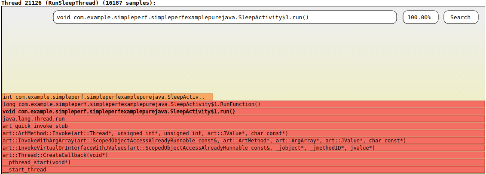
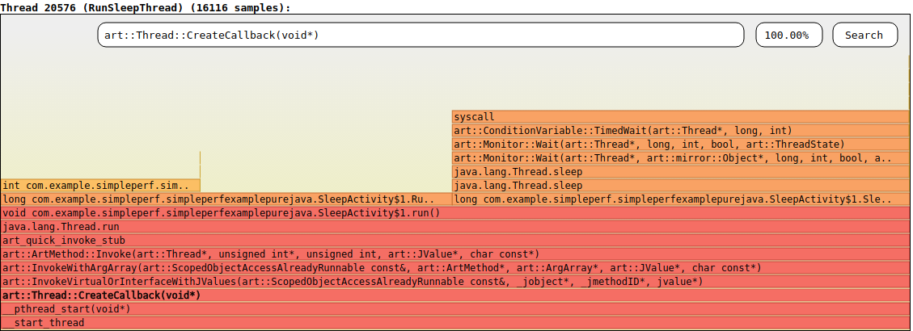

# Simpleperf

Simpleperf is a native profiling tool for Android. It can be used to profile
both Android applications and native processes running on Android. It can
profile both Java and C++ code on Android. It can be used on Android L
and above.

Simpleperf is part of the Android Open Source Project. The source code is [here](https://android.googlesource.com/platform/system/extras/+/master/simpleperf/).
The latest document is [here](https://android.googlesource.com/platform/system/extras/+/master/simpleperf/doc/README.md).
Bugs and feature requests can be submitted at http://github.com/android-ndk/ndk/issues.


## Table of Contents

- [Simpleperf introduction](#simpleperf-introduction)
    - [Why simpleperf](#why-simpleperf)
    - [Tools in simpleperf](#tools-in-simpleperf)
    - [Simpleperf's profiling principle](#simpleperfs-profiling-principle)
    - [Main simpleperf commands](#main-simpleperf-commands)
        - [Simpleperf list](#simpleperf-list)
        - [Simpleperf stat](#simpleperf-stat)
        - [Simpleperf record](#simpleperf-record)
        - [Simpleperf report](#simpleperf-report)
- [Android application profiling](#android-application-profiling)
    - [Prepare an Android application](#prepare-an-android-application)
    - [Record and report profiling data (using command-lines)](#record-and-report-profiling-data-using-commandlines)
    - [Record and report profiling data (using python scripts)](#record-and-report-profiling-data-using-python-scripts)
    - [Record and report call graph](#record-and-report-call-graph)
    - [Visualize profiling data](#visualize-profiling-data)
    - [Annotate source code](#annotate-source-code)
    - [Trace offcpu time](#trace-offcpu-time)
    - [Profile from launch of an application](#profile-from-launch-of-an-application)
- [Answers to common issues](#answers-to-common-issues)
    - [Why we suggest profiling on android >= N devices](#why-we-suggest-profiling-on-android-n-devices)

## Simpleperf introduction

### Why simpleperf

Simpleperf works similar to linux-tools-perf, but it has some specific features for
Android profiling:

1. Aware of Android environment

    a. It can profile embedded shared libraries in apk.

    b. It reads symbols and debug information from .gnu_debugdata section.

    c. It gives suggestions when errors occur.

    d. When recording with -g option, unwind the stack before writting to file to
    save storage space.

    e. It supports adding additional information (like symbols) in perf.data, to
    support recording on device and reporting on host.

2. Using python scripts for profiling tasks

3. Easy to release

    a. Simpleperf executables on device are built as static binaries. They can be
    pushed on any Android device and run.

    b. Simpleperf executables on host are built as static binaries, and support
    different hosts: mac, linux and windows.


### Tools in simpleperf

Simpleperf is periodically released with Android ndk, located at `simpleperf/`.
The latest release can be found [here](https://android.googlesource.com/platform/prebuilts/simpleperf/).
Simpleperf tools contain executables, shared libraries and python scripts.

**Simpleperf executables running on Android device**
Simpleperf executables running on Android device are located at `bin/android/`.
Each architecture has one executable, like `bin/android/arm64/simpleperf`. It
can record and report profiling data. It provides a command-line interface
broadly the same as the linux-tools perf, and also supports some additional
features for Android-specific profiling.

**Simpleperf executables running on hosts**
Simpleperf executables running on hosts are located at `bin/darwin`, `bin/linux`
and `bin/windows`. Each host and architecture has one executable, like
`bin/linux/x86_64/simpleperf`. It provides a command-line interface for
reporting profiling data on hosts.

**Simpleperf report shared libraries used on host**
Simpleperf report shared libraries used on host are located at `bin/darwin`,
`bin/linux` and `bin/windows`. Each host and architecture has one library, like
`bin/linux/x86_64/libsimpleperf_report.so`. It is a library for parsing
profiling data.

**Python scripts**
Python scripts are written to help different profiling tasks.

`annotate.py` is used to annotate source files based on profiling data.

`app_profiler.py` is used to profile Android applications and native programs.

`binary_cache_builder.py` is used to pull libraries from Android devices.

`pprof_proto_generator.py` is used to convert profiling data to format used by pprof.

`report.py` is used to provide a GUI interface to report profiling result.

`report_sample.py` is used to generate flamegraph.

`run_simpleperf_on_device.py` is a simple wrapper to run simpleperf on device.

`simpleperf_report_lib.py` provides a python interface for parsing profiling data.


### Simpleperf's profiling principle

Modern CPUs have a hardware component called the performance monitoring unit
(PMU). The PMU has several hardware counters, counting events like how many cpu
cycles have happened, how many instructions have executed, or how many cache
misses have happened.

The Linux kernel wraps these hardware counters into hardware perf events. In
addition, the Linux kernel also provides hardware independent software events
and tracepoint events. The Linux kernel exposes all this to userspace via the
perf_event_open system call, which simpleperf uses.

Simpleperf has three main functions: stat, record and report.

The stat command gives a summary of how many events have happened in the
profiled processes in a time period. Here’s how it works:
1. Given user options, simpleperf enables profiling by making a system call to
linux kernel.
2. Linux kernel enables counters while scheduling on the profiled processes.
3. After profiling, simpleperf reads counters from linux kernel, and reports a
counter summary.

The record command records samples of the profiled process in a time period.
Here’s how it works:
1. Given user options, simpleperf enables profiling by making a system call to
linux kernel.
2. Simpleperf creates mapped buffers between simpleperf and linux kernel.
3. Linux kernel enable counters while scheduling on the profiled processes.
4. Each time a given number of events happen, linux kernel dumps a sample to a
mapped buffer.
5. Simpleperf reads samples from the mapped buffers and generates perf.data.

The report command reads a "perf.data" file and any shared libraries used by
the profiled processes, and outputs a report showing where the time was spent.


### Main simpleperf commands

Simpleperf supports several subcommands, including list, stat, record and report.
Each subcommand supports different options. This section only covers the most
important subcommands and options. To see all subcommands and options,
use --help.

    # List all subcommands.
    $ simpleperf --help

    # Print help message for record subcommand.
    $ simpleperf record --help


#### Simpleperf list

simpleperf list is used to list all events available on the device. Different
devices may support different events because of differences in hardware and
kernel.

    $ simpleperf list
    List of hw-cache events:
      branch-loads
      ...
    List of hardware events:
      cpu-cycles
      instructions
      ...
    List of software events:
      cpu-clock
      task-clock
      ...


#### Simpleperf stat

simpleperf stat is used to get a raw event counter information of the profiled program
or system-wide. By passing options, we can select which events to use, which
processes/threads to monitor, how long to monitor and the print interval.
Below is an example.

    # Stat using default events (cpu-cycles,instructions,...), and monitor
    # process 7394 for 10 seconds.
    $ simpleperf stat -p 7394 --duration 10
    Performance counter statistics:

     1,320,496,145  cpu-cycles         # 0.131736 GHz                     (100%)
       510,426,028  instructions       # 2.587047 cycles per instruction  (100%)
         4,692,338  branch-misses      # 468.118 K/sec                    (100%)
    886.008130(ms)  task-clock         # 0.088390 cpus used               (100%)
               753  context-switches   # 75.121 /sec                      (100%)
               870  page-faults        # 86.793 /sec                      (100%)

    Total test time: 10.023829 seconds.

**Select events**
We can select which events to use via -e option. Below are examples:

    # Stat event cpu-cycles.
    $ simpleperf stat -e cpu-cycles -p 11904 --duration 10

    # Stat event cache-references and cache-misses.
    $ simpleperf stat -e cache-references,cache-misses -p 11904 --duration 10

When running the stat command, if the number of hardware events is larger than
the number of hardware counters available in the PMU, the kernel shares hardware
counters between events, so each event is only monitored for part of the total
time. In the example below, there is a percentage at the end of each row,
showing the percentage of the total time that each event was actually monitored.

    # Stat using event cache-references, cache-references:u,....
    $ simpleperf stat -p 7394 -e     cache-references,cache-references:u,cache-references:k,cache-misses,cache-misses:u,cache-misses:k,instructions --duration 1
    Performance counter statistics:

    4,331,018  cache-references     # 4.861 M/sec    (87%)
    3,064,089  cache-references:u   # 3.439 M/sec    (87%)
    1,364,959  cache-references:k   # 1.532 M/sec    (87%)
       91,721  cache-misses         # 102.918 K/sec  (87%)
       45,735  cache-misses:u       # 51.327 K/sec   (87%)
       38,447  cache-misses:k       # 43.131 K/sec   (87%)
    9,688,515  instructions         # 10.561 M/sec   (89%)

    Total test time: 1.026802 seconds.

In the example above, each event is monitored about 87% of the total time. But
there is no guarantee that any pair of events are always monitored at the same
time. If we want to have some events monitored at the same time, we can use
--group option. Below is an example.

    # Stat using event cache-references, cache-references:u,....
    $ simpleperf stat -p 7394 --group cache-references,cache-misses --group cache-references:u,cache-misses:u --group cache-references:k,cache-misses:k -e instructions --duration 1
    Performance counter statistics:

    3,638,900  cache-references     # 4.786 M/sec          (74%)
       65,171  cache-misses         # 1.790953% miss rate  (74%)
    2,390,433  cache-references:u   # 3.153 M/sec          (74%)
       32,280  cache-misses:u       # 1.350383% miss rate  (74%)
      879,035  cache-references:k   # 1.251 M/sec          (68%)
       30,303  cache-misses:k       # 3.447303% miss rate  (68%)
    8,921,161  instructions         # 10.070 M/sec         (86%)

    Total test time: 1.029843 seconds.

**Select target to monitor**
We can select which processes or threads to monitor via -p option or -t option.
Monitoring a process is the same as monitoring all threads in the process.
Simpleperf can also fork a child process to run the new command and then monitor
the child process. Below are examples.

    # Stat process 11904 and 11905.
    $ simpleperf stat -p 11904,11905 --duration 10

    # Stat thread 11904 and 11905.
    $ simpleperf stat -t 11904,11905 --duration 10

    # Start a child process running `ls`, and stat it.
    $ simpleperf stat ls

**Decide how long to monitor**
When monitoring existing threads, we can use --duration option to decide how long
to monitor. When monitoring a child process running a new command, simpleperf
monitors until the child process ends. In this case, we can use Ctrl-C to stop monitoring
at any time. Below are examples.

    # Stat process 11904 for 10 seconds.
    $ simpleperf stat -p 11904 --duration 10

    # Stat until the child process running `ls` finishes.
    $ simpleperf stat ls

    # Stop monitoring using Ctrl-C.
    $ simpleperf stat -p 11904 --duration 10
    ^C

**Decide the print interval**
When monitoring perf counters, we can also use --interval option to decide the print
interval. Below are examples.

    # Print stat for process 11904 every 300ms.
    $ simpleperf stat -p 11904 --duration 10 --interval 300

    # Print system wide stat at interval of 300ms for 10 seconds (rooted device only).
    # system wide profiling needs root privilege
    $ su 0 simpleperf stat -a --duration 10 --interval 300

**Display counters in systrace**
simpleperf can also work with systrace to dump counters in the collected trace.
Below is an example to do a system wide stat

    # capture instructions (kernel only) and cache misses with interval of 300 milliseconds for 15 seconds
    $ su 0 simpleperf stat -e instructions:k,cache-misses -a --interval 300 --duration 15
    # on host launch systrace to collect trace for 10 seconds
    (HOST)$ external/chromium-trace/systrace.py --time=10 -o new.html sched gfx view
    # open the collected new.html in browser and perf counters will be shown up


#### Simpleperf record

simpleperf record is used to dump records of the profiled program. By passing
options, we can select which events to use, which processes/threads to monitor,
what frequency to dump records, how long to monitor, and where to store records.

    # Record on process 7394 for 10 seconds, using default event (cpu-cycles),
    # using default sample frequency (4000 samples per second), writing records
    # to perf.data.
    $ simpleperf record -p 7394 --duration 10
    simpleperf I 07-11 21:44:11 17522 17522 cmd_record.cpp:316] Samples recorded: 21430. Samples lost: 0.

**Select events**
In most cases, the cpu-cycles event is used to evaluate consumed cpu time.
As a hardware event, it is both accurate and efficient. We can also use other
events via -e option. Below is an example.

    # Record using event instructions.
    $ simpleperf record -e instructions -p 11904 --duration 10

**Select target to monitor**
The way to select target in record command is similar to that in stat command.
Below are examples.

    # Record process 11904 and 11905.
    $ simpleperf record -p 11904,11905 --duration 10

    # Record thread 11904 and 11905.
    $ simpleperf record -t 11904,11905 --duration 10

    # Record a child process running `ls`.
    $ simpleperf record ls

**Set the frequency to record**
We can set the frequency to dump records via the -f or -c options. For example,
-f 4000 means dumping approximately 4000 records every second when the monitored
thread runs. If a monitored thread runs 0.2s in one second (it can be preempted
or blocked in other times), simpleperf dumps about 4000 * 0.2 / 1.0 = 800
records every second. Another way is using -c option. For example, -c 10000
means dumping one record whenever 10000 events happen. Below are examples.

    # Record with sample frequency 1000: sample 1000 times every second running.
    $ simpleperf record -f 1000 -p 11904,11905 --duration 10

    # Record with sample period 100000: sample 1 time every 100000 events.
    $ simpleperf record -c 100000 -t 11904,11905 --duration 10

**Decide how long to monitor**
The way to decide how long to monitor in record command is similar to that in
stat command. Below are examples.

    # Record process 11904 for 10 seconds.
    $ simpleperf record -p 11904 --duration 10

    # Record until the child process running `ls` finishes.
    $ simpleperf record ls

    # Stop monitoring using Ctrl-C.
    $ simpleperf record -p 11904 --duration 10
    ^C

**Set the path to store records**
By default, simpleperf stores records in perf.data in current directory. We can
use -o option to set the path to store records. Below is an example.

    # Write records to data/perf2.data.
    $ simpleperf record -p 11904 -o data/perf2.data --duration 10


#### Simpleperf report

simpleperf report is used to report based on perf.data generated by simpleperf
record command. Report command groups records into different sample entries,
sorts sample entries based on how many events each sample entry contains, and
prints out each sample entry. By passing options, we can select where to find
perf.data and executable binaries used by the monitored program, filter out
uninteresting records, and decide how to group records.

Below is an example. Records are grouped into 4 sample entries, each entry is
a row. There are several columns, each column shows piece of information
belonging to a sample entry. The first column is Overhead, which shows the
percentage of events inside current sample entry in total events. As the
perf event is cpu-cycles, the overhead can be seen as the percentage of cpu
time used in each function.

    # Reports perf.data, using only records sampled in libsudo-game-jni.so,
    # grouping records using thread name(comm), process id(pid), thread id(tid),
    # function name(symbol), and showing sample count for each row.
    $ simpleperf report --dsos /data/app/com.example.sudogame-2/lib/arm64/libsudo-game-jni.so --sort comm,pid,tid,symbol -n
    Cmdline: /data/data/com.example.sudogame/simpleperf record -p 7394 --duration 10
    Arch: arm64
    Event: cpu-cycles (type 0, config 0)
    Samples: 28235
    Event count: 546356211

    Overhead  Sample  Command    Pid   Tid   Symbol
    59.25%    16680   sudogame  7394  7394  checkValid(Board const&, int, int)
    20.42%    5620    sudogame  7394  7394  canFindSolution_r(Board&, int, int)
    13.82%    4088    sudogame  7394  7394  randomBlock_r(Board&, int, int, int, int, int)
    6.24%     1756    sudogame  7394  7394  @plt

**Set the path to read records**
By default, simpleperf reads perf.data in current directory. We can use -i
option to select another file to read records.

    $ simpleperf report -i data/perf2.data

**Set the path to find executable binaries**
If reporting function symbols, simpleperf needs to read executable binaries
used by the monitored processes to get symbol table and debug information. By
default, the paths are the executable binaries used by monitored processes while
recording. However, these binaries may not exist when reporting or not contain
symbol table and debug information. So we can use --symfs to redirect the paths.
Below is an example.

    $ simpleperf report
    # In this case, when simpleperf wants to read executable binary /A/b,
    # it reads file in /A/b.

    $ simpleperf report --symfs /debug_dir
    # In this case, when simpleperf wants to read executable binary /A/b,
    # it prefers file in /debug_dir/A/b to file in /A/b.

**Filter records**
When reporting, it happens that not all records are of interest. Simpleperf
supports five filters to select records of interest. Below are examples.

    # Report records in threads having name sudogame.
    $ simpleperf report --comms sudogame

    # Report records in process 7394 or 7395
    $ simpleperf report --pids 7394,7395

    # Report records in thread 7394 or 7395.
    $ simpleperf report --tids 7394,7395

    # Report records in libsudo-game-jni.so.
    $ simpleperf report --dsos /data/app/com.example.sudogame-2/lib/arm64/libsudo-game-jni.so

    # Report records in function checkValid or canFindSolution_r.
    $ simpleperf report --symbols "checkValid(Board const&, int, int);canFindSolution_r(Board&, int, int)"

**Decide how to group records into sample entries**
Simpleperf uses --sort option to decide how to group sample entries. Below are
examples.

    # Group records based on their process id: records having the same process
    # id are in the same sample entry.
    $ simpleperf report --sort pid

    # Group records based on their thread id and thread comm: records having
    # the same thread id and thread name are in the same sample entry.
    $ simpleperf report --sort tid,comm

    # Group records based on their binary and function: records in the same
    # binary and function are in the same sample entry.
    $ simpleperf report --sort dso,symbol

    # Default option: --sort comm,pid,tid,dso,symbol. Group records in the same
    # thread, and belong to the same function in the same binary.
    $ simpleperf report


## Android application profiling

This section shows how to profile an Android application.
[Here](https://android.googlesource.com/platform/system/extras/+/master/simpleperf/demo/README.md) are examples. And we use
[SimpleperfExamplePureJava](https://android.googlesource.com/platform/system/extras/+/master/simpleperf/demo/SimpleperfExamplePureJava) project to show the profiling results.

Simpleperf only supports profiling native instructions in binaries in ELF
format. If the Java code is executed by interpreter, or with jit cache, it
can’t be profiled by simpleperf. As Android supports Ahead-of-time compilation,
it can compile Java bytecode into native instructions with debug information.
On devices with Android version <= M, we need root privilege to compile Java
bytecode with debug information. However, on devices with Android version >= N,
we don't need root privilege to do so.

Profiling an Android application involves three steps:
1. Prepare the application.
2. Record profiling data.
3. Report profiling data.

To profile, we can use either command lines or python scripts. Below shows both.


### Prepare an Android application

Before profiling, we need to install the application to be profiled on an Android device.
To get valid profiling results, please check following points:

**1. The application should be debuggable.**
It means [android:debuggable](https://developer.android.com/guide/topics/manifest/application-element.html#debug)
should be true. So we need to use debug [build type](https://developer.android.com/studio/build/build-variants.html#build-types)
instead of release build type. It is understandable because we can't profile others' apps.
However, on a rooted Android device, the application doesn't need to be debuggable.

**2. Run on an Android >= N device.**
We suggest profiling on an Android >= N device. The reason is [here](#why-we-suggest-profiling-on-android-n-devices).


**3. On Android O, add `wrap.sh` in the apk.**
To profile Java code, we need ART running in oat mode. But on Android O,
debuggable applications are forced to run in jit mode. To work around this,
we need to add a `wrap.sh` in the apk. So if you are running on Android O device,
Check [here](https://android.googlesource.com/platform/system/extras/+/master/simpleperf/demo/SimpleperfExamplePureJava/app/profiling.gradle)
for how to add `wrap.sh` in the apk.

**4. Make sure C++ code is compiled with optimizing flags.**
If the application contains C++ code, it can be compiled with -O0 flag in debug build type.
This makes C++ code slow. Check [here](https://android.googlesource.com/platform/system/extras/+/master/simpleperf/demo/SimpleperfExamplePureJava/app/profiling.gradle)
for how to avoid that.

**5. Use native libraries with debug info in the apk when possible.**
If the application contains C++ code or pre-compiled native libraries, try to use
unstripped libraries in the apk. This helps simpleperf generating better profiling
results. Check [here](https://android.googlesource.com/platform/system/extras/+/master/simpleperf/demo/SimpleperfExamplePureJava/app/profiling.gradle)
for how to use unstripped libraries.

Here we use [SimpleperfExamplePureJava](https://android.googlesource.com/platform/system/extras/+/master/simpleperf/demo/SimpleperfExamplePureJava) as an example.
It builds an app-profiling.apk for profiling.

    $ git clone https://android.googlesource.com/platform/system/extras
    $ cd extras/simpleperf/demo
    # Open SimpleperfExamplesPureJava project with Android studio,
    # and build this project sucessfully, otherwise the `./gradlew` command below will fail.
    $ cd SimpleperfExamplePureJava

    # On windows, use "gradlew" instead.
    $ ./gradlew clean assemble
    $ adb install -r app/build/outputs/apk/app-profiling.apk


### Record and report profiling data (using command-lines)

We recommend using python scripts for profiling because they are more convenient.
But using command-line will give us a better understanding of the profile process
step by step. So we first show how to use command lines.

**1. Enable profiling**

    $ adb shell setprop security.perf_harden 0

**2. Fully compile the app**

We need to compile Java bytecode into native instructions to profile Java code
in the application. This needs different commands on different Android versions.

On Android >= N:

    $ adb shell setprop debug.generate-debug-info true
    $ adb shell cmd package compile -f -m speed com.example.simpleperf.simpleperfexamplepurejava
    # Restart the app to take effect
    $ adb shell am force-stop com.example.simpleperf.simpleperfexamplepurejava

On Android M devices, We need root privilege to force Android to fully compile
Java code into native instructions in ELF binaries with debug information. We
also need root privilege to read compiled native binaries (because installd
writes them to a directory whose uid/gid is system:install). So profiling Java
code can only be done on rooted devices.

    $ adb root
    $ adb shell setprop dalvik.vm.dex2oat-flags -g

    # Reinstall the app.
    $ adb install -r app/build/outputs/apk/app-profiling.apk

On Android L devices, we also need root privilege to compile the app with debug info
and access the native binaries.

    $ adb root
    $ adb shell setprop dalvik.vm.dex2oat-flags --include-debug-symbols

    # Reinstall the app.
    $ adb install -r app/build/outputs/apk/app-profiling.apk


**3. Start the app if needed**

    $ adb shell am start -n com.example.simpleperf.simpleperfexamplepurejava/.MainActivity

    $ adb shell pidof com.example.simpleperf.simpleperfexamplepurejava
    6885

So the id of the app process is `6885`. We will use this number in the command lines below,
please replace this number with what you get by running `pidof` command.
On Android <= M, pidof may not exist or work well, and you can try
`ps | grep com.example.simpleperf.simpleperfexamplepurejava` instead.

**4. Download simpleperf to the app's data directory**

    # Find which architecture the app is using. On arm devices, it must be arm.
    # But on arm64 devices, it can be either arm or arm64. If you are not sure,
    # you can find it out in the app process's map.
    $ adb shell pidof com.example.simpleperf.simpleperfexamplepurejava
    6885
    $ adb shell run-as com.example.simpleperf.simpleperfexamplepurejava cat /proc/6885/maps | grep boot.oat
    708e6000-70e33000 r--p 00000000 103:09 1214                              /system/framework/arm64/boot.oat

    # The app uses /arm64/boot.oat, so push simpleperf in bin/android/arm64/ to device.

    # Now download the simpleperf for the app's architecture on device.
    $ cd ../../scripts/
    $ adb push bin/android/arm64/simpleperf /data/local/tmp
    $ adb shell chmod a+x /data/local/tmp/simpleperf


**5. Record perf.data**

    $ adb shell /data/local/tmp/simpleperf record \
      --app com.example.simpleperf.simpleperfexamplepurejava --duration 10 \
      -o /data/local/tmp/perf.data
    simpleperf I 04-27 20:41:11  6940  6940 cmd_record.cpp:357] Samples recorded: 40008. Samples lost: 0.

The profiling data is recorded at /data/local/tmp/perf.data.

Normally we need to use the app when profiling, otherwise we may record no samples.
But in this case, the MainActivity starts a busy thread. So we don't need to use
the app while profiling.

There are many options to record profiling data, check [record command](#simpleperf-record) for details.

**6. Report perf.data**

    # Pull perf.data on host.
    $ adb pull /data/local/tmp/perf.data

    # Report samples using report.py, report.py is a python wrapper of simpleperf report command.
    $ python report.py
    ...
    Overhead  Command   Pid   Tid   Shared Object                                                                     Symbol
    83.54%    Thread-2  6885  6900  /data/app/com.example.simpleperf.simpleperfexamplepurejava-2/oat/arm64/base.odex  void com.example.simpleperf.simpleperfexamplepurejava.MainActivity$1.run()
    16.11%    Thread-2  6885  6900  /data/app/com.example.simpleperf.simpleperfexamplepurejava-2/oat/arm64/base.odex  int com.example.simpleperf.simpleperfexamplepurejava.MainActivity$1.callFunction(int)

There are many ways to show reports, check [report command](#simpleperf-report) for details.


### Record and report profiling data (using python scripts)

Besides command lines, We can use `app-profiler.py` to profile Android applications.
It downloads simpleperf on device, records perf.data, and collects profiling
results and native binaries on host.

**1. Record perf.data by running `app-profiler.py`**

    $ python app_profiler.py --app com.example.simpleperf.simpleperfexamplepurejava \
         --apk ../SimpleperfExamplePureJava/app/build/outputs/apk/app-profiling.apk \
         -r "-e cpu-cycles:u --duration 10"


If running successfully, it will collect profiling data in perf.data in current
directory, and related native binaries in binary_cache/.

**2. Report perf.data**

We can use `report.py` to report perf.data.

    $ python report.py

We can add any option accepted by `simpleperf report` command to `report.py`.


### Record and report call graph

A call graph is a tree showing function call relations. Below is an example.

    main() {
        FunctionOne();
        FunctionTwo();
    }
    FunctionOne() {
        FunctionTwo();
        FunctionThree();
    }
    callgraph:
        main-> FunctionOne
           |    |
           |    |-> FunctionTwo
           |    |-> FunctionThree
           |
           |-> FunctionTwo


#### Record dwarf based call graph

When using command lines, add `-g` option like below:

    $ adb shell /data/local/tmp/simpleperf record -g \
    --app com.example.simpleperf.simpleperfexamplepurejava --duration 10 \
    -o /data/local/tmp/perf.data

When using app_profiler.py, add "-g" in record option as below:

    $ python app_profiler.py --app com.example.simpleperf.simpleperfexamplepurejava \
        --apk ../SimpleperfExamplePureJava/app/build/outputs/apk/app-profiling.apk \
        -r "-e cpu-cycles:u --duration 10 -g"

Recording dwarf based call graph needs support of debug information
in native binaries. So if using native libraries in the application,
it is better to contain non-stripped native libraries in the apk.


#### Record stack frame based call graph

When using command lines, add `--call-graph fp` option like below:

    $ adb shell /data/local/tmp/simpleperf record --call-graph fp \
    --app com.example.simpleperf.simpleperfexamplepurejava --duration 10 \
    -o /data/local/tmp/perf.data

When using app_profiler.py, add "--call-graph fp" in record option as below:

    $ python app_profiler.py --app com.example.simpleperf.simpleperfexamplepurejava \
        --apk ../SimpleperfExamplePureJava/app/build/outputs/apk/app-profiling.apk \
        -r "-e cpu-cycles:u --duration 10 --call-graph fp"

Recording stack frame based call graphs needs support of stack frame
register. Notice that on arm architecture, the stack frame register
is not well supported, even if compiled using -O0 -g -fno-omit-frame-pointer
options. It is because the kernel can't unwind user stack containing both
arm/thumb code. **So please consider using dwarf based call graph on arm
architecture, or profiling in arm64 environment.**


#### Report call graph

To report call graph using command lines, add `-g` option.

    $ python report.py -g
    ...
    Children  Self    Command          Pid    Tid    Shared Object                                                                     Symbol
    99.97%    0.00%   Thread-2         10859  10876  /system/framework/arm64/boot.oat                                                  java.lang.Thread.run
       |
       -- java.lang.Thread.run
          |
           -- void com.example.simpleperf.simpleperfexamplepurejava.MainActivity$1.run()
               |--83.66%-- [hit in function]
               |
               |--16.22%-- int com.example.simpleperf.simpleperfexamplepurejava.MainActivity$1.callFunction(int)
               |    |--99.97%-- [hit in function]

To report call graph in gui mode, add `--gui` option.

    $ python report.py -g --gui
    # Double-click an item started with '+' to show its callgraph.

### Visualize profiling data

`simpleperf_report_lib.py` provides an interface reading samples from perf.data.
By using it, You can write python scripts to read perf.data or convert perf.data
to other formats. Below are two examples.


### Show flamegraph

After collecting perf.data, you can use [inferno](./inferno.md) to show
flamegraphs.
On non-Windows platforms:

    $ ./inferno.sh -sc --symfs binary_cache

On Windows platform:

    $ inferno.bat -sc --symfs binary_cache

Remove `--symfs binary_cache` if you selected not to collect binaries when
using `app_profiler.py`.

You can also build flamegraphs based on scripts in
https://github.com/brendangregg/FlameGraph. Please make sure you have perl
installed.

    $ git clone https://github.com/brendangregg/FlameGraph.git
    $ python report_sample.py --symfs binary_cache >out.perf
    $ FlameGraph/stackcollapse-perf.pl out.perf >out.folded
    $ FlameGraph/flamegraph.pl out.folded >a.svg


### Visualize using pprof

pprof is a tool for visualization and analysis of profiling data. It can
be got from https://github.com/google/pprof. pprof_proto_generator.py can
generate profiling data in a format acceptable by pprof.

    $ python pprof_proto_generator.py
    $ pprof -pdf pprof.profile


### Annotate source code

`annotate.py` reads perf.data, binaries in `binary-cache` (collected by `app-profiler.py`)
and source code, and generates annoated source code in `annotated_files/`.

**1. Run annotate.py**

    $ python annotate.py -s ../SimpleperfExamplePureJava

`addr2line` is need to annotate source code. It can be found in Android ndk
release, in paths like toolchains/aarch64-linux-android-4.9/prebuilt/linux-x86_64/bin/aarch64-linux-android-addr2line.
Please use `--addr2line` option to set the path of `addr2line` if annotate.py
can't find it.

**2. Read annotated code**

The annotated source code is located at `annotated_files/`.
`annotated_files/summary` shows how each source file is annotated.

One annotated source file is `annotated_files/java/com/example/simpleperf/simpleperfexamplepurejava/MainActivity.java`.
It's content is similar to below:

    // [file] shows how much time is spent in current file.
    /* [file] acc_p: 99.966552%, p: 99.837438% */package com.example.simpleperf.simpleperfexamplepurejava;
    ...
    // [func] shows how much time is spent in current function.
    /* [func] acc_p: 16.213395%, p: 16.209250% */            private int callFunction(int a) {
    ...
    // This shows how much time is spent in current line.
    // acc_p field means how much time is spent in current line and functions called by current line.
    // p field means how much time is spent just in current line.
    /* acc_p: 99.966552%, p: 83.628188%        */                    i = callFunction(i);


### Trace offcpu time

Simpleperf is a cpu profiler, it generates samples for a thread only when it is
running on a cpu. However, sometimes we want to find out where time of a thread
is spent, whether it is running on cpu, preempted by other threads, doing I/O
work, or waiting for some events. To support this, we added the --trace-offcpu
option in the simpleperf record command. When --trace-offcpu is used, simpleperf
generates a sample when a running thread is scheduled out, so we know the
callstack of a thread when it is scheduled out. And when reporting a perf.data
generated with --trace-offcpu, we use timestamp to the next sample
(instead of event counts from the previous sample) as the weight of current
sample. As a result, we can get a callgraph based on timestamp, including both
on cpu time and off cpu time.

trace-offcpu is implemented using sched:sched_switch tracepoint event, which
may not work well on old kernels. But it is guaranteed to be supported on
devices after Android O MR1. We can check whether trace-offcpu is supported as
below.

    $ python run_simpleperf_on_device.py list --show-features
    dwarf-based-call-graph
    trace-offcpu

If trace-offcpu is supported, it will be shown in the feature list.
Then we can try it. Below is an example without using --trace-offcpu option.

    $ python app_profiler.py -p com.example.simpleperf.simpleperfexamplepurejava \
      -a .SleepActivity -r "-g -e cpu-cycles:u --duration 10"
    $ ./inferno.sh -sc



In the graph, all time is taken by RunFunction(), and sleep time is ignored.
But if we add --trace-offcpu option, the graph is changed as below.

    $ python app_profiler.py -p com.example.simpleperf.simpleperfexamplepurejava \
      -a .SleepActivity -r "-g -e cpu-cycles:u --trace-offcpu --duration 10"
    $ ./inferno.sh -sc



As shown in the graph, half time is spent in RunFunction(), and half time is
spent in SleepFunction(). It includes both on cpu time and off cpu time.

### Profile from launch of an application

Sometimes we want to profile the launch-time of an application. To support this,
we added the --app option in the simpleperf record command. The --app option
sets the package name of the Android application to profile. If the app is not
already running, the simpleperf record command will poll for the app process in
a loop with an interval of 1ms. So to profile from launch of an application,
we can first start simpleperf record with --app, then start the app.
Below is an example.

    $ adb shell /data/local/tmp/simpleperf record -g \
    --app com.example.simpleperf.simpleperfexamplepurejava --duration 1 \
    -o /data/local/tmp/perf.data
    # Start the app manually or using the `am` command.

To make it convenient to use, app_profiler.py combines these in the
--profile_from_launch option. Below is an example.

    $ python app_profiler.py -p com.example.simpleperf.simpleperfexamplepurejava \
      -a .MainActivity --arch arm64 -r "-g -e cpu-cycles:u --duration 1" \
      --profile_from_launch


## Answers to common issues

### Why we suggest profiling on Android >= N devices?
```
1. Running on a device reflects a real running situation, so we suggest
profiling on real devices instead of emulators.
2. To profile Java code, we need ART running in oat mode, which is only
available >= L for rooted devices, and >= N for non-rooted devices.
3. Old Android versions are likely to be shipped with old kernels (< 3.18),
which may not support profiling features like dwarf based call graph.
4. Old Android versions are likely to be shipped with Arm32 chips. In Arm32
mode, stack frame based call graph doesn't work well.
```
