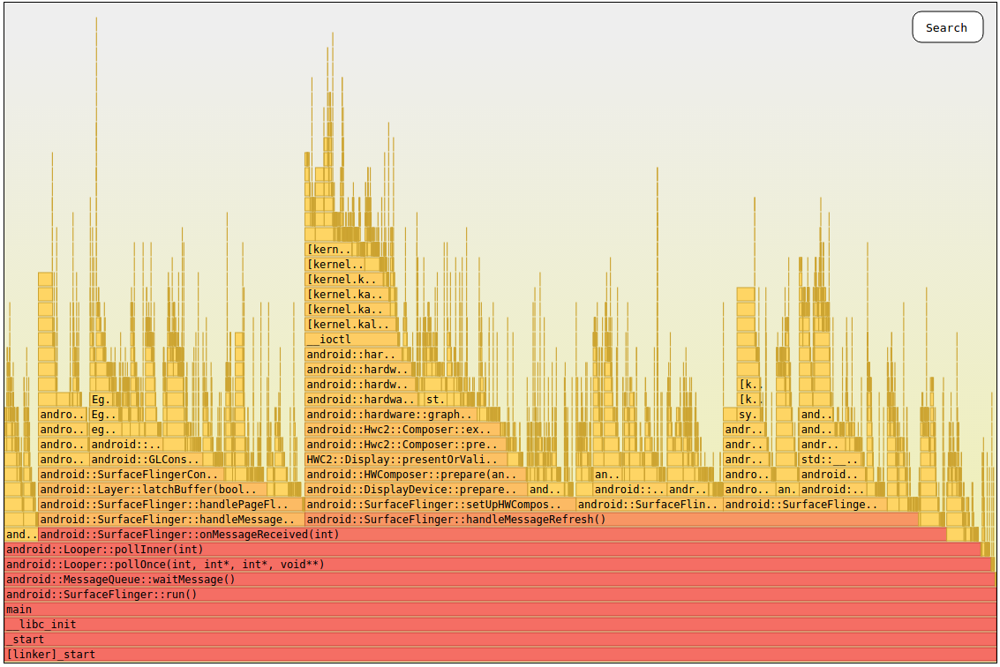
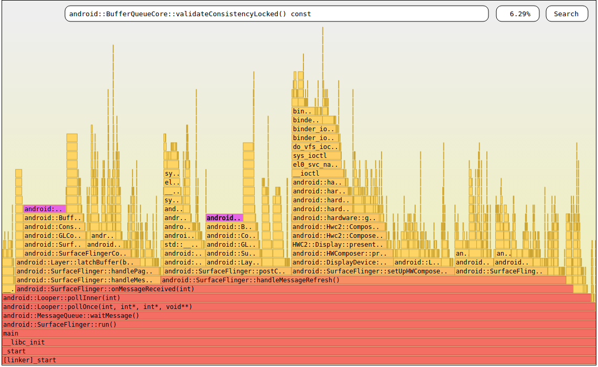

## Inferno


### Description

Inferno is a flamegraph generator for native (C/C++) Android apps. It was
originally written to profile and improve surfaceflinger performance
(Android compositor) but it can be used for any native Android application
. You can see a sample report generated with Inferno
[here](./report.html). Report are self-contained in HTML so they can be
exchanged easily.

Notice there is no concept of time in a flame graph since all callstack are
merged together. As a result, the width of a flamegraph represents 100% of
the number of samples and the height is related to the number of functions on
the stack when sampling occurred.




In the flamegraph featured above you can see the main thread of SurfaceFlinger.
It is immediatly apparent that most of the CPU time is spent processing messages
`android::SurfaceFlinger::onMessageReceived`. The most expensive task is to ask
 the screen to be refreshed as `android::DisplayDevice::prepare` shows in orange
. This graphic division helps to see what part of the program is costly and
where a developer's effort to improve performances should go.

### Example of bottleneck

A flamegraph give you instant vision on the CPU cycles cost centers but
it can also be used to find specific offenders. To find them, look for
plateaus. It is easier to see an example:



In the previous flamegraph, two
plateaus (due to `android::BufferQueueCore::validateConsistencyLocked`)
are immediately apparent.

### How it works
Inferno relies on simpleperf to record the callstack of a native application
thousands of times per second. Simpleperf takes care of unwinding the stack
either using frame pointer (recommended) or dwarf. At the end of the recording
`simpleperf` also symbolize all IPs automatically. The record are aggregated and
dumps dumped to a file `perf.data`. This file is pulled from the Android device
and processed on the host by Inferno. The callstacks are merged together to
visualize in which part of an app the CPU cycles are spent.

### How to use it

Open a terminal and from `simpleperf/scripts` directory type:
```
./inferno.sh  (on Linux/Mac)
inferno.bat (on Windows)
```

Inferno will collect data, process them and automatically open your web browser
to display the HTML report.

### Parameters

You can select how long to sample for, the color of the node and many other
things. Use `-h` to get a list of all supported parameters.

```
./inferno.sh -h
```

### Troubleshooting

#### Messy flame graph
A healthy flame graph features a single call site at its base (see [here](./report.html)).
If you don't see a unique call site like `_start` or `_start_thread` at the base
from which all flames originate, something went wrong. : Stack unwinding may
fail to reach the root callsite. These incomplete
callstack are impossible to merge properly. By default Inferno asks
 `simpleperf` to unwind the stack via the kernel and frame pointers. Try to
 perform unwinding with dwarf `-du`, you can further tune this setting.


#### No flames
If you see no flames at all or a mess of 1 level flame without a common base,
this may be because you compiled without frame pointers. Make sure there is no
` -fomit-frame-pointer` in your build config. Alternatively, ask simpleperf to
collect data with dward unwinding `-du`.


#### High percentage of lost samples

If simpleperf reports a lot of lost sample it is probably because you are
unwinding with `dwarf`. Dwarf unwinding involves copying the stack before it is
processed. Try to use frame pointer unwinding which can be done by the kernel
and it much faster.

The cost of frame pointer is negligible on arm64 parameter but considerable
 on arm 32-bit arch (due to register pressure). Use a 64-bit build for better
 profiling.

#### run-as: package not debuggable
If you cannot run as root, make sure the app is debuggable otherwise simpleperf
will not be able to profile it.
