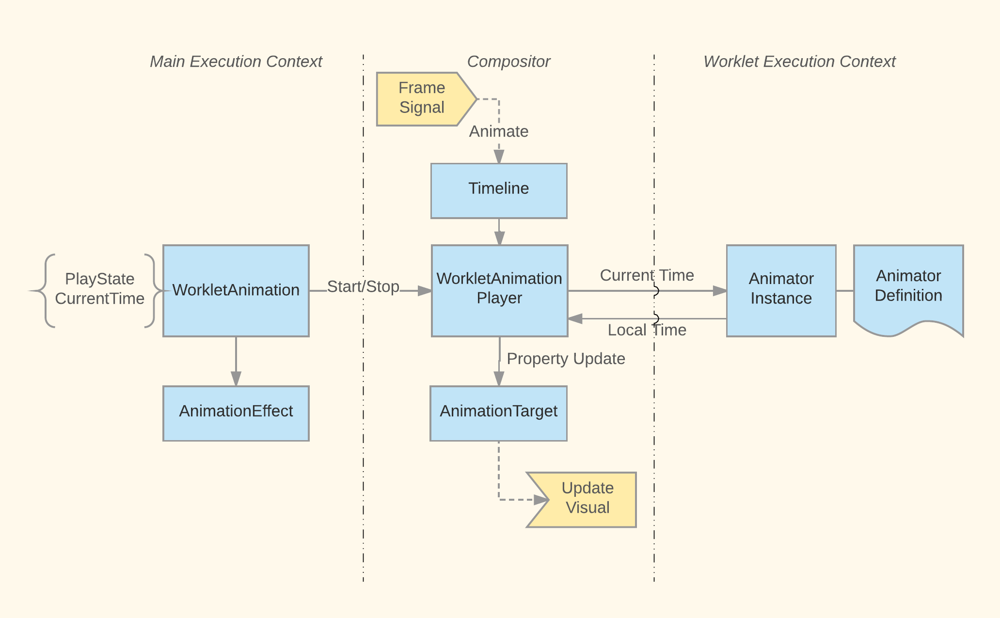

# Animation Worklet

This directory contains source code that implements Animation Worklet API.

See [Animation Worklet Explainer](https://github.com/WICG/animation-worklet/blob/gh-pages/README.md)
for the set of web-exposed API that implements.

## Worklet Animation in Multiple Contexts

A key concept in AnimationWorklet is  worklet animation which refers to a single animation with an
`animate` function that is intended to run in animation worklet context.

To create and animate a worklet animation, there are at least three different contexts involved.
Each having their own concrete type that corresponds to a single worklet animation:

 * Main context: allows creation and provides playback controls for animation and integration with
   DOM. The corresponding type is a `blink::WorkletAnimation`.
 * Compositor context: determines the input for composited (accelerated) animations and draws them.
   The corresponding type is a `cc::WorkletAnimationPlayer`.
 * Animation context: executes of the javascript `animate` function. The corresponding type is a
   `blink::Animator`.

The main `animate` function input is "current time" which may be linked to a frame time or 
an scroll offset. Its output is "local time" which are fed into keyframe effects which eventually
lead to a visual update.

## An Animation Frame Cycle in Worklet Context

AnimationWorklet provides worklet context that hosts and runs animations in isolation from main
document execution context. It is however not responsible for scheduling animation frames or
directly updating the DOM element or their visuals but rather relies on other components for these.

A normal animation frame cycle in worklet context involves the following:

1. Receive animation frame request signal (a.k.a mutation) along with the animation input for this
   frame.
2. Run all animations (in future we may selectively run animations if their input changes).
3. Record animation output in form of "time" values.
4. Send animation output.

A key function that encapsulate this cycle is [`AnimationWorkletGlobalScope::Mutate()`](./AnimationWorkletGlobalScope.cpp).

In current implementation, animation worklet thread only interacts with compositor thread. This
means in step 1 it receives input from the compositor and in step 4 it sends output to the
compositor. This may however change as we support non-composited animations.

### Interaction with Compositor

The compositor player object controls the life time and play state of the corresponding animator
object in the worklet context. In particular the compositor player Id also identifies the
corresponding animator in the worklet context.

Compositor animation inputs depend on impl frame timestamp and layer's scroll offsets. Whenever
these change, compositor initiates an animation frame request to the worklet thread and blocks on
receiving update from it. This is fairly simple but inefficient scheduling method. In particular we
may invalidate animation inputs multiple times in a single frame (i.e., impl frame begin, after
commit, and after scrolling) and blocking compositor is not necessary. A more efficient scheduling
algorithm is upcoming.

### Interaction with Main

Currently we only support composite worklet animations. This means that the worklet and main
contexts do not interact directly to run animations but are mediated via compositor.

As far as main is concerned worklet animations are simply composited animations that it hands over
to compositor. A key difference is that unlike typical composited animations, main does not run its
own version of the animation to update computed style. So it needs to receive property value
updates from compositor (this is not yet in place).

## Testing

Layout tests that cover web-exposed API for Animation Worklet are tested in 
[`LayoutTests/virtual/threaded/fast/animationworklet/`](../../../LayoutTests/virtual/threaded/fast/animationworklet/).

There are unit tests covering animation worklet and global scope in [`modules/animationworklet`](.).
