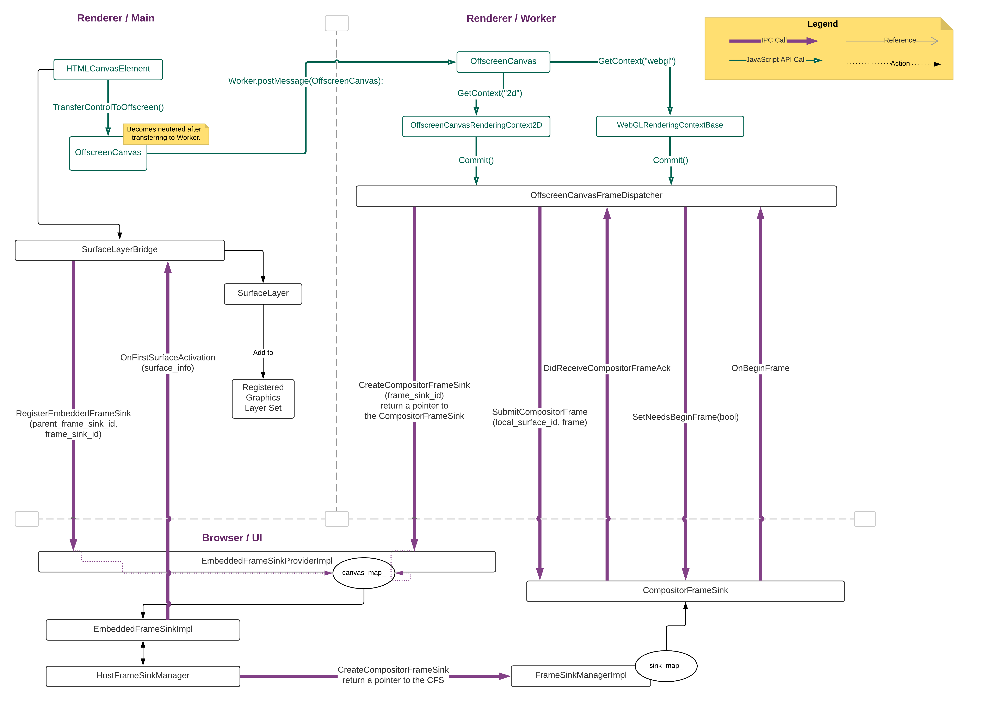
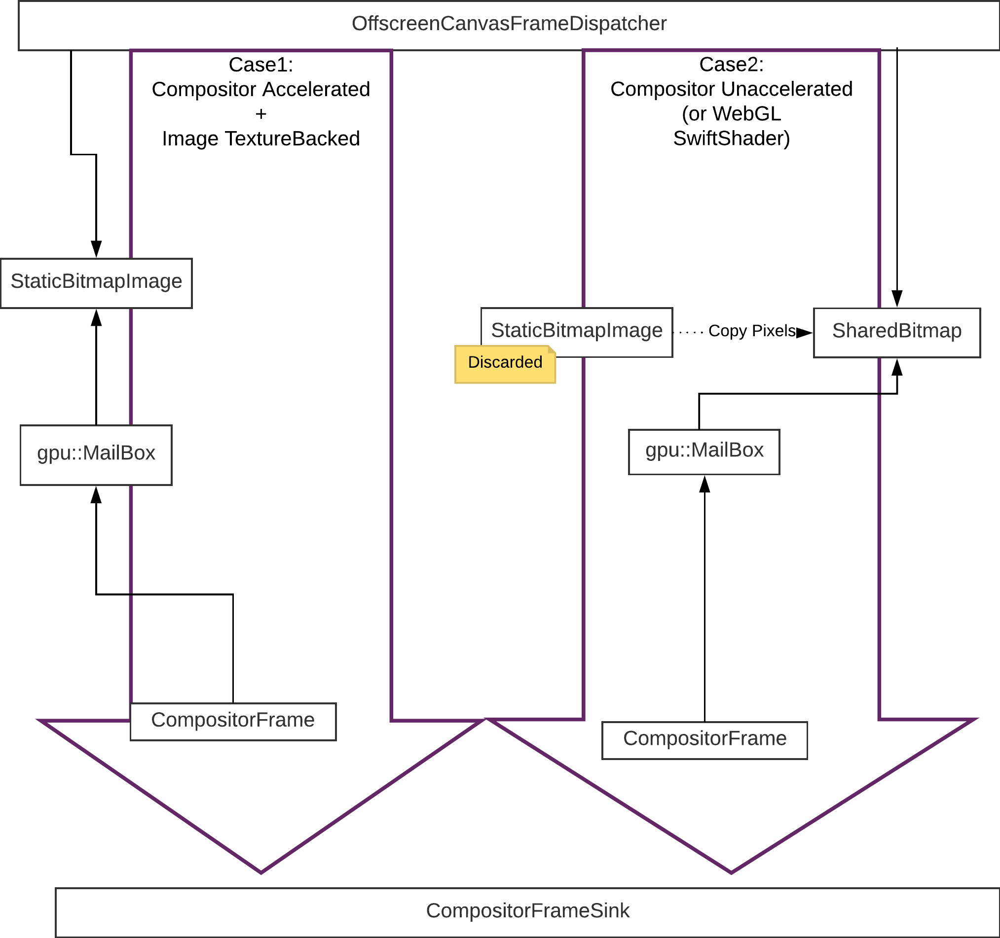
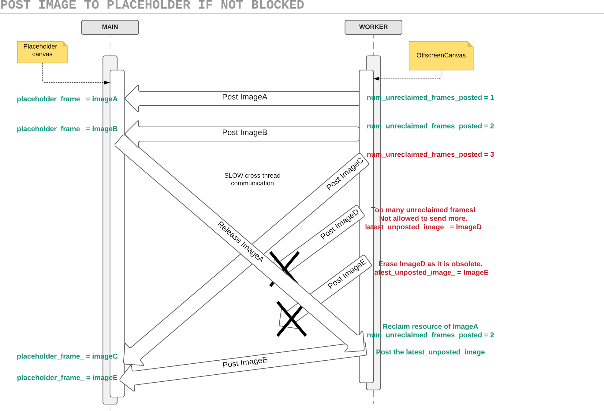

This document aims to explain the latest implementation details of
OffscreenCanvas.commit(). Some parts (e.g, compositor frame submission
mechanism, image resources) may remain unchanged in the future; some (3-way
mojo communication) might be dropped and picked up in a different format later;
 some (e.g., frame dispatching rate) will become irrelevant in a future date,
as a refactoring is done by [fserb@](mailto:fserb@chromium.org) due to
specification change.

# The General Mojo IPC Flow

The following diagram illustrates the essential mojo calls for executing
OffscreenCanvas.commit().



OffscreenCanvas.commit() involves communication between three parties--the main
thread and the worker thread in the renderer process, plus the UI thread in the
browser process. There are some more complex inter-process/thread communication
in the implementation of display compositor in Viz, beyond what’s being drawn
in the browser side in this diagram.

## Placeholder Canvas Initiating the Mojo Call

In the beginning, we have an HTMLCanvasElement in the main thread (called
"placeholder canvas"). We also have an EmbeddedFrameSinkProviderImpl in the
browser (one instance per renderer process), which is the implementation of the
mojo interface EmbeddedFrameSinkProvider’s receiving end; it is set up during
the initialization of the render process, as one of the many initial mojo
interfaces (see RenderProcessHostImpl::RegisterMojoInterfaces()).

When users perform `transferControlToOffscreen()` on the canvas (see
HTMLCanvasElementModule::transferControlToOffscreen()), this HTMLCanvasElement
will create a reference to a SurfaceLayerBridge instance. The constructor of
SurfaceLayerBridge generates a FrameSinkId that is unique in the current
renderer process (see Platform::GenerateFrameSinkId()), extracts the
FrameSinkId of the layer tree view under which the placeholder canvas is
attached, and then sends these IDs in a mojo call
**RegisterEmbeddedFrameSink()** to the EmbeddedFrameSinkProviderImpl.

Upon receiving the mojo call **RegisterEmbeddedFrameSink()**, the global
instance of EmbeddedFrameSinkProviderImpl will instantiate an
EmbeddedFrameSinkImpl, and saves this instance in the frame\_sink\_map\_,
identified by the FrameSinkId. In the meantime, the EmbeddedFrameSinkImpl
gains access to its client--the SurfaceLayerBridge instance--and can send mojo
calls to it in the future.

On the blink side, a SolidColorLayer with transparent background is created
inside the SurfaceLayerBridge object as a placeholder layer; this layer is
registered to the graphics layer set, just like any other content layer. In a
separate process of layer compositing, the graphics layer updater will identify
a canvas with SurfaceLayerBridge to be a special case that requires a separate
platform layer (see CompositedLayerCompositedLayerMapping::
UpdateGraphicsLayerConfiguration()).

Eventually, an OffscreenCanvas object is created, which contains the
FrameSinkId, the dimension and DOMNodeId of the placeholder canvas.
From users’ point of view, this is the time when they see an `OffscreenCanvas`
JS object getting created.

## Placeholder Canvas Transferring the OffscreenCanvas to Worker

Users can then perform the following script to post an OffscreenCanvas from
main thread to worker:
```
worker.postMessage(offscreenCanvas, [offscreenCanvas])
```

Then they can extract this OffscreenCanvas in the worker script:
```
self.onmessage = function(e) { var transferredOffscreenCanvas = e.data; }
```

This message sending and receiving to transfer a JavaScript object is
implemented by the V8ScriptValueSerializer and V8ScriptValueDeserializer. To
post an `OffscreenCanvas`, the serializer will write an
OffscreenCanvasTransferTag, followed by 5 different uint32\_t values--the
width, the height, the DOMNodeId of the placeholder canvas, the ClientId and
the SinkId. Note that the ClientId and the SinkId are two components of a
FrameSinkId. To receive an `OffscreenCanvas`, the deserializer will identify
the transferred DOMObject as an `OffscreenCanvas` based on the
OffscreenCanvasTransferTag and read the 5 uint32\_t values in the same order of
writing, before constructing a new `OffscreenCanvas` object on the worker
thread.

As a result, we will have an `OffscreenCanvas` object on worker, with the
information of placeholder canvas’s dimension, DOMNodeId as well as the
FrameSinkId.

## OffscreenCanvas calling commit() for the first time

The `OffscreenCanvas` on worker can create either a "2d" or an “WebGL”
rendering context just like a usual canvas. Either of this offscreen rendering
context has an API `commit()`. In the current specification and implementation,
it returns a `Promise` when an image frame has been successfully dispatched;
this `Promise`-based design is going to be changed soon in the future.

When users call `commit()` on the rendering context, a snapshot of the
OffscreenCanvas will be taken. The snapshot is represented by a
StaticBitmapImage object, which will be centrally managed in the
OffscreenCanvasFrameDispatcher. In the current design, the image snapshot will
not be immediately dispatched. Instead, it will be saved in the
current\_frame\_ instance member of the `OffscreenCanvas` object and wait for
an appropriate moment to be dispatched.

Meanwhile, OffscreenCanvas will instantiate an OffscreenCanvasFrameDispatcher.
During the construction of an OffscreenCanvasFrameDispatcher, a current
LocalSurfaceId will be generated (Note: a LocalSurfaceId and a
FrameSinkId together form a unique SurfaceId, which identifies a Surface in
browser). Then it sends a mojo call **CreateCompositorFrameSink()** to the
always running EmbeddedFrameSinkProviderImpl in the browser; this mojo call
carries the FrameSinkId that OffscreenCanvas got from the placeholder canvas
during the control transfer, as well as a CompositorFrameSink pointer sink\_
that’s waiting to be set by the display compositor in the future. On the
receiving end, EmbeddedFrameSinkProviderImpl will use the FrameSinkId to find
 from its frame\_sink\_map\_ the corresponding EmbeddedFrameSinkImpl which
links to this OffscreenCanvas’s placeholder canvas, and then pass along the
request of creating CompositorFrameSink to the EmbeddedFrameSinkImpl.
EmbeddedFrameSinkImpl will forward this request to the HostFrameSinkManager,
which has access to the privileged interface FrameSinkManager that has the
authority to control the creation and destruction of CompositorFrameSinks in
the display compositor. In addition, it will also register the parent
FrameSinkId and FrameSinkId as a parent-child hierarchy relationship to the
HostFrameSinkManager. A lot of call forwarding has been carried out in the
display compositor side; but for OffscreenCanvas alone, we can treat the
behind-scene implementation as a black box for easier understanding. As a
result of this mojo call **CreateCompositorFrameSink()**, the created
CompositorFrameSink will now have a two-way direct communication channel with
the OffscreenCanvasFrameDispatcher.

Upon having the pointer sink\_ to directly communicate with the
CompositorFrameSink, OffscreenCanvasFrameDispatcher will send another mojo
call **SetNeedsBeginFrame(true)** to it, indicating its interest to receive
BeginFrame signals from the display compositor. BeginFrame signals are similar
to the vSync signals and could be used as a way to sync the frame dispatching
rhythm to an appropriate rate.

When it is the appropriate time to dispatch the saved image,
OffscreenCanvasFrameDispatcher will prepare a CompositorFrame according to the
image type and acceleration mode (see OffscreenCanvasFrameDispatcher::
DispatchFrame()). Then it sends the CompositorFrame as well as the current
LocalSurfaceId to the CompositorFrameSink via a mojo call
**SubmitCompositorFrame()**. The receiving end, the CompositorFrameSinkImpl,
will handle this CompositorFrame and queues it to the corresponding Surface.

Because this is the first time `commit()` is called, the display compositor
does not have the Surface for the given SurfaceId (a combination of
FrameSinkId of the CompositorFrameSink and the LocalSurfaceId) yet. The
display compositor will then create a new Surface (see
CompositorFrameSinkSupport::MaybeSubmitCompositorFrame()). Once the Surface is
created, there is going to be a few more chain calls in the display compositor,
to inform different observers about this new creation. Afterwards, the
CompositorFrame that we sends in this case will be queued to the newly created
Surface (see Surface::QueueFrame()), which will result in a few more chain
calls to inform different parties/observers. Ultimately,
EmbeddedFrameSinkImpl::OnFirstSurfaceActivation() will be invoked, sending
another mojo call **OnFirstSurfaceActivation()** to the SurfaceLayerBridge.
Then the SurfaceLayerBridge will replace the SolidColorLayer with a real
SurfaceLayer with the appropriate SurfaceId information; it will then trigger
a compositing update in the placeholder canvas.

## OffscreenCanvas Resizing

OffscreenCanvas resizing uses the same mojo call mechanism as the first
OffscreenCanvas.commit(). Users initiate the resizing by setting
`OffscreenCanvas.width` (or `OffscreenCanvas.height`) to a value different from
its original one. OffscreenCanvasFrameDispatcher will save these values and set
change\_size\_for\_next\_commit\_ to be "true"; at this point of time, no new
mojo calls are performed.

If a new image frame is dispatched, OffscreenCanvasFrameDispatcher will detect
that change\_size\_for\_next\_commit\_ is true; in this case, it will generate
a new LocalSurfaceId. (Reminder: SurfaceId = FrameSinkId +
LocalSurfaceId). This is the intended design of Surfaces--a new Surface is
required for a rectangle with a new dimension but we want to maintain the
attachment with the same CompositorFrameSink (which is identified by the
FrameSinkId); therefore during a resizing, we create a new SurfaceId by
using the same FrameSinkId and a new LocalSurfaceId. This new
LocalSurfaceId will be sent in the next **SubmitCompositorFrame()** mojo
call, together with the newly prepared CompositorFrame. The receiving
CompositorFrameSink will detect a change of LocalSurfaceId and re-create a
new Surface.

In addition, the intrinsic size of the placeholder canvas will be also updated
via OffscreenCanvasFrameDispatcher::PostImageToPlaceholderIfNotBlocked(), which
is cross-thread propagation that sends latest image of OffscreenCanvas to its
placeholder canvas.

# The Image Resources in OffscreenCanvas.Commit()

## Extracting the Image Resources from Rendering Contexts

The image resources of OffscreenCanvas’s 2d rendering context are centrally
managed by a CanvasResourceProvider instance. CanvasResourceProvider is an
abstract class that encapsulates a drawable graphics resources and its
implementations could be managing different specific resource types, ranging
from Gpu textures, Gpu memory buffer, to shared bitmap in RAM. When `commit()`
is invoked by the user, an image snapshot would be taken from the SkSurface
managed by the CanvasResourceProvider; the SkSurface can be on Gpu context (see
SkSurface::MakeRenderTarget()) or on RAM memory (see SkSurface::MakeRaster()).
The image snapshot would be saved as a StaticBitmapImage instance.

The image resources of OffscreenCanvas’s WebGL rendering context are centrally
managed by its DrawingBuffer instance. There are two ways of extracting the
current image from WebGL rendering context and this is determined by the value
of the WebGL attribute `preserveDrawingBuffer`. If `preserveDrawingBuffer` is
true, the texture on the WebGL back buffer is copied into the backing
TextureId of a temporary CanvasResourceProvider instance before a snapshot is
taken from there (see WebGLRenderingContextBase::GetImage()). If
`preserveDrawingBuffer` is false, the texture on the back\_color\_buffer\_ is
transferred and returned, while the original back\_color\_buffer\_ member is
reset, i.e., put back in the recycled color buffer queue (see
DrawingBuffer::TransferToStaticBitmapImage()), thus making any second attempt
to retrieve the WebGL image impossible (hence the meaning of “not preserving”).

In the case of a false `preserveDrawingBuffer`, the returned ColorBuffer
contains the actual GPU memory buffer. Its resource release is carefully
handled by a release callback. This release callback is saved in the
DrawingBuffer instance and is swapped only when a new `commit()` is coming or
the DrawingBuffer is destructed; when the swapping happens, the previously
saved callback will be run, releasing the ColorBuffer that holds up the GPU
memory resource (see DrawingBuffer::SwapPreviousFrameCallback()) . This
release mechanism is not consistent with the rest of canvas resource; ideally,
everything should be kept under CanvasResourceProvider; this might be a future
to-do item.

## Preparing the CompositorFrame

The image extracted from the previous step is now encapsulated as a
StaticBitmapImage instance, which is saved in the OffscreenCanvas. When it is
the right time to dispatch the image, OffscreenCanvasFrameDispatcher will
prepare a CompositorFrame based on this StaticBitmapImage instance and sends it
off to the CompositorFrameSink (see
OffscreenCanvasFrameDispatcher::DispatchFrame()).



OffscreenCanvasFrameDispatcher has delegated all its resource management tasks
to its OffscreenCanvasResourceProvider instance (which will be merged to
CanvasResourceProvider soon by [junov@](mailto:junov@chromium.org)). This
resource provider has two different methods in converting a StaticBitmapImage
into a viz::TransferableResource, which is an essential component of a
CompositorFrame. There are four scenarios here but there are only two ways of
handling.

<table>
  <tr>
    <td>Is Image texture-backed?</td>
    <td>Is GPU Compositing enabled?</td>
    <td>How to handle it?</td>
    <td>Which function converts StaticBitmapImage to viz::TransferableResource?
   </td>
  </tr>
  <tr>
    <td>Yes</td>
    <td>Yes</td>
    <td>We make use of a gpu::MailboxHolder (see
        AcceleratedStaticBitmapImage::EnsureMailbox()) that saves the
        gpu::Mailbox and the gpu sync token that are necessary in rendering the
        image. Then the StaticBitmapImage is put in the resource map of the
        resource provider.</td>
    <td rowspan="2">SetTransferableResourceToStaticBitmapImage()</td>
  </tr>
  <tr>
    <td>No</td>
    <td>Yes</td>
    <td>Same as the above, except that before all the steps, we need to convert
        the unaccelerated image to an accelerated image by creating the image’s
        gpu copy first.</td>
  </tr>
  <tr>
    <td>Yes</td>
    <td>No</td>
    <td rowspan="2">Convert the accelerated image to an SkImage inside the
        AcceleratedStaticBitmapImage and then do a SkImage::readPixels() to
        copy the pixels into a SharedBitmap (Note: SharedBitmap is a
        RAM-storage image with shared access from renderer and browser). Then
        the original StaticBitmapImage is discarded.</td>
    <td rowspan="2">SetTransferableResourceToSharedBitmap()</td>
  </tr>
  <tr>
    <td>No</td>
    <td>No</td>
  </tr>
</table>

# Syncing the OffscreenCanvas Animation

## Placeholder Canvas Accessing the Image at all times

What happens when the users perform `canvas.toBlob()` on the placeholder
canvas? What happens when the users want to right click the placeholder canvas
and copy the image? Because we directly "commit" the CompositorFrame from
worker thread to the display compositor, the placeholder canvas on the main
thread actually does not have access to the image resource. The solution we
adopt here is to post the image from worker thread to the main thread,
whenever there is a new image committed, subject to the message receiving
capacity of the main thread.

OffscreenCanvasFrameDispatcher::PostImageToPlaceholderIfNotBlocked() is the
function to send an image from OffscreenCanvas to placeholder canvas, using a
cross-thread task. The cross-thread task sends the following:

1. The image;

2. The placeholder canvas’s DOMNodeId, useful to identify the HTMLCanvasElement
instance;

3. The pointers of OffscreenCanvasFrameDispatcher and the current worker
thread’s task runner, both useful in posting a "return call" from the
placeholder canvas to the OffscreenCanvas instance.

We have a mechanism to prevent over-sending messages from OffscreenCanvas to
the main thread, by keeping track the number of unreclaimed frames on the
OffscreenCanvas. When this number exceeds a threshold (which is currently set
to 3), OffscreenCanvasFrameDispatcher will save the unposted image, until the
first "reclaim resource" call from placeholder canvas is received to release
the previous image resource. The following sequence diagram illustrates a few
different scenarios that may possibly arise in this main-worker communication.



The actual release of an image resource is only executed when the
ReclaimResource() is invoked in both of these places:

1. A mojo call from the display compositor **DidReceiveCompositorFrameAck()**,
indicating that the particular CompositorFrame using this image resource has
been processed;

2. A message sent from the placeholder canvas indicating that it no longer
needs this image resource (either because it now has another new image or the
canvas is destructed).

The second invocation is illustrated as the "Release ImageA" message in the
above sequence diagram.

## Dispatching Frame on Appropriate Time

TODO(fserb@): Edit this section of documentation when `commit()` is finished.

The current implementation assumes that there are two time points when we can
do the actual dispatching:

1. At the end of the current JavaScript Task;

2. On the beginning of a BeginFrame signal.

The latest plans, carried out by [fserb@](mailto:fserb@chromium.org), would be
to revamp the `commit()` design as follows:

1. Keep the `commit()`, but drop its returned `Promise`. Make this `commit()` a
blocking API, instead of an async API.

2. Implement `requestAnimationFrame()` in `WorkerGlobalScope`.
