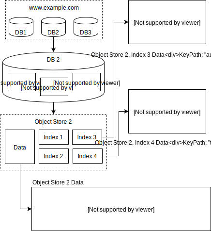

# IndexedDB (IDB) Overview for Database People

This document is intended to help people with some database experience quickly
understand IndexedDB. In the interest of brevity, non-essential quirks and edge
cases are not covered. [The IDB Specification](https://w3c.github.io/IndexedDB/)
covers all the details, and is good follow-up reading.

IDB's storage hierarchy is as follows:

1. An *origin* (e.g., https://localhost:8080) owns multiple *databases*.
2. A *database* owns multiple *object stores* (similar to SQL tables).
3. An *object store* is a collection of *entries* (similar to SQL records),
   which are essentially *(primary key, value)* pairs.
4. An *object store* owns multiple *indexes*.
5. An *index* is a collection of *index entries*, which are essentially *(index
   key, primary key)* pairs.

*** aside
This image embeds the data needed for editing using [draw.io](https://github.com/jgraph/drawio).
***

IDB *keys* (both *primary keys* and *index keys*) are a fairly restricted subset
of JavaScript's supported types. There are no index-level type constraints, so
the same index may hold many types of values (i.e. string keys and number keys
side by side). The IDB spec defines a single strict ordering relationship over
all possible IDB keys. This implies that the relationship covers all key types
(e.g., numbers < dates < strings < binary keys < arrays). This also implies no
custom orderings (e.g., no collations).

Conceptually, IDB object store entries are sorted according to their primary
keys. Like in SQL, a object store's primary keys have to be unique.

IDB indexes are conceptually sorted sets, i.e. index entries are sorted by
(index key, primary key). It is possible for an index to have multiple entries
with the same index key. Unlike SQL indexes, an IDB index can contain multiple
entries with the same primary key - *multiEntry* indexes map each element inside
an IDB value array to an index entry.

IDB *values* are [a fairly large subset of JavaScript's supported
types](https://html.spec.whatwg.org/multipage/structured-data.html#serializable-objects).
There are no object store-level constraints on value types, so the values in a
store can be pretty heterogeneous. By contrast, SQL tables have schemas which
heavily constrain the rows.

From a database perspective, IDB values can mostly be thought of as black boxes.
The two caveats are:

* IDB values can contain
  [Blobs](https://developer.mozilla.org/en-US/docs/Web/API/Blob), which are
  serialized separately (at least by Chromium). The IDB backend must track the
  Blobs associated with a value.
* IDB primary keys can be extracted from IDB values. IDB index keys are always
  extracted from IDB values. This means that an IDB backend that only logs
  object store operations must be able to extract keys from IDB values when the
  log is replayed. (we don't do that in Chromium) The key extraction algorithm
  is non-trivial, see *keyPath* and *multiEntry* indexes.

IDB has transactions. Each transaction operates on a fixed set of object stores
that is declared when the transaction is started. This means IDB implementations
can use a simple scheme based on read-write locks, and don't have to worry about
deadlocks.

IDB transactions have the following modes:

* *read*, *readwrite* - fairly obvious
* *versionchange* - The only type that allows schema changes (the IDB
  equivalent of DDL queries). Conceptually, *versionchange* transactions get a
  write-lock on *all* the object stores in a database, so each *versionchange*
  transaction gets exclusive database access.

All IDB queries are scoped to a single object store (i.e., no equivalent of SQL
joins). IDB supports single-key CRUD (*get*, *put*, *delete*). IDB also supports
range-based retrieval (*get*, *getAll*) and iteration (like cursors used by many
RDBMS implementations). Iteration follows the implicit ordering of the source
(object store or index), but can either go in the forward direction / ascending
order, or in the backward direction / descending order. There is no equivalent
of SQL's `ORDER BY` / `GROUP BY`. `LIMIT` can be implemented using cursors, but
`OFFSET` cannot.

An IDB transaction can have multiple *requests* (a rough equivalent of SQL
queries) issued against a transaction at the same time. Queries are executed
asynchronously. The results must obey sequential consistency based on the order
in which queries were issued. The order in which results are delivered to
JavaScript must match the query issuing order.

IDB transactions auto-close when all requests have been completed and no more
requests are made. The details are connected to the JavaScript event model, are
a bit subtle, and don't matter too much from a DBMS perspective. Transactions
are auto-aborted when a request fails (e.g. due to a constraint violation), but
the auto-abort can be prevented (by responding to the request's error event).

Each Web application has one main JavaScript thread (per browser tab) and
possibly multiple worker threads. Each thread can obtain an arbitrary number of
*connections* to the IDB database (open it), so it is possible for a database to
be accessed from multiple Web application threads. (which may be hosted by
separate renderer processes in Chrome) However, IDB transactions are not
cloneable or transferrable (i.e. cannot be passed around using *postMessage*),
so each transaction belongs to exactly one thread for its entire lifetime. So,
all the requests in a transaction must be issued by the same JavaScript thread,
which means that the query issuing order mentioned above is well-defined.
