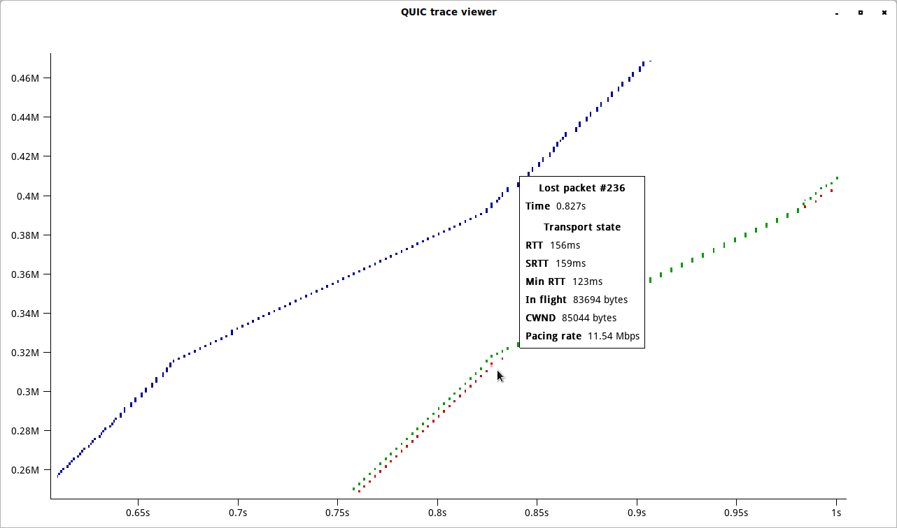

# QUIC trace utilities

This repository contains a format for recording a trace of QUIC connection,
together with the tools for analyzing the resulting traces.  This format of
traces is currently partially supported by Chromium, and we hope for more
implementations to adopt it in the future.

The primary focus of this format is debugging congestion-control related
issues, but other transport aspects (e.g. flow control) and transport-related
aspects of the application (e.g. annotations for the types of data carried by
the streams) are also within the scope.

## How to record this format

The traces are represented as a Protocol Buffer, which is completely described
in `lib/quic_trace.proto`.  Projects that use Bazel can embed this repository
directly and use the provided Bazel rules.

## OpenGL-based renderer

This repository contains two different tools to visualize the trace:

1. A simple gnuplot-based trace renderer.
1. A fully featured OpenGL-based renderer.

The OpenGL-based is the current preferred way of rendering traces.  It supports
Linux and macOS, though Windows support is coming soon.  OpenGL 3.3 or later is
required.  Most of its dependencies are shipped using Bazel build files, but for
Linux, system SDL2 is used.

### Build instructions

Building trace renderer on Linux:

1. Install SDL2 with headers (`libsdl2-dev` on Debian and related systems).
1. Install OpenGL headers (on Debian, `libsdl2-dev` pulls those in).
1. Install Bazel from https://bazel.build
1. Build the renderer by running `bazel build -c opt //tools/render/...`
1. Run the renderer by running, for example,
   `bazel-bin/tools/render/render_trace examples/example.qtr`.

Building trace renderer on macOS:
1. Install Bazel from https://bazel.build
1. Build the renderer by running `bazel build -c opt --apple_platform_type=macos
   --cpu=darwin_x86_64 //tools/render/...`
1. Run the renderer by running, for example,
   `bazel-bin/tools/render/render_trace examples/example.qtr`.

Note that macOS build requires a specific set of flags, because by default Bazel
on macOS targets iOS.

### Scalability

The OpenGL-based renderer was built with the goal of rendering large traces in
mind, and our testing has shown that it performs quite well with traces as large
as 120MiB worth of data transferred (that's approximately 90,000 packets sent),
even when ran on a machine with high-resolution screen and an integrated GPU.

## Legacy gnuplot-based renderer

This rendering script was originally built as a simple proof of concept for
rendering the trace format, but still might be useful if other tools are not
available.  Instructions:

1. Build the helper tool by running `bazel build
   //tools/quic_trace_to_time_sequence_gnuplot`.
1. Generate the graph by running `tools/time_sequence_gnuplot.sh trace_file
   trace.png`.
