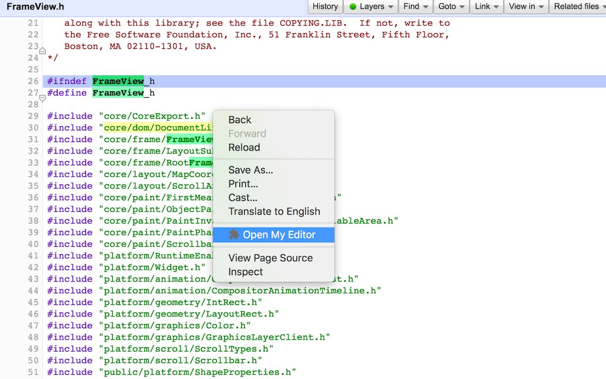
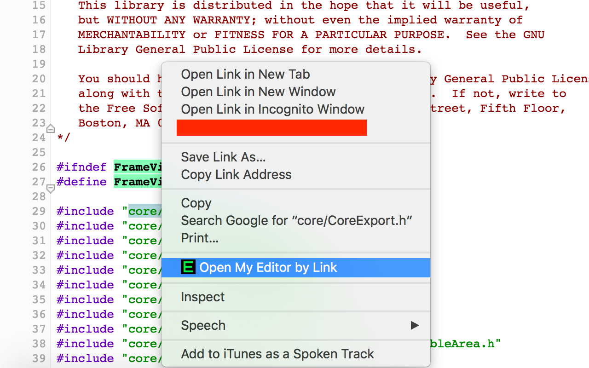
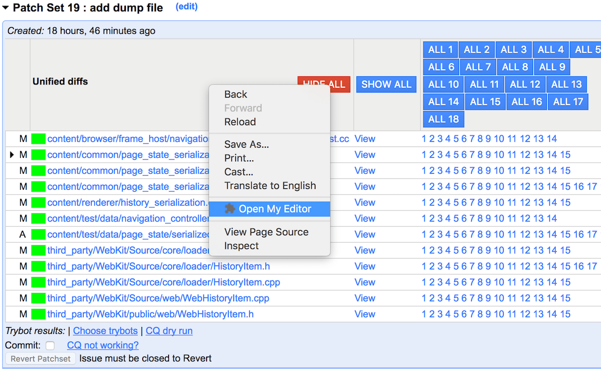
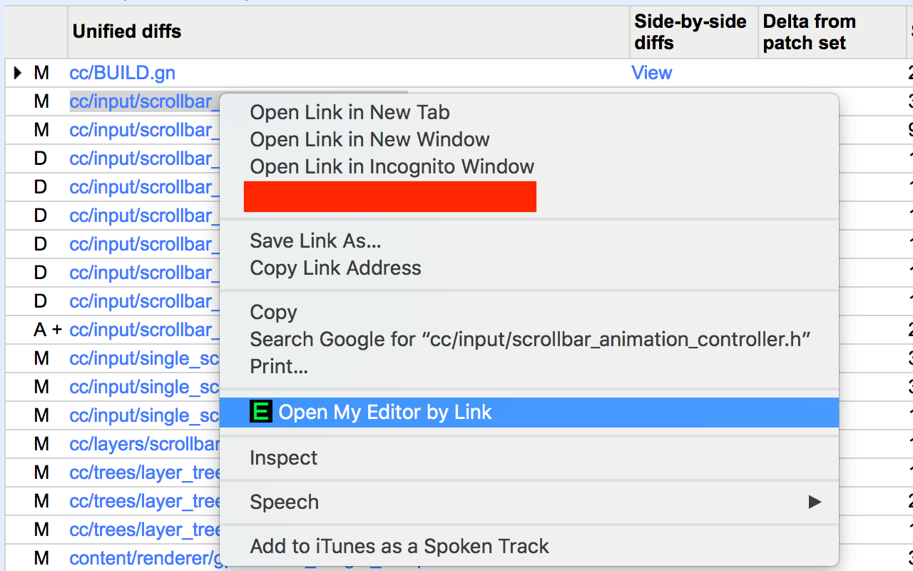

# Open My Editor (OME)

OME gives you a context menu for opening files in your editor on
[Chromium Code Search](https://cs.chromium.org/), 
[Chromium Code Review](https://codereview.chromium.org/) and 
[Chromium Build](https://build.chromium.org).

For Chromium Code Search, right click on code block and select `Open My Editor`, 
it will open the file in your editor at the selected line.



For Chromium Code Search, right click on symbol or filename and select 
`Open My Editor by link` can also open file (maybe with linenumber).



For Chromium Code Review, right click on the patchset table and select 
`Open My Editor`, it will open all the files in the patchset.



For Chromium Code Review, you can also right click on a filename and select 
`Open My Editor by link`.



For any build.chromium.org site, select the file path then right click and 
select `Open My Editor $file`.

## Installation

1. Install the [Chrome Extension](https://chrome.google.com/webstore/detail/ome/ddmghiaepldohkneojcfejekplkakgjg?hl=en-US)
2. Install dependencies `pip install bottle sh`, you may need to install 
   `python` and `python-pip` if you don't have `pip`.

3. Start `omed.py`
  
    ```
    python ${CHROMIUM_SRC}/tools/chrome_extensions/open_my_editor/omed.py
    ```

    It's convenient to configure your system to automatically run omed.py at
    startup so that you don't have to remember to manually start it.

4. Create a `myeditor` executable to be used for launching your editor, and add 
   it to your path. See [`myeditor-example/`](https://chromium.googlesource.com/chromium/src.git/+/master/tools/chrome_extensions/open_my_editor/myeditor-example/).
5. Enjoy.

## How it works

In the Chrome Extension, I read the filepath and line number from right click,  
then make a http call to `omed.py`. `omed.py` calls `myeditor` to open your 
editor.
